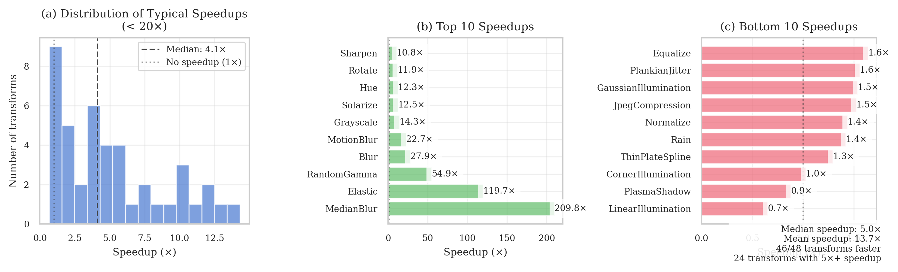

# Image Augmentation Library Benchmarks

A comprehensive benchmarking suite for comparing the performance of popular image augmentation libraries including [Albumentations](https://albumentations.ai/), [imgaug](https://imgaug.readthedocs.io/en/latest/), [torchvision](https://pytorch.org/vision/stable/index.html), [Kornia](https://kornia.readthedocs.io/en/latest/), and [Augly](https://github.com/facebookresearch/AugLy).

<details>
<summary>Table of Contents</summary>

- [Image Augmentation Library Benchmarks](#image-augmentation-library-benchmarks)
  - [Overview](#overview)
  - [Benchmark Results](#benchmark-results)
    - [System Information](#system-information)
    - [Benchmark Parameters](#benchmark-parameters)
    - [Library Versions](#library-versions)
  - [Performance Comparison](#performance-comparison)
  - [Requirements](#requirements)
  - [Supported Libraries](#supported-libraries)
  - [Notes](#notes)
  - [Setup](#setup)
    - [Getting Started](#getting-started)
    - [Using Your Own Images](#using-your-own-images)
  - [Methodology](#methodology)
    - [Benchmark Process](#benchmark-process)
  - [Running Benchmarks](#running-benchmarks)
    - [Single Library](#single-library)
      - [Command Line Arguments](#command-line-arguments)
    - [All Libraries](#all-libraries)
      - [All Libraries Options](#all-libraries-options)
    - [Output Structure](#output-structure)
    - [Output Format](#output-format)

</details>

## Overview

This benchmark suite measures the throughput and performance characteristics of common image augmentation operations across different libraries. It features:

- Adaptive warmup to ensure stable measurements
- Multiple runs for statistical significance
- Detailed performance metrics and system information
- Thread control settings for consistent single-threaded performance
- Support for multiple image formats and loading methods




# Benchmark Results

### System Information

- Platform: macOS-15.1-arm64-arm-64bit
- Processor: arm
- CPU Count: 16
- Python Version: 3.12.8

### Benchmark Parameters

- Number of images: 2000
- Runs per transform: 5
- Max warmup iterations: 1000

### Library Versions

- albumentations: 2.0.2
- augly: 1.0.0
- imgaug: 0.4.0
- kornia: 0.8.0
- torchvision: 0.20.1

## Performance Comparison

Number shows how many uint8 images per second can be processed on one CPU thread. Larger is better.

| Transform            | albumentations<br>2.0.2   | augly<br>1.0.0   | imgaug<br>0.4.0   | kornia<br>0.8.0   | torchvision<br>0.20.1   |
|:---------------------|:--------------------------|:-----------------|:------------------|:------------------|:------------------------|
| Resize               | **3662 ± 54**             | 1083 ± 21        | 2995 ± 70         | 645 ± 13          | 260 ± 9                 |
| RandomCrop128        | **116784 ± 2222**         | 45395 ± 934      | 21408 ± 622       | 2946 ± 42         | 31450 ± 249             |
| HorizontalFlip       | **12649 ± 238**           | 8808 ± 1012      | 9599 ± 495        | 1297 ± 13         | 2486 ± 107              |
| VerticalFlip         | **24989 ± 904**           | 16830 ± 1653     | 19935 ± 1708      | 2872 ± 37         | 4696 ± 161              |
| Rotate               | **3066 ± 83**             | 1739 ± 105       | 2574 ± 10         | 256 ± 2           | 258 ± 4                 |
| Affine               | **1503 ± 29**             | -                | 1328 ± 16         | 248 ± 6           | 188 ± 2                 |
| Perspective          | **1222 ± 16**             | -                | 908 ± 8           | 154 ± 3           | 147 ± 5                 |
| Elastic              | 359 ± 7                   | -                | **395 ± 14**      | 1 ± 0             | 3 ± 0                   |
| ChannelShuffle       | **8162 ± 180**            | -                | 1252 ± 26         | 1328 ± 44         | 4417 ± 234              |
| Grayscale            | **37212 ± 1856**          | 6088 ± 107       | 3100 ± 24         | 1201 ± 52         | 2600 ± 23               |
| GaussianBlur         | 943 ± 11                  | 387 ± 4          | **1460 ± 23**     | 254 ± 5           | 127 ± 4                 |
| GaussianNoise        | 234 ± 7                   | -                | **263 ± 9**       | 125 ± 1           | -                       |
| Invert               | **35494 ± 17186**         | -                | 3682 ± 79         | 2881 ± 43         | 4244 ± 30               |
| Posterize            | **14146 ± 1381**          | -                | 3111 ± 95         | 836 ± 30          | 4247 ± 26               |
| Solarize             | **12920 ± 1097**          | -                | 3843 ± 80         | 263 ± 6           | 1032 ± 14               |
| Sharpen              | **2375 ± 38**             | -                | 1101 ± 30         | 201 ± 2           | 220 ± 3                 |
| Equalize             | **1303 ± 64**             | -                | 814 ± 11          | 306 ± 1           | 795 ± 3                 |
| JpegCompression      | **1354 ± 23**             | 1202 ± 19        | 687 ± 26          | 120 ± 1           | 889 ± 7                 |
| RandomGamma          | **12631 ± 1159**          | -                | 3504 ± 72         | 230 ± 3           | -                       |
| MedianBlur           | **1259 ± 8**              | -                | 1152 ± 14         | 6 ± 0             | -                       |
| MotionBlur           | **3608 ± 18**             | -                | 928 ± 37          | 159 ± 1           | -                       |
| CLAHE                | **649 ± 13**              | -                | 555 ± 14          | 165 ± 3           | -                       |
| Brightness           | **11254 ± 418**           | 2108 ± 32        | 1076 ± 32         | 1127 ± 27         | 854 ± 13                |
| Contrast             | **11255 ± 242**           | 1379 ± 25        | 717 ± 5           | 1109 ± 41         | 602 ± 13                |
| CoarseDropout        | **15760 ± 594**           | -                | 1190 ± 22         | -                 | -                       |
| Blur                 | **7403 ± 114**            | 386 ± 4          | 5381 ± 125        | 265 ± 11          | -                       |
| Saturation           | **1581 ± 127**            | -                | 495 ± 3           | 155 ± 2           | -                       |
| Shear                | **1336 ± 18**             | -                | 1244 ± 14         | 261 ± 1           | -                       |
| ColorJitter          | **968 ± 52**              | 418 ± 5          | -                 | 104 ± 4           | 87 ± 1                  |
| RandomResizedCrop    | **4521 ± 17**             | -                | -                 | 661 ± 16          | 837 ± 37                |
| Pad                  | **31866 ± 530**           | -                | -                 | -                 | 4889 ± 183              |
| AutoContrast         | **1534 ± 115**            | -                | -                 | 541 ± 8           | 344 ± 1                 |
| Normalize            | **1797 ± 190**            | -                | -                 | 1251 ± 14         | 1018 ± 7                |
| Erasing              | **25411 ± 5727**          | -                | -                 | 1210 ± 27         | 3577 ± 49               |
| CenterCrop128        | **119630 ± 3484**         | -                | -                 | -                 | -                       |
| RGBShift             | **3526 ± 128**            | -                | -                 | 896 ± 9           | -                       |
| PlankianJitter       | **3351 ± 42**             | -                | -                 | 2150 ± 52         | -                       |
| HSV                  | **1277 ± 91**             | -                | -                 | -                 | -                       |
| ChannelDropout       | **10988 ± 243**           | -                | -                 | 2283 ± 24         | -                       |
| LinearIllumination   | 462 ± 52                  | -                | -                 | **708 ± 6**       | -                       |
| CornerIllumination   | **464 ± 45**              | -                | -                 | 452 ± 3           | -                       |
| GaussianIllumination | **670 ± 91**              | -                | -                 | 436 ± 13          | -                       |
| Hue                  | **1846 ± 193**            | -                | -                 | 150 ± 1           | -                       |
| PlasmaBrightness     | **163 ± 1**               | -                | -                 | 85 ± 1            | -                       |
| PlasmaContrast       | **138 ± 4**               | -                | -                 | 84 ± 0            | -                       |
| PlasmaShadow         | 190 ± 3                   | -                | -                 | **216 ± 5**       | -                       |
| Rain                 | **2121 ± 64**             | -                | -                 | 1493 ± 9          | -                       |
| SaltAndPepper        | **2233 ± 35**             | -                | -                 | 480 ± 12          | -                       |
| Snow                 | **588 ± 32**              | -                | -                 | 143 ± 1           | -                       |
| OpticalDistortion    | **687 ± 38**              | -                | -                 | 174 ± 0           | -                       |
| ThinPlateSpline      | **75 ± 5**                | -                | -                 | 58 ± 0            | -                       |


The benchmark automatically creates isolated virtual environments for each library and installs the necessary dependencies. Base requirements:

- Python 3.10+
- uv (for fast package installation)
- Disk space for virtual environments
- Image dataset in a supported format (JPEG, PNG)

## Supported Libraries

- [Albumentations](https://albumentations.ai/)
- [imgaug](https://imgaug.readthedocs.io/en/latest/)
- [torchvision](https://pytorch.org/vision/stable/index.html)
- [Kornia](https://kornia.readthedocs.io/en/latest/)
- [Augly](https://github.com/facebookresearch/AugLy)

Each library's specific dependencies are managed through separate requirements files in the `requirements/` directory.

## Notes

- The benchmark prioritizes consistent measurement over raw speed by enforcing single-threaded execution
- Early stopping mechanisms prevent excessive time spent on slow transforms
- Variance stability checks ensure meaningful measurements
- System information and thread settings are captured to aid in reproducibility

## Setup

### Getting Started

For testing and comparison purposes, you can use the ImageNet validation set:

```bash
wget https://image-net.org/data/ILSVRC/2012/ILSVRC2012_img_val.tar
tar -xf ILSVRC2012_img_val.tar -C /path/to/your/target/directory
```

### Using Your Own Images

While the ImageNet validation set provides a standardized benchmark, we strongly recommend running the benchmarks on your own dataset that matches your use case:

- Use images that are representative of your actual workload
- Consider image sizes and formats you typically work with
- Include edge cases specific to your application

This will give you more relevant performance metrics for your specific use case, as:

- Different image sizes can significantly impact performance
- Some transforms may perform differently on different types of images
- Your specific image characteristics might favor certain libraries over others

## Methodology

### Benchmark Process

1. **Image Loading**: Images are loaded using library-specific loaders to ensure optimal format compatibility:
   - OpenCV (BGR → RGB) for Albumentations and imgaug
   - torchvision for PyTorch-based operations
   - PIL for augly
   - Normalized tensors for Kornia

2. **Warmup Phase**:
   - Performs adaptive warmup until performance variance stabilizes
   - Uses configurable parameters for stability detection
   - Implements early stopping for slow transforms
   - Maximum time limits prevent hanging on problematic transforms

3. **Measurement Phase**:
   - Multiple runs of each transform
   - Measures throughput (images/second)
   - Calculates statistical metrics (median, standard deviation)

4. **Environment Control**:
   - Forces single-threaded execution across libraries
   - Captures detailed system information and library versions
   - Monitors thread settings for various numerical libraries

## Running Benchmarks

### Single Library

To benchmark a single library:

```bash
./benchmark/run_single.sh -l albumentations -d /path/to/images -o /path/to/output
```

#### Command Line Arguments

```bash
Usage: run_single.sh -l LIBRARY -d DATA_DIR -o OUTPUT_DIR [-n NUM_IMAGES] [-r NUM_RUNS]
[--max-warmup MAX_WARMUP] [--warmup-window WINDOW]
[--warmup-threshold THRESHOLD] [--min-warmup-windows MIN_WINDOWS]
Required arguments:
-l LIBRARY Library to benchmark (albumentations, imgaug, torchvision, kornia, augly)
-d DATA_DIR Directory containing images
-o OUTPUT_DIR Directory for output files
Optional arguments:
-n NUM_IMAGES Number of images to process (default: 1000)
-r NUM_RUNS Number of benchmark runs (default: 5)
--max-warmup Maximum warmup iterations (default: 5000)
--warmup-window Window size for variance check (default: 5)
--warmup-threshold Variance stability threshold (default: 0.05)
--min-warmup-windows Minimum windows to check (default: 3)
```

### All Libraries

To run benchmarks for all supported libraries and generate a comparison:

```bash
./run_all.sh -d /path/to/images -o /path/to/output
```

#### All Libraries Options

```bash
Usage: run_all.sh -d DATA_DIR -o OUTPUT_DIR [-n NUM_IMAGES] [-r NUM_RUNS]
[--max-warmup MAX_WARMUP] [--warmup-window WINDOW]
[--warmup-threshold THRESHOLD] [--min-warmup-windows MIN_WINDOWS]
Required arguments:
-d DATA_DIR Directory containing images
-o OUTPUT_DIR Directory for output files
Optional arguments:
-n NUM_IMAGES Number of images to process (default: 2000)
-r NUM_RUNS Number of benchmark runs (default: 5)
--max-warmup Maximum warmup iterations (default: 1000)
--warmup-window Window size for variance check (default: 5)
--warmup-threshold Variance stability threshold (default: 0.05)
--min-warmup-windows Minimum windows to check (default: 3)
```

The `run_all.sh` script will:

1. Run benchmarks for each library ([albumentations](https://albumentations.ai/), [imgaug](https://imgaug.readthedocs.io/en/latest/), [torchvision](https://pytorch.org/vision/stable/index.html), [kornia](https://kornia.readthedocs.io/en/latest/), [augly](https://github.com/facebookresearch/AugLy))
2. Save individual results as JSON files in the output directory
3. Generate a comparison CSV file combining results from all libraries

### Output Structure

```tree
output_directory/
├── albumentations_results.json
├── imgaug_results.json
├── torchvision_results.json
├── kornia_results.json
└── augly_results.json
```

When running all benchmarks, the output directory will contain:

### Output Format

The benchmark produces a JSON file containing:

```json
{
    "metadata": {
        "system_info": {
            "python_version": "...",
            "platform": "...",
            "processor": "...",
            "cpu_count": "...",
            "timestamp": "..."
        },
        "library_versions": {...},
        "thread_settings": {...},
        "benchmark_params": {...}
    },
    "results": {
        "transform_name": {
            "supported": true,
            "warmup_iterations": 100,
            "throughputs": [...],
            "median_throughput": 123.45,
            "std_throughput": 1.23,
            "times": [...],
            "mean_time": 0.123,
            "std_time": 0.001,
            "variance_stable": true,
            "early_stopped": false,
            "early_stop_reason": null
        }
        // ... results for other transforms
    }
}
```
