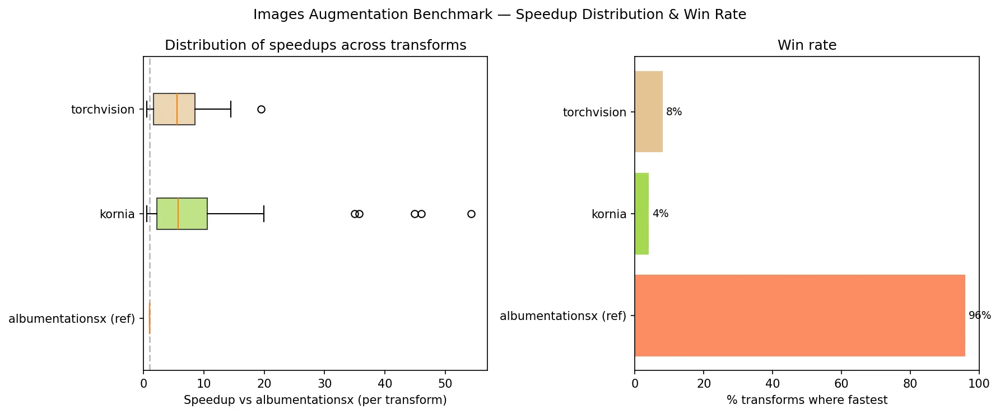
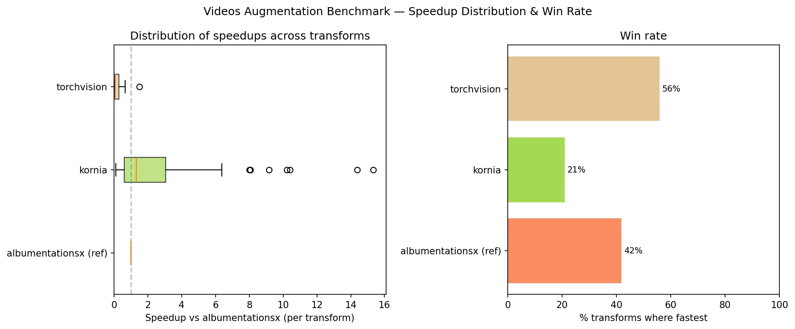

# Image and Video Augmentation Library Benchmarks

A comprehensive benchmarking suite for comparing the performance of popular image and video augmentation libraries including [AlbumentationsX](https://albumentations.ai/), [torchvision](https://docs.pytorch.org/vision/stable/index.html), and [Kornia](https://kornia.readthedocs.io/en/latest/).

## GitAds Sponsored
[](https://gitads.dev/v1/ad-track?source=albumentations-team/benchmark@github)

<details>
<summary>Table of Contents</summary>

- [Image and Video Augmentation Library Benchmarks](#image-and-video-augmentation-library-benchmarks)
  - [Overview](#overview)
  - [Benchmark Types](#benchmark-types)
    - [Image Benchmarks](#image-benchmarks)
    - [Video Benchmarks](#video-benchmarks)
  - [Performance Highlights](#performance-highlights)
    - [Image Augmentation Performance](#image-augmentation-performance)
    - [Video Augmentation Performance](#video-augmentation-performance)
  - [Requirements](#requirements)
  - [Supported Libraries](#supported-libraries)
  - [Setup](#setup)
    - [Getting Started](#getting-started)
    - [Using Your Own Data](#using-your-own-data)
  - [Running Benchmarks](#running-benchmarks)
    - [Image Benchmarks](#running-image-benchmarks)
    - [Video Benchmarks](#running-video-benchmarks)
  - [Methodology](#methodology)
  - [Contributing](#contributing)

</details>

## Overview

This benchmark suite measures the throughput and performance characteristics of common augmentation operations across different libraries. It features:

- Benchmarks for both image and video augmentation
- Adaptive warmup to ensure stable measurements
- Multiple runs for statistical significance
- Detailed performance metrics and system information
- Thread control settings for consistent performance
- Support for multiple image/video formats and loading methods

## Benchmark Types

### Image Benchmarks

The image benchmarks compare the performance of various libraries on standard image transformations. All benchmarks are run on a single CPU thread to ensure consistent and comparable results.

[**Detailed Image Benchmark Results**](docs/images/README.md)



<!-- IMAGE_BENCHMARK_TABLE_START -->
| Transform            | albumentationsx 2.0.18 [img/s]   | kornia 0.8.2 [img/s]   | torchvision 0.25.0 [img/s]   | Speedup (albx/fastest other)   |
|:---------------------|:---------------------------------|:-----------------------|:-----------------------------|:-------------------------------|
| Affine               | **1345 ± 39**                    | -                      | 264 ± 16                     | 5.09x                          |
| AutoContrast         | **1598 ± 19**                    | 576 ± 18               | 178 ± 2                      | 2.78x                          |
| Blur                 | **7411 ± 299**                   | 365 ± 8                | -                            | 20.31x                         |
| Brightness           | **11809 ± 1365**                 | 2276 ± 169             | 1681 ± 21                    | 5.19x                          |
| CLAHE                | **619 ± 8**                      | 109 ± 2                | -                            | 5.68x                          |
| CenterCrop128        | 107145 ± 5452                    | -                      | **203348 ± 7429**            | 0.53x                          |
| ChannelDropout       | **11815 ± 611**                  | 3065 ± 179             | -                            | 3.85x                          |
| ChannelShuffle       | **8085 ± 225**                   | 1446 ± 115             | 4290 ± 303                   | 1.88x                          |
| ColorJitter          | **1132 ± 10**                    | 100 ± 3                | 88 ± 3                       | 11.33x                         |
| Contrast             | **12680 ± 553**                  | 2159 ± 193             | 870 ± 26                     | 5.87x                          |
| CornerIllumination   | **447 ± 10**                     | 350 ± 4                | -                            | 1.28x                          |
| Equalize             | **1198 ± 11**                    | 310 ± 17               | 588 ± 17                     | 2.04x                          |
| Erasing              | **27290 ± 6206**                 | 776 ± 45               | 10421 ± 629                  | 2.62x                          |
| GaussianBlur         | **2509 ± 13**                    | 353 ± 13               | 124 ± 17                     | 7.12x                          |
| GaussianIllumination | **622 ± 54**                     | 428 ± 16               | -                            | 1.45x                          |
| GaussianNoise        | **320 ± 13**                     | 121 ± 2                | -                            | 2.64x                          |
| Grayscale            | **19884 ± 2088**                 | 1574 ± 77              | 2206 ± 179                   | 9.02x                          |
| HorizontalFlip       | **12947 ± 578**                  | 1128 ± 42              | 2234 ± 27                    | 5.79x                          |
| Hue                  | **1689 ± 58**                    | 123 ± 7                | -                            | 13.70x                         |
| Invert               | **33874 ± 5105**                 | 4412 ± 293             | 22891 ± 2484                 | 1.48x                          |
| JpegCompression      | **1277 ± 32**                    | 117 ± 5                | 826 ± 11                     | 1.55x                          |
| LinearIllumination   | 442 ± 9                          | **849 ± 22**           | -                            | 0.52x                          |
| LongestMaxSize       | **3544 ± 123**                   | 481 ± 36               | -                            | 7.38x                          |
| MotionBlur           | **4187 ± 90**                    | 117 ± 6                | -                            | 35.85x                         |
| Normalize            | **1510 ± 60**                    | 1173 ± 39              | 947 ± 33                     | 1.29x                          |
| OpticalDistortion    | **729 ± 15**                     | 193 ± 4                | -                            | 3.77x                          |
| Pad                  | **34558 ± 4740**                 | -                      | 4480 ± 129                   | 7.71x                          |
| Perspective          | **1153 ± 16**                    | 170 ± 5                | 217 ± 8                      | 5.30x                          |
| PhotoMetricDistort   | **859 ± 57**                     | -                      | 80 ± 3                       | 10.70x                         |
| PlankianJitter       | **2994 ± 124**                   | 1578 ± 100             | -                            | 1.90x                          |
| PlasmaBrightness     | **142 ± 4**                      | 76 ± 2                 | -                            | 1.87x                          |
| PlasmaContrast       | **136 ± 6**                      | 75 ± 6                 | -                            | 1.81x                          |
| PlasmaShadow         | 178 ± 7                          | **211 ± 5**            | -                            | 0.84x                          |
| Posterize            | 12776 ± 728                      | 709 ± 27               | **17723 ± 1380**             | 0.72x                          |
| RGBShift             | **2308 ± 9**                     | 1787 ± 71              | -                            | 1.29x                          |
| Rain                 | **1970 ± 82**                    | 1591 ± 61              | -                            | 1.24x                          |
| RandomCrop128        | 103591 ± 1101                    | 2802 ± 40              | **112838 ± 2384**            | 0.92x                          |
| RandomGamma          | **12351 ± 418**                  | 226 ± 5                | -                            | 54.54x                         |
| RandomResizedCrop    | **4292 ± 40**                    | 579 ± 6                | 789 ± 27                     | 5.44x                          |
| Resize               | **3365 ± 76**                    | 648 ± 15               | 271 ± 4                      | 5.19x                          |
| Rotate               | **2805 ± 119**                   | 330 ± 7                | 319 ± 8                      | 8.49x                          |
| SaltAndPepper        | **578 ± 7**                      | 450 ± 5                | -                            | 1.29x                          |
| Saturation           | **1179 ± 46**                    | 132 ± 4                | -                            | 8.95x                          |
| Sharpen              | **2205 ± 39**                    | 263 ± 14               | 274 ± 9                      | 8.04x                          |
| Shear                | **1235 ± 29**                    | 358 ± 11               | -                            | 3.45x                          |
| SmallestMaxSize      | **2447 ± 160**                   | 375 ± 10               | -                            | 6.53x                          |
| Snow                 | **667 ± 18**                     | 129 ± 4                | -                            | 5.16x                          |
| Solarize             | **11959 ± 707**                  | 262 ± 3                | 1117 ± 35                    | 10.71x                         |
| ThinPlateSpline      | **80 ± 1**                       | 61 ± 2                 | -                            | 1.31x                          |
| VerticalFlip         | **27128 ± 1197**                 | 2387 ± 58              | 26928 ± 4799                 | 1.01x                          |
<!-- IMAGE_BENCHMARK_TABLE_END -->

### Video Benchmarks

The video benchmarks compare CPU-based processing (AlbumentationsX) with GPU-accelerated processing (Kornia) for video transformations. The benchmarks use the [UCF101 dataset](https://www.crcv.ucf.edu/data/UCF101.php), which contains realistic videos from 101 action categories.

[**Detailed Video Benchmark Results**](docs/videos/README.md)



<!-- VIDEO_BENCHMARK_TABLE_START -->
| Transform            | albumentationsx (video) 2.0.18 [vid/s]   | kornia (video) 0.8.0 [vid/s]   | torchvision (video) 0.21.0 [vid/s]   | Speedup (albx/fastest other)   |
|:---------------------|:-----------------------------------------|:-------------------------------|:-------------------------------------|:-------------------------------|
| Affine               | -                                        | 21 ± 0                         | **453 ± 0**                          | N/A                            |
| AutoContrast         | 19 ± 0                                   | 21 ± 0                         | **578 ± 17**                         | 0.03x                          |
| Blur                 | **90 ± 7**                               | 21 ± 0                         | -                                    | 4.34x                          |
| Brightness           | 166 ± 3                                  | 22 ± 0                         | **756 ± 435**                        | 0.22x                          |
| CenterCrop128        | 687 ± 125                                | 70 ± 1                         | **1133 ± 235**                       | 0.61x                          |
| ChannelDropout       | **126 ± 3**                              | 22 ± 0                         | -                                    | 5.78x                          |
| ChannelShuffle       | 24 ± 0                                   | 20 ± 0                         | **958 ± 0**                          | 0.02x                          |
| ColorJitter          | 15 ± 0                                   | 19 ± 0                         | **69 ± 0**                           | 0.21x                          |
| Contrast             | 162 ± 9                                  | 22 ± 0                         | **547 ± 13**                         | 0.30x                          |
| CornerIllumination   | **7 ± 0**                                | 3 ± 0                          | -                                    | 2.65x                          |
| Equalize             | 13 ± 0                                   | 4 ± 0                          | **192 ± 1**                          | 0.07x                          |
| Erasing              | **297 ± 14**                             | -                              | 255 ± 7                              | 1.17x                          |
| GaussianBlur         | 39 ± 1                                   | 22 ± 0                         | **543 ± 11**                         | 0.07x                          |
| GaussianIllumination | 9 ± 0                                    | **20 ± 0**                     | -                                    | 0.46x                          |
| GaussianNoise        | 9 ± 0                                    | **22 ± 0**                     | -                                    | 0.38x                          |
| Grayscale            | 73 ± 3                                   | 22 ± 0                         | **838 ± 467**                        | 0.09x                          |
| HorizontalFlip       | 27 ± 0                                   | 22 ± 0                         | **978 ± 49**                         | 0.03x                          |
| Hue                  | **22 ± 0**                               | 20 ± 0                         | -                                    | 1.11x                          |
| Invert               | 345 ± 7                                  | 22 ± 0                         | **843 ± 176**                        | 0.41x                          |
| LinearIllumination   | **6 ± 0**                                | 4 ± 0                          | -                                    | 1.48x                          |
| MedianBlur           | **21 ± 0**                               | 8 ± 0                          | -                                    | 2.50x                          |
| Normalize            | 17 ± 0                                   | 22 ± 0                         | **461 ± 0**                          | 0.04x                          |
| Pad                  | 211 ± 12                                 | -                              | **760 ± 338**                        | 0.28x                          |
| PlankianJitter       | **48 ± 1**                               | 11 ± 0                         | -                                    | 4.45x                          |
| PlasmaBrightness     | 3 ± 0                                    | **17 ± 0**                     | -                                    | 0.18x                          |
| PlasmaContrast       | 2 ± 0                                    | **17 ± 0**                     | -                                    | 0.14x                          |
| PlasmaShadow         | 5 ± 0                                    | **19 ± 0**                     | -                                    | 0.29x                          |
| Posterize            | 181 ± 8                                  | -                              | **631 ± 15**                         | 0.29x                          |
| RGBShift             | 7 ± 0                                    | **22 ± 0**                     | -                                    | 0.32x                          |
| Rain                 | **24 ± 1**                               | 4 ± 0                          | -                                    | 6.24x                          |
| RandomCrop128        | 700 ± 36                                 | 65 ± 0                         | **1133 ± 15**                        | 0.62x                          |
| RandomGamma          | **163 ± 1**                              | 22 ± 0                         | -                                    | 7.53x                          |
| RandomResizedCrop    | 23 ± 0                                   | 6 ± 0                          | **182 ± 16**                         | 0.12x                          |
| Resize               | 21 ± 1                                   | 6 ± 0                          | **140 ± 35**                         | 0.15x                          |
| Rotate               | 46 ± 1                                   | 22 ± 0                         | **534 ± 0**                          | 0.09x                          |
| SaltAndPepper        | **11 ± 0**                               | 9 ± 0                          | -                                    | 1.27x                          |
| Saturation           | 15 ± 0                                   | **37 ± 0**                     | -                                    | 0.42x                          |
| Sharpen              | 36 ± 1                                   | 18 ± 0                         | **420 ± 9**                          | 0.09x                          |
| Solarize             | 191 ± 1                                  | 21 ± 0                         | **628 ± 6**                          | 0.30x                          |
| VerticalFlip         | 374 ± 7                                  | 22 ± 0                         | **978 ± 5**                          | 0.38x                          |
<!-- VIDEO_BENCHMARK_TABLE_END -->

## Performance Highlights

### Image Augmentation Performance

<!-- IMAGE_SPEEDUP_SUMMARY_START -->
See the full benchmark table above for image results.
<!-- IMAGE_SPEEDUP_SUMMARY_END -->

### Video Augmentation Performance

<!-- VIDEO_SPEEDUP_SUMMARY_START -->
See the full benchmark table above for video results.
<!-- VIDEO_SPEEDUP_SUMMARY_END -->

## Requirements

The benchmark automatically creates isolated virtual environments for each library and installs the necessary dependencies. Base requirements:

- Python 3.10+
- uv (for fast package installation)
- Disk space for virtual environments
- Image/video dataset in a supported format

## Supported Libraries

- [AlbumentationsX](https://albumentations.ai/)
- [torchvision](https://docs.pytorch.org/vision/stable/index.html)
- [Kornia](https://kornia.readthedocs.io/en/latest/)

Each library's specific dependencies are managed through separate requirements files in the `requirements/` directory.

## Setup

### Getting Started

For testing and comparison purposes, you can use standard datasets:

**For image benchmarks:**
```bash
wget https://image-net.org/data/ILSVRC/2012/ILSVRC2012_img_val.tar
tar -xf ILSVRC2012_img_val.tar -C /path/to/your/target/directory
```

**For video benchmarks:**
```bash
# UCF101 dataset
wget https://www.crcv.ucf.edu/data/UCF101/UCF101.rar
unrar x UCF101.rar -d /path/to/your/target/directory
```

### Using Your Own Data

We strongly recommend running the benchmarks on your own dataset that matches your use case:

- Use images/videos that are representative of your actual workload
- Consider sizes and formats you typically work with
- Include edge cases specific to your application

This will give you more relevant performance metrics for your specific use case.

## Running Benchmarks

### Running Image Benchmarks

To benchmark a single library:

```bash
./run_single.sh -l albumentationsx -d /path/to/images -o /path/to/output
```

To run benchmarks for all supported libraries and generate a comparison:

```bash
./run_all.sh -d /path/to/images -o /path/to/output --update-docs
```

### Running Video Benchmarks

To benchmark a single library:

```bash
./run_video_single.sh -l albumentationsx -d /path/to/videos -o /path/to/output
```

To run benchmarks for all supported libraries and generate a comparison:

```bash
./run_video_all.sh -d /path/to/videos -o /path/to/output --update-docs
```

#### Using Custom Transforms

To benchmark transforms, create a Python file defining `LIBRARY` and `CUSTOM_TRANSFORMS`:

```python
# my_transforms.py
import albumentations as A

# Specify the library
LIBRARY = "albumentationsx"

CUSTOM_TRANSFORMS = [
    # Test different parameters of the same transform
    A.ToGray(method="weighted_average", p=1),
    A.ToGray(method="pca", p=1),

    # Different noise levels
    A.GaussNoise(var_limit=(10.0, 50.0), p=1),
    A.GaussNoise(var_limit=(100.0, 200.0), p=1),

    # Any other transforms...
    A.RandomBrightnessContrast(brightness_limit=0.2, contrast_limit=0.2, p=1),
]
```

Then run:

```bash
# Using the shell script (recommended)
./run_video_single.sh -d /path/to/videos -o output/ -s my_transforms.py

# Or Python directly
python -m benchmark.video_runner -d /path/to/videos -o output.json -s my_transforms.py
```

The results will show each transform with all its parameters:
- `ToGray(method=weighted_average, p=1)`
- `ToGray(method=pca, p=1)`
- `GaussNoise(var_limit=(10.0, 50.0), mean=0, p=1, per_channel=True)`

See `examples/custom_video_specs_template.py` and `example_direct_transforms.py` for more examples.

To analyze parametric results:

```bash
python tools/analyze_parametric_results.py parametric_results.json
```

This will show:
- Best and worst configurations for each transform
- Performance differences between parameter choices
- Optimal settings for your use case

## Methodology

The benchmark methodology is designed to ensure fair and reproducible comparisons:

1. **Data Loading**: Data is loaded using library-specific loaders to ensure optimal format compatibility
2. **Warmup Phase**: Adaptive warmup until performance variance stabilizes
3. **Measurement Phase**: Multiple runs with statistical analysis
4. **Environment Control**: Consistent thread settings and hardware utilization

For detailed methodology, see the specific benchmark READMEs:
- [Image Benchmark Methodology](docs/images/README.md#methodology)
- [Video Benchmark Methodology](docs/videos/README.md#methodology)

## Contributing

Contributions are welcome! If you'd like to add support for a new library, improve the benchmarking methodology, or fix issues, please submit a pull request.

When contributing, please:
1. Follow the existing code style
2. Add tests for new functionality
3. Update documentation as needed
4. Ensure all tests pass

<!-- GitAds-Verify: ROVYUM6GM9I4GUYXL61ND2O2ZT2SVPGP -->
