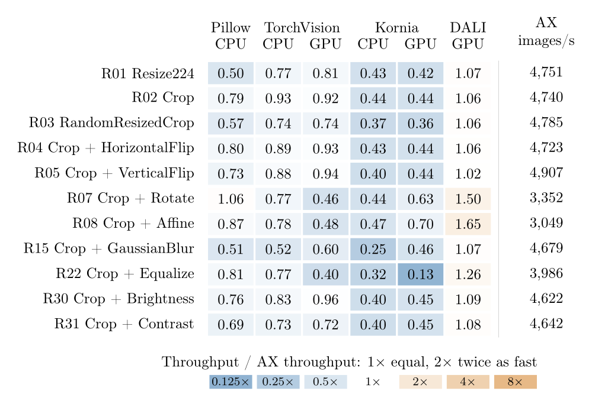
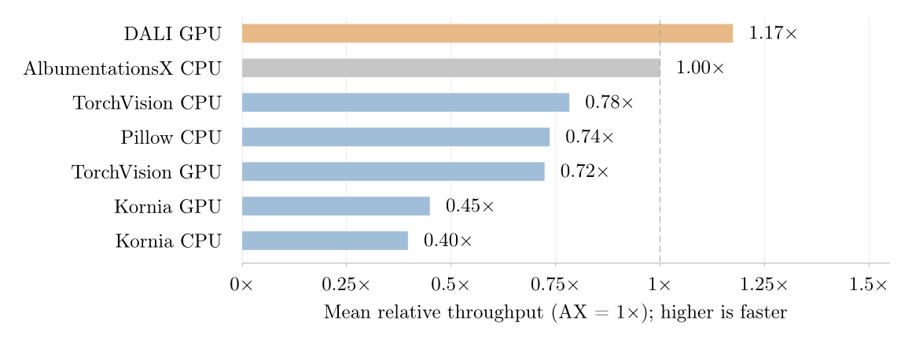
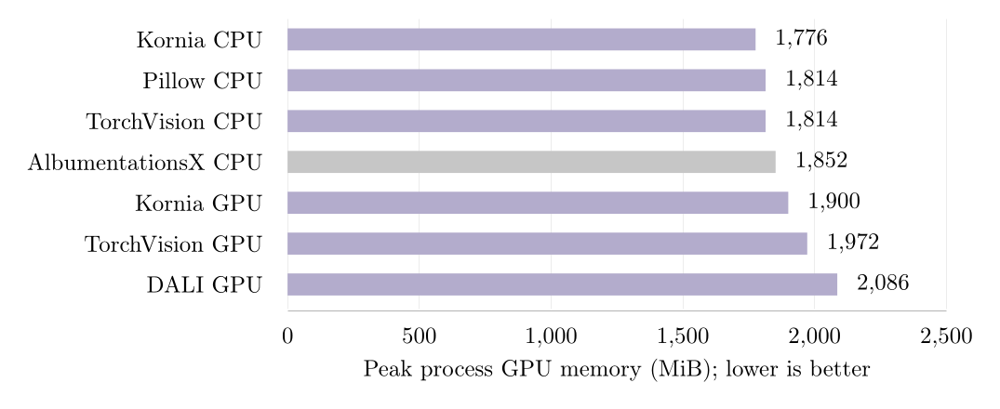
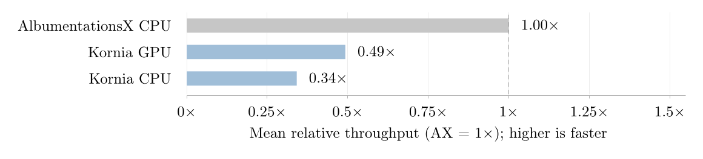
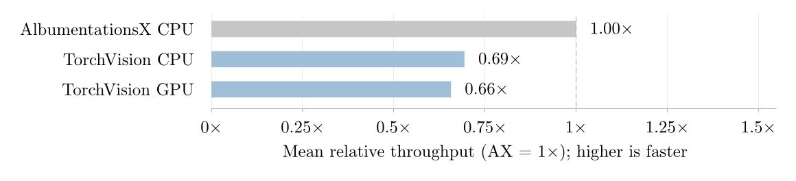
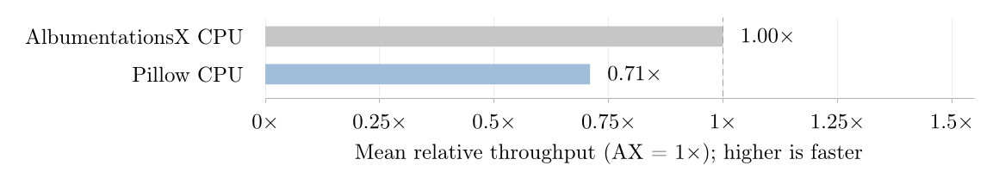
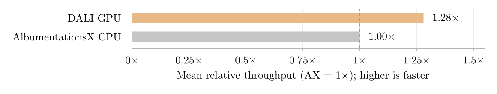
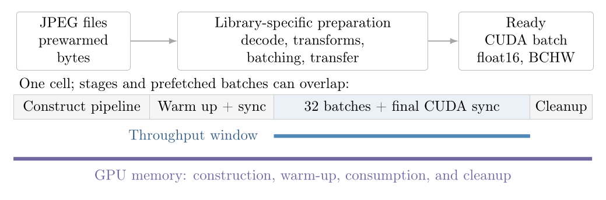

# Augmentation Benchmark

## Citing

If you use this code, benchmark results, or methodology in your research, please cite
[RGB Input Pipelines: Throughput, GPU Memory, and Transformation Coverage](https://arxiv.org/abs/2609.06635).
Your citation makes the project's research impact visible to funders and helps sustain maintenance.

```bibtex
@misc{iglovikov2026rgbinputpipelines,
  title={RGB Input Pipelines: Throughput, GPU Memory, and Transformation Coverage},
  author={Vladimir Iglovikov},
  year={2026},
  eprint={2609.06635},
  archivePrefix={arXiv},
  primaryClass={cs.PF},
  url={https://arxiv.org/abs/2609.06635}
}
```

## About the benchmark

How quickly can an image input pipeline deliver a complete batch to a GPU, and how much GPU memory does it use? This repository compares seven RGB JPEG-to-CUDA paths from AlbumentationsX, Pillow, TorchVision, Kornia, and NVIDIA DALI.

The published preprint, [**RGB Input Pipelines: Throughput, GPU Memory, and Transformation Coverage**](https://arxiv.org/abs/2609.06635), reports 759 measurements: 253 implementation–recipe pairs across 57 selected recipes, with three seeds per pair. Each measurement records throughput and peak process GPU memory in the same pass. A separate census maps entries from a selected AlbumentationsX transformation catalog to APIs in other libraries.

Read the [per-recipe results and seed observations](paper/generated/recipe-results.csv), [reproduction instructions](paper/README.md), or [manuscript source](paper/main.tex). The reported experiment uses [source revision `5fc35f6`](https://github.com/albumentations-team/benchmark/tree/5fc35f6fdd177c286cbc4f5e39d1520576d6464a).

<!-- BEGIN GENERATED RESULTS -->

## Results for the selected run

Run [`3f8e2e315710`](docs/generated/run.json); [measured source `5fc35f6`](https://github.com/albumentations-team/benchmark/tree/5fc35f6fdd177c286cbc4f5e39d1520576d6464a). 759 measurements, 253 implementation/recipe pairs, 57 recipes, 3 seeds per pair.

This is the run reported in the [published preprint](https://arxiv.org/abs/2609.06635).

All rows below use the same 11 recipes. Throughput is the arithmetic mean of per-recipe ratios: each path's median over 3 seeds divided by AX's median for that recipe. GPU memory is the median of those recipes' peak-memory medians.

| Measured path | Version | Mean throughput / AX (higher is faster) | Peak process GPU memory (MiB, lower is better) |
| --- | --- | ---: | ---: |
| DALI GPU | 2.2.0 | 1.17× | 2,086 |
| AlbumentationsX CPU | 2.4.2 | 1.00× | 1,852 |
| TorchVision CPU | 0.28.0+cu130 | 0.78× | 1,814 |
| Pillow CPU | 12.3.0 | 0.74× | 1,814 |
| TorchVision GPU | 0.28.0+cu130 | 0.72× | 1,972 |
| Kornia GPU | 0.8.3 | 0.45× | 1,900 |
| Kornia CPU | 0.8.3 | 0.40× | 1,776 |

### Per-recipe throughput

Each cell compares the same recipe's seed medians. AX images/s gives the absolute scale. Color shows the ratio on a logarithmic scale, not statistical significance. The published DALI Crop and Affine mappings differ from other paths; see the interpretation below.



### Throughput and GPU memory on the common recipe set





### Broader pairwise comparisons

Each chart uses the exact recipe intersection of the paths it shows. Recipe sets differ between charts, so their averages cannot rank all libraries together.









The counts below include recipes supported by only one competing CPU/GPU path. AX wins when it exceeds every available competing path. Ratios and memory differences use the faster competitor per recipe; exact ties select CPU.

| Competitor | Shared recipes | AX faster | Median competitor / AX throughput | Median competitor - AX GPU memory (MiB) |
| --- | ---: | ---: | ---: | ---: |
| Kornia | 51 | 50 | 0.45× | +72 |
| TorchVision | 26 | 26 | 0.81× | -38 |
| Pillow | 26 | 25 | 0.74× | -38 |
| DALI | 22 | 0 | 1.18× | +298 |

### Measurement settings

Machine: `g2-standard-16`, `nvidia-l4`. Output: CUDA `float16` BCHW `256x3x224x224`. Dataset: 10,000 selected files. Seeds: 137, 138, 139. Workers: 15; prefetch setting: 2; persistent workers: true; dataset prewarm: true.

Warm-up batches: 1. Throughput measures 32 batches (8,192 images), ending after CUDA synchronization. Construction and worker startup are excluded; prefetch effects remain.

GPU memory is sampled by NVML every 50 ms from before pipeline construction through final synchronization and cleanup in the same pass. The peak includes process and library allocations. Shorter peaks may be missed; CPU and model memory are not measured.



<!-- END GENERATED RESULTS -->

## Update the README results

The tables, measurement settings, eight figures, and [machine-readable results](docs/generated/results.json) are generated from one selected run. After downloading that run's `run.json` and complete `cells/` directory, run from the repository root:

```bash
uv run python -m paper.generate_readme --run /path/to/run.json --cells /path/to/cells
```

Rendering requires `pdflatex` with TikZ and `preview`, and Poppler's `pdftocairo`. If the run used a different recipe catalog, pass its file with `--recipes /path/to/rgb.yaml`; its checksum must match the manifest.

Rerun this command to select another complete run. It updates this README and `docs/generated/` together; editing raw JSON alone does not trigger an update. Commit those generated files with the README. Website builds read `docs/generated/results.json` from `main`; it contains the selected run manifest, versions, seed observations, recipe medians and ranges, figure dimensions and SHA-256 checksums, and the same common-set and pairwise aggregates used above. Publish a newer completed run with this command to update website consumers; `paper/generated/` remains the published article snapshot. Runs and their cells are immutable: changed benchmark inputs require a new run.

The published results stay in [`paper/generated/`](paper/generated). The README and paper share the calculation functions and [`paper/figures.tex`](paper/figures.tex), so figure design and aggregation have one implementation. The [paper generator](paper/README.md#regenerate-the-reported-data) remains pinned to the published run.

## How to interpret the published comparisons

Recipe parameters were manually matched for practical effect. Output validation checks shape, layout, dtype, and device. It does not establish equal pixels, random distributions, or augmentation quality. The published run's adapters include these consequential differences:

- DALI's `RandomCrop224` resizes the short side to 224 before cropping; the other paths crop the decoded image and pad small inputs when needed.
- DALI's `Affine` uses scale and shift but omits the catalog's rotation and shear. Affine sampling also differs among AX, TorchVision, and Kornia.
- Seeds 137, 138, and 139 specify repeated executions and shared file orders, not matched augmentation draws. AX constructs `Compose` without an explicit seed, and DataLoader workers use a fixed loader-generator seed.

The [paper's Section 2.3 and Appendix C](https://arxiv.org/pdf/2609.06635) explain these mappings. Three observations do not establish statistical significance. The experiment measures complete input paths, so it cannot attribute an advantage to a decoder, transform, or transfer in isolation. Other hardware, image sizes, batch sizes, worker policies, or composed recipes require their own measurements; training effects require running the model too.

## Transformation coverage

The [coverage census](catalog/operations.yaml) starts from 118 selected AX RGB 2D entries and records 46 Kornia, 38 TorchVision, and 23 Pillow correspondences. These counts describe matches to the AX selection, not competing libraries' total API sizes or numerically equivalent operations. One competing API can match several AX entries. DALI participates only in the execution experiment.

The published census uses AX 2.3.7; the published execution run uses AX 2.4.2. Coverage entries and the 57 measured recipes are different units, and unsupported recipes never count as zero-speed results.

## Run the RGB matrix

Read [the execution contract](docs/benchmark_execution_contract.md) before changing or launching a run. Configure [GCP access](configs/cloud/gcp-l4.yaml) and access to the [dataset archive](configs/families/rgb.yaml), then commit the intended inputs. With `uv` and an authenticated `gcloud` installed, run from the repository root:

```bash
uv run augbench launch-rgb
```

The command requires a clean worktree, validates existing immutable cells, and resumes missing cells for the same run identity. It reuses an active VM for that run or provisions one L4 VM. Code and frozen inputs determine the run identity; changing them creates a new run. To inspect or regenerate the published tables without launching a VM, follow the [paper's reproduction instructions](paper/README.md).

## Repository layout

```text
catalog/       operation census and RGB recipes
configs/       workload and GCP configuration
environments/  locked RGB benchmark environment
infra/gcp/     VM bootstrap
src/augbench/  benchmark implementation
paper/         manuscript, bibliography, generated tables, and per-seed data
```

RGB is the only runnable study. 9-channel images, video, and volumes require separate datasets, recipes, implementations, output contracts, and runs.
