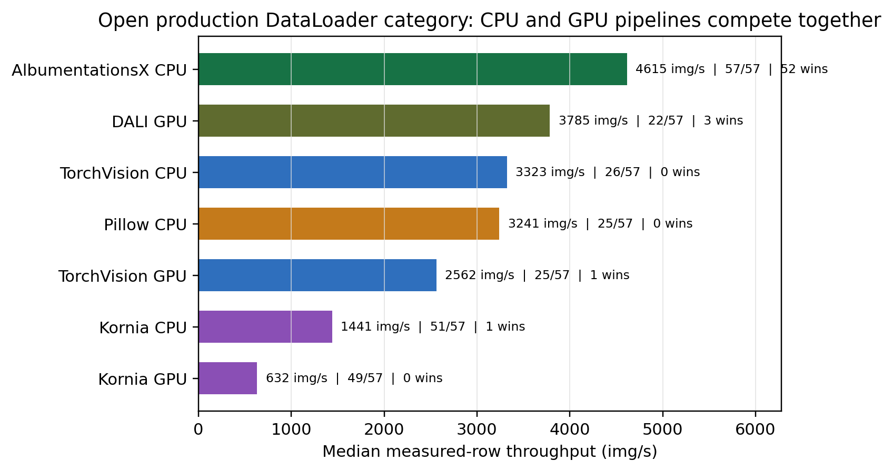
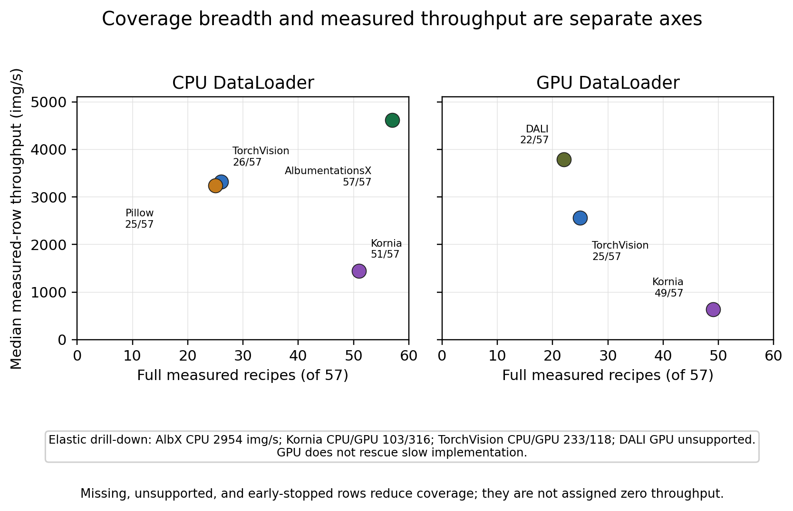
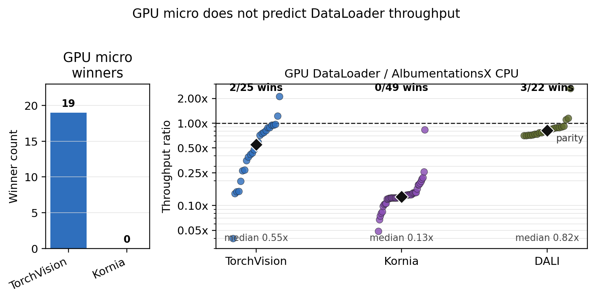
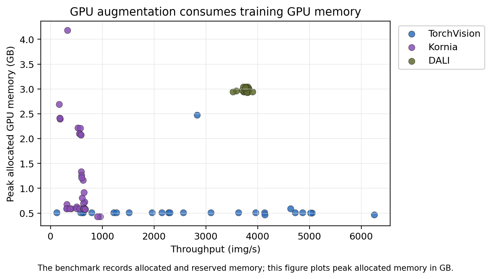
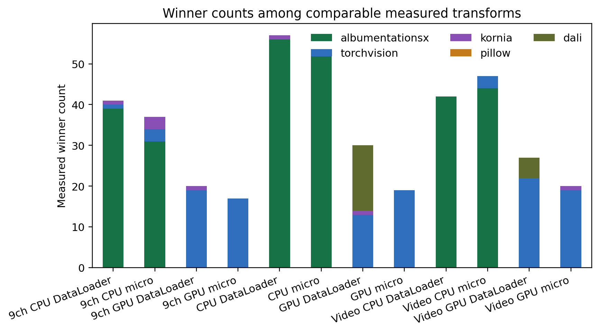

# Image and Video Augmentation Library Benchmarks

A comprehensive benchmarking suite for comparing the performance of popular image and video augmentation libraries including [AlbumentationsX](https://albumentations.ai/), [torchvision](https://docs.pytorch.org/vision/stable/index.html), and [Kornia](https://kornia.readthedocs.io/en/latest/).

## GitAds Sponsored
[](https://gitads.dev/v1/ad-track?source=albumentations-team/benchmark@github)

<details>
<summary>Table of Contents</summary>

- [Image and Video Augmentation Library Benchmarks](#image-and-video-augmentation-library-benchmarks)
  - [Overview](#overview)
  - [Benchmark Types](#benchmark-types)
    - [Image Benchmarks](#image-benchmarks)
    - [Video Benchmarks](#video-benchmarks)
  - [Benchmark Results](#benchmark-results)
    - [Result Tables](#result-tables)
    - [RGB](#rgb)
    - [9-Channel](#9-channel)
    - [Video](#video)
  - [Requirements](#requirements)
  - [Supported Libraries](#supported-libraries)
  - [Setup](#setup)
    - [Getting Started](#getting-started)
    - [Using Your Own Data](#using-your-own-data)
  - [Running Benchmarks](#running-benchmarks)
    - [Google Cloud (detached)](#google-cloud-detached)
    - [RGB Image Benchmarks](#rgb-image-benchmarks-all-libraries)
    - [Video Benchmarks](#video-benchmarks-all-libraries)
  - [Architecture](#architecture)
  - [Methodology](#methodology)
  - [Contributing](#contributing)

</details>

## Overview

This benchmark suite measures the throughput and performance characteristics of common augmentation operations across different libraries. It features:

- Benchmarks for both image and video augmentation
- Adaptive warmup to ensure stable measurements
- Multiple runs for statistical significance
- Detailed performance metrics and system information
- Thread control settings for consistent performance
- Support for multiple image/video formats and loading methods

## Benchmark Types

### Image Benchmarks

The image benchmarks compare the performance of various libraries on standard image transformations. Interpret the tables by benchmark mode:

- **Micro / profiler benchmarks** preload decoded images and time augmentation only. These runs use one internal CPU thread for every library to measure single-stream transform cost. For tensor-native image libraries (`torchvision`, `kornia`), `--device cuda|mps|auto` preloads tensors on the selected device and times device-resident augmentation.
- **DataLoader benchmarks** use recipe-level training pipelines, not primitive transform-only timing. Every DataLoader recipe includes fixed crop shape preparation, the measured augmentation, normalization, tensor conversion, and default collation; those fixed steps are included in throughput. `memory_dataloader_augment` preloads decoded samples and isolates worker/augmentation scaling; `decode_dataloader_augment` adds disk read/decode; `decode_dataloader_augment_batch_copy` additionally materializes the collated batch tensor and copies it to CUDA/MPS when requested. CPU image pipelines apply the full recipe inside the dataset path before collation. TorchVision and Kornia image GPU DataLoader rows split the recipe: workers use the same library on CPU for crop/pad shape preparation, then the collated batch is copied to GPU. Kornia runs the measured augmentation batched with `same_on_batch=False` plus normalization; TorchVision runs only the measured augmentation in a per-sample GPU loop to preserve per-image randomness, then applies normalization once to the whole batch. Video ecosystem rows also include DALI native GPU pipelines and a PyTorchVideo canonical training recipe. Pipeline recipes include `Normalize+ToTensor` in the library spec: AlbumentationsX uses `ToTensorV2`, Pillow uses `torchvision.transforms.PILToTensor` before normalization, and torchvision/Kornia already operate on tensors. All pipeline recipes return fixed-shape tensor outputs that PyTorch default collation can stack. These runs record worker counts, thread policy, device target, randomness scope, and whether decode/collate/device transfer were included.

The checked-in result tables use `2,000` ImageNet validation images for image micro benchmarks and `10,000` images for
image DataLoader benchmarks. Full `50,000`-image ImageNet sweeps are optional when validating a specific production
deployment.

### Video Benchmarks

Video benchmarks use fixed-length clips from UCF101. AlbumentationsX receives clips as NumPy arrays with shape
`(T, H, W, C)` and applies transforms through `transform(images=video)["images"]`, so parameters are sampled once per
clip and shared across frames. This matches the training-style semantics used by Kornia's `same_on_batch=True` path.

## Benchmark Results

<!-- BENCHMARK_RESULTS_START -->

The figures and tables below are generated from checked-in benchmark data.
Website-ready CSV/Markdown exports are in `docs/benchmark_data/`; reusable PNG/PDF figures are in `docs/benchmark_figures/`.

### Figure 1. Open production DataLoader category



CPU and GPU DataLoader implementations compete together over the same 57-recipe universe. Bars show median measured-row throughput; labels show full measured coverage and open-category wins. AlbumentationsX CPU wins 52 of 57 recipes and has the highest median throughput.

### Figure 2. Coverage breadth versus measured throughput



DataLoader coverage and throughput are distinct benchmark axes. The x-axis is the count of full measured recipes over the canonical 57 CPU DataLoader recipes, and the y-axis is median throughput over measured rows only. The Elastic drill-down shows that GPU execution does not rescue a slow implementation of a hard transform.

### Figure 3. GPU DataLoader pipelines versus AlbumentationsX CPU



Each point is a paired GPU DataLoader recipe divided by the AlbumentationsX CPU DataLoader throughput for the same recipe. The dashed line marks parity. Most GPU rows fall below parity once the full DataLoader path is measured.

### Figure 4. GPU memory consumed by augmentation pipelines



GPU augmentation also consumes accelerator memory that would otherwise be available to model parameters, activations, optimizer state, or larger batches. Each point is a measured GPU DataLoader row with peak allocated memory recorded during the benchmark.

### Figure 5. Winner counts by benchmark regime



Measured winner counts among comparable measured transforms by regime. The conclusion changes when moving from augmentation-only microbenchmarks to production-style DataLoader measurements.

### Result Tables

The tables below summarize the checked-in benchmark results for RGB images, 9-channel images, and video clips. Image table values are medians with 95% confidence intervals when available; the video fallback table reports its own uncertainty in the column headers. Image tables report throughput in images/s; the video table reports clips/s. A dash means no full measured row is available.

### RGB

| Transform | AlbumentationsX<br>CPU micro | AlbumentationsX<br>CPU DataLoader | TorchVision<br>GPU micro | DALI<br>GPU DataLoader |
| --- | ---: | ---: | ---: | ---: |
| Affine | 871.8 ± 9.1 | **4527.7 ± 31.8** | 1316.9 ± 76.9 | 3806.0 ± 90.1 |
| AutoContrast | 1242.7 ± 21.7 | **4645.6 ± 90.1** | 3942.2 ± 531.8 | - |
| Blur | 4448.7 ± 19.5 | **5274.9 ± 195.9** | - | - |
| Brightness | **6912.2 ± 14.4** | 5230.9 ± 274.5 | 5706.8 ± 956.3 | 3797.8 ± 38.0 |
| CLAHE | 282.9 ± 1.3 | 3384.5 ± 192.0 | - | **3730.6 ± 158.7** |
| ChannelDropout | **6810.1 ± 73.5** | 5316.5 ± 101.4 | - | - |
| ChannelShuffle | 4337.4 ± 14.5 | 5086.6 ± 250.8 | **9557.4 ± 2514.8** | - |
| ColorJiggle | 639.3 ± 5.5 | **4255.1 ± 68.1** | 680.0 ± 18.7 | 3742.5 ± 38.5 |
| ColorJitter | 641.4 ± 0.8 | **4224.7 ± 261.0** | 687.0 ± 23.4 | 3817.8 ± 113.7 |
| Contrast | **6932.8 ± 34.1** | 5258.2 ± 162.6 | 3274.0 ± 360.2 | 3759.3 ± 83.0 |
| CornerIllumination | 424.6 ± 2.7 | **3824.1 ± 95.3** | - | - |
| Elastic | 191.0 ± 0.4 | **2954.0 ± 65.9** | - | - |
| EnhanceDetail | 2148.3 ± 14.5 | **5033.1 ± 63.7** | - | - |
| EnhanceEdge | 1373.3 ± 17.6 | **4923.4 ± 112.2** | - | - |
| Equalize | 807.4 ± 3.2 | **4304.4 ± 139.7** | 2015.9 ± 149.1 | 3823.9 ± 56.3 |
| Erasing | **9510.6 ± 83.9** | 5118.2 ± 296.1 | 2242.0 ± 183.9 | 3791.4 ± 50.9 |
| GaussianBlur | 2342.8 ± 4.3 | **5029.0 ± 106.1** | 2803.2 ± 279.1 | 3700.9 ± 94.7 |
| GaussianIllumination | 388.1 ± 1.4 | **3655.9 ± 47.9** | - | - |
| GaussianNoise | 225.1 ± 0.5 | 3321.3 ± 68.1 | - | **3820.0 ± 67.6** |
| Grayscale | 5193.9 ± 1.5 | 5263.2 ± 89.8 | **8863.8 ± 2122.0** | - |
| HorizontalFlip | 8416.0 ± 21.4 | 5218.1 ± 163.2 | **16083.8 ± 5064.7** | 3722.4 ± 86.3 |
| Hue | 966.9 ± 0.9 | **4698.0 ± 54.0** | - | 3784.2 ± 6.0 |
| Invert | 15094.9 ± 69.6 | 5491.9 ± 106.5 | **15936.1 ± 5092.4** | - |
| JpegCompression | 692.0 ± 7.5 | **4106.2 ± 170.9** | - | 3786.2 ± 26.7 |
| LinearIllumination | 520.7 ± 1.2 | **4076.3 ± 91.2** | - | - |
| LongestMaxSize | **2824.5 ± 47.9** | 1316.9 ± 32.7 | - | - |
| MedianBlur | 843.3 ± 4.2 | **4038.1 ± 113.5** | - | - |
| MotionBlur | 1952.5 ± 23.3 | **4614.8 ± 136.8** | - | - |
| OpticalDistortion | 274.4 ± 1.2 | **3556.4 ± 70.4** | - | - |
| Pad | 13181.0 ± 134.1 | 4866.6 ± 92.5 | **16609.6 ± 5327.4** | 3756.1 ± 88.2 |
| Perspective | 559.4 ± 2.0 | **3992.0 ± 131.9** | 760.6 ± 22.8 | - |
| PhotoMetricDistort | 580.9 ± 5.1 | **4149.0 ± 105.1** | 619.4 ± 15.7 | - |
| PlankianJitter | 2253.1 ± 19.2 | **4899.4 ± 85.3** | - | - |
| PlasmaBrightness | 267.0 ± 0.8 | **2672.0 ± 64.8** | - | - |
| PlasmaContrast | 142.8 ± 0.5 | **2155.6 ± 96.2** | - | - |
| PlasmaShadow | 419.8 ± 2.9 | **2795.5 ± 44.2** | - | - |
| Posterize | 14398.5 ± 65.3 | 5319.0 ± 73.7 | **15122.0 ± 4628.1** | - |
| RGBShift | 2292.1 ± 3.2 | **4830.7 ± 131.1** | - | - |
| Rain | 1258.8 ± 2.4 | **4528.5 ± 225.5** | - | - |
| RandomCrop224 | **38380.3 ± 217.1** | 5084.5 ± 122.8 | 15008.3 ± 4670.8 | 3589.1 ± 82.9 |
| RandomGamma | **9937.7 ± 51.6** | 5251.3 ± 153.4 | - | - |
| RandomJigsaw | **5172.0 ± 17.8** | 4868.3 ± 31.1 | - | - |
| RandomResizedCrop | **7150.4 ± 21.0** | 5056.2 ± 143.9 | 3886.9 ± 481.3 | 3898.1 ± 116.7 |
| RandomRotate90 | **5990.0 ± 95.9** | 5086.5 ± 48.6 | - | - |
| Resize | 2462.7 ± 41.7 | 1333.8 ± 15.7 | **6472.7 ± 1160.8** | 3523.1 ± 69.2 |
| Rotate | 1407.6 ± 45.8 | **4782.3 ± 137.3** | 1363.9 ± 59.6 | 3808.5 ± 71.7 |
| SaltAndPepper | 737.7 ± 11.3 | **4459.7 ± 45.9** | - | 3824.4 ± 85.8 |
| Saturation | 846.6 ± 19.1 | **4581.7 ± 110.3** | - | 3792.5 ± 33.6 |
| Sharpen | 1387.6 ± 5.2 | **4821.7 ± 141.8** | 3332.5 ± 389.0 | - |
| Shear | 784.4 ± 6.3 | **4261.2 ± 88.1** | - | 3771.7 ± 61.0 |
| SmallestMaxSize | **2017.5 ± 27.8** | 1328.7 ± 42.2 | - | - |
| Snow | 489.3 ± 3.3 | **4135.0 ± 171.2** | - | - |
| Solarize | 9759.5 ± 38.8 | 5338.8 ± 71.7 | **10111.6 ± 2582.8** | - |
| ThinPlateSpline | 51.7 ± 0.1 | **721.0 ± 66.3** | - | - |
| Transpose | 4626.8 ± 29.6 | **5230.6 ± 130.3** | - | - |
| UnsharpMask | 906.1 ± 2.2 | **4521.6 ± 78.0** | - | - |
| VerticalFlip | 14051.5 ± 61.9 | 5301.7 ± 165.5 | **16368.3 ± 5461.5** | 3766.2 ± 133.8 |

### 9-Channel

| Transform | AlbumentationsX<br>9ch CPU micro | AlbumentationsX<br>9ch CPU DataLoader | TorchVision<br>9ch GPU micro | TorchVision<br>9ch GPU DataLoader |
| --- | ---: | ---: | ---: | ---: |
| Affine | 229.8 ± 0.0 | **1617.5 ± 0.0** | 1187.5 ± 0.0 | 1085.2 ± 0.0 |
| AutoContrast | 316.6 ± 0.0 | **1749.3 ± 0.0** | 1329.1 ± 0.0 | 1024.6 ± 0.0 |
| Blur | 1385.1 ± 0.0 | **1998.8 ± 0.0** | - | - |
| Brightness | **2477.1 ± 0.0** | 2041.0 ± 0.0 | 1952.7 ± 0.0 | 1271.8 ± 0.0 |
| ChannelDropout | **3335.5 ± 0.0** | 2027.3 ± 0.0 | - | - |
| ChannelShuffle | 1447.9 ± 0.0 | 1946.7 ± 0.0 | **10344.1 ± 0.0** | 1341.8 ± 0.0 |
| Contrast | **2482.3 ± 0.0** | 2113.2 ± 0.0 | 1162.8 ± 0.0 | 920.2 ± 0.0 |
| CornerIllumination | 195.8 ± 0.0 | **1627.4 ± 0.0** | - | - |
| Elastic | 121.0 ± 0.0 | **1404.3 ± 0.0** | - | 99.3 ± 0.0 |
| Erasing | **3658.7 ± 0.0** | 2024.1 ± 0.0 | 1438.0 ± 0.0 | 1323.0 ± 0.0 |
| GaussianBlur | 747.5 ± 0.0 | 1952.9 ± 0.0 | **3044.7 ± 0.0** | 1259.0 ± 0.0 |
| GaussianIllumination | 189.4 ± 0.0 | **1583.1 ± 0.0** | - | - |
| GaussianNoise | 75.8 ± 0.0 | **1249.8 ± 0.0** | - | - |
| Grayscale | 177.7 ± 0.0 | 1559.5 ± 0.0 | **3042.9 ± 0.0** | 1275.9 ± 0.0 |
| HorizontalFlip | 837.3 ± 0.0 | 1801.2 ± 0.0 | **20436.0 ± 0.0** | 1482.7 ± 0.0 |
| Invert | 4622.5 ± 0.0 | 2026.3 ± 0.0 | **24578.9 ± 0.0** | 1524.5 ± 0.0 |
| JpegCompression | 103.5 ± 0.0 | **1287.1 ± 0.0** | - | - |
| LinearIllumination | 163.1 ± 0.0 | **1585.7 ± 0.0** | - | - |
| LongestMaxSize | **612.5 ± 0.0** | 469.9 ± 0.0 | - | - |
| MedianBlur | 290.1 ± 0.0 | **1542.1 ± 0.0** | - | - |
| MotionBlur | 776.7 ± 0.0 | **1854.2 ± 0.0** | - | - |
| OpticalDistortion | 140.0 ± 0.0 | **1491.5 ± 0.0** | - | - |
| Pad | 4373.1 ± 0.0 | 1797.5 ± 0.0 | **17954.9 ± 0.0** | 1443.3 ± 0.0 |
| Perspective | 208.6 ± 0.0 | **1580.8 ± 0.0** | 718.0 ± 0.0 | 759.7 ± 0.0 |
| PlasmaBrightness | 114.3 ± 0.0 | **1308.6 ± 0.0** | - | - |
| PlasmaContrast | 46.0 ± 0.0 | **873.9 ± 0.0** | - | - |
| PlasmaShadow | 235.5 ± 0.0 | **1391.6 ± 0.0** | - | - |
| Posterize | 4533.0 ± 0.0 | 2012.5 ± 0.0 | **20756.5 ± 0.0** | 1554.5 ± 0.0 |
| RandomCrop224 | **18067.7 ± 0.0** | 2004.5 ± 0.0 | 15069.7 ± 0.0 | 1577.2 ± 0.0 |
| RandomGamma | **3439.2 ± 0.0** | 2003.2 ± 0.0 | - | - |
| RandomJigsaw | **2852.1 ± 0.0** | 1952.4 ± 0.0 | - | - |
| RandomResizedCrop | 1870.7 ± 0.0 | 1782.6 ± 0.0 | **4337.0 ± 0.0** | 628.2 ± 0.0 |
| RandomRotate90 | 687.7 ± 0.0 | **1862.5 ± 0.0** | - | - |
| Resize | 543.3 ± 0.0 | 468.6 ± 0.0 | **4727.3 ± 0.0** | 1394.3 ± 0.0 |
| Rotate | 645.4 ± 0.0 | **1883.7 ± 0.0** | 1253.4 ± 0.0 | 1115.8 ± 0.0 |
| Sharpen | 479.0 ± 0.0 | **1831.2 ± 0.0** | 1204.8 ± 0.0 | 905.9 ± 0.0 |
| Shear | 181.0 ± 0.0 | **1576.7 ± 0.0** | - | - |
| SmallestMaxSize | 435.4 ± 0.0 | **467.1 ± 0.0** | - | - |
| Solarize | 3364.3 ± 0.0 | 2082.8 ± 0.0 | **12677.5 ± 0.0** | 1527.0 ± 0.0 |
| ThinPlateSpline | 44.4 ± 0.0 | **460.9 ± 0.0** | - | - |
| VerticalFlip | 4444.1 ± 0.0 | 2021.4 ± 0.0 | **23657.7 ± 0.0** | 1560.0 ± 0.0 |

### Video

| Transform | AlbumentationsX<br>Video CPU micro | AlbumentationsX<br>Video CPU DataLoader | TorchVision<br>Video GPU micro | TorchVision<br>Video GPU DataLoader |
| --- | ---: | ---: | ---: | ---: |
| Affine | 168.0 ± 0.0 | 258.3 ± 0.0 | **1277.1 ± 0.0** | 351.2 ± 0.0 |
| AutoContrast | 163.1 ± 0.0 | 265.8 ± 0.0 | **4478.6 ± 0.0** | 391.5 ± 0.0 |
| Blur | **823.2 ± 0.0** | 309.4 ± 0.0 | - | - |
| Brightness | 1988.4 ± 0.0 | 317.3 ± 0.0 | **5717.8 ± 0.0** | 396.9 ± 0.0 |
| CLAHE | **52.5 ± 0.0** | - | - | - |
| ChannelDropout | **1415.6 ± 0.0** | 315.3 ± 0.0 | - | - |
| ChannelShuffle | 148.0 ± 0.0 | 294.5 ± 0.0 | **10815.0 ± 0.0** | 420.6 ± 0.0 |
| ColorJiggle | 133.9 ± 0.0 | 238.9 ± 0.0 | **555.7 ± 0.0** | 265.9 ± 0.0 |
| ColorJitter | 134.5 ± 0.0 | 240.3 ± 0.0 | **569.2 ± 0.0** | 265.1 ± 0.0 |
| Contrast | 1964.6 ± 0.0 | 315.0 ± 0.0 | **3832.1 ± 0.0** | 375.2 ± 0.0 |
| CornerIllumination | **135.4 ± 0.0** | - | - | - |
| Elastic | 150.5 ± 0.0 | **250.1 ± 0.0** | 14.2 ± 0.0 | 86.7 ± 0.0 |
| Equalize | 128.3 ± 0.0 | 236.2 ± 0.0 | **2103.9 ± 0.0** | 343.9 ± 0.0 |
| Erasing | **2456.2 ± 0.0** | 309.6 ± 0.0 | 940.2 ± 0.0 | 344.4 ± 0.0 |
| GaussianBlur | 469.7 ± 0.0 | 296.2 ± 0.0 | **2359.6 ± 0.0** | 377.7 ± 0.0 |
| GaussianIllumination | 124.4 ± 0.0 | **247.7 ± 0.0** | - | - |
| GaussianNoise | 129.6 ± 0.0 | **183.9 ± 0.0** | - | - |
| Grayscale | 427.5 ± 0.0 | 293.8 ± 0.0 | **8900.6 ± 0.0** | 425.5 ± 0.0 |
| HorizontalFlip | 188.5 ± 0.0 | 261.6 ± 0.0 | **30476.2 ± 0.0** | 440.4 ± 0.0 |
| Hue | 221.7 ± 0.0 | **267.9 ± 0.0** | - | - |
| Invert | 2956.8 ± 0.0 | 316.4 ± 0.0 | **23860.3 ± 0.0** | 430.2 ± 0.0 |
| JpegCompression | 140.6 ± 0.0 | **239.0 ± 0.0** | - | - |
| LinearIllumination | **108.5 ± 0.0** | - | - | - |
| MedianBlur | 132.3 ± 0.0 | **224.3 ± 0.0** | - | - |
| MotionBlur | **449.7 ± 0.0** | - | - | - |
| Normalize | 403.6 ± 0.0 | - | **4990.4 ± 0.0** | - |
| OpticalDistortion | 154.0 ± 0.0 | **253.9 ± 0.0** | - | - |
| Pad | 2099.0 ± 0.0 | 276.5 ± 0.0 | **18024.8 ± 0.0** | 432.6 ± 0.0 |
| Perspective | 120.1 ± 0.0 | 234.4 ± 0.0 | **818.1 ± 0.0** | 312.1 ± 0.0 |
| PlankianJitter | **514.3 ± 0.0** | 295.4 ± 0.0 | - | - |
| PlasmaBrightness | 42.1 ± 0.0 | **101.5 ± 0.0** | - | - |
| PlasmaContrast | 17.3 ± 0.0 | **68.6 ± 0.0** | - | - |
| PlasmaShadow | 58.8 ± 0.0 | **139.2 ± 0.0** | - | - |
| Posterize | 2910.0 ± 0.0 | 315.8 ± 0.0 | **21706.1 ± 0.0** | 425.7 ± 0.0 |
| RGBShift | 105.4 ± 0.0 | **179.7 ± 0.0** | - | - |
| Rain | 244.3 ± 0.0 | **265.6 ± 0.0** | - | - |
| RandomCrop224 | 3504.7 ± 0.0 | 268.7 ± 0.0 | **16046.0 ± 0.0** | 450.8 ± 0.0 |
| RandomGamma | **2011.8 ± 0.0** | 315.0 ± 0.0 | - | - |
| RandomJigsaw | **87.3 ± 0.0** | - | - | - |
| RandomResizedCrop | 741.2 ± 0.0 | 304.7 ± 0.0 | **4353.3 ± 0.0** | 364.0 ± 0.0 |
| RandomRotate90 | **223.2 ± 0.0** | - | - | - |
| Resize | 210.0 ± 0.0 | 54.1 ± 0.0 | **579.4 ± 0.0** | 208.3 ± 0.0 |
| Rotate | 283.1 ± 0.0 | 277.8 ± 0.0 | **1307.9 ± 0.0** | 346.2 ± 0.0 |
| SaltAndPepper | **914.8 ± 0.0** | 307.4 ± 0.0 | - | - |
| Saturation | 180.5 ± 0.0 | **255.4 ± 0.0** | - | - |
| Sharpen | 265.7 ± 0.0 | 280.2 ± 0.0 | **3085.6 ± 0.0** | 392.8 ± 0.0 |
| Shear | **158.2 ± 0.0** | - | - | - |
| Snow | 106.9 ± 0.0 | **230.5 ± 0.0** | - | - |
| Solarize | 2002.2 ± 0.0 | 312.6 ± 0.0 | **12890.8 ± 0.0** | 398.0 ± 0.0 |
| ThinPlateSpline | 74.7 ± 0.0 | **156.3 ± 0.0** | - | - |
| VerticalFlip | 2895.2 ± 0.0 | 259.2 ± 0.0 | **34455.4 ± 0.0** | 448.3 ± 0.0 |

<!-- BENCHMARK_RESULTS_END -->

## Requirements

The benchmark automatically creates isolated virtual environments for each library and installs the necessary dependencies. Base requirements:

- Python 3.10+
- uv (for fast package installation)
- Disk space for virtual environments
- Image/video dataset in a supported format

## Supported Libraries

- [AlbumentationsX](https://albumentations.ai/) (commercial/AGPL)
- [torchvision](https://docs.pytorch.org/vision/stable/index.html)
- [Kornia](https://kornia.readthedocs.io/en/latest/)

Each library's specific dependencies are managed through separate requirements files in the `requirements/` directory.

## Setup

### Getting Started

For testing and comparison purposes, you can use standard datasets:

**For image benchmarks:**
```bash
wget https://image-net.org/data/ILSVRC/2012/ILSVRC2012_img_val.tar
mkdir -p imagenet/val
tar -xf ILSVRC2012_img_val.tar -C imagenet/val
```

This is the same ImageNet validation input convention used by `imread_benchmark`: download the official validation tar, unpack it locally, then point `--data-dir` at `imagenet/val`.

**For video benchmarks:**
```bash
# UCF101 dataset
wget https://www.crcv.ucf.edu/data/UCF101/UCF101.rar
unrar x UCF101.rar -d /path/to/your/target/directory
```

For cloud runs, package datasets as a single tarball and upload that object to GCS. This is much faster and more reliable
than copying thousands of small files from your laptop to GCS and then from GCS to the VM.

```bash
# ImageNet validation directory -> tarball.
COPYFILE_DISABLE=1 tar --no-xattrs \
  --exclude="__MACOSX" \
  --exclude="*/__MACOSX/*" \
  --exclude=".DS_Store" \
  --exclude="*/.DS_Store" \
  --exclude="._*" \
  --exclude="*/._*" \
  -cf /tmp/imagenet-val.tar \
  -C /path/to/imagenet val

gcloud storage cp /tmp/imagenet-val.tar gs://my-bucket/datasets/imagenet/val.tar

# UCF101 directory -> tarball.
COPYFILE_DISABLE=1 tar --no-xattrs \
  --exclude="__MACOSX" \
  --exclude="*/__MACOSX/*" \
  --exclude=".DS_Store" \
  --exclude="*/.DS_Store" \
  --exclude="._*" \
  --exclude="*/._*" \
  -cf /tmp/ucf101.tar \
  -C /Users/vladimiriglovikov/data ucf101

gcloud storage cp /tmp/ucf101.tar gs://imagenet_validation/ucf101/ucf101.tar
gcloud storage objects describe gs://imagenet_validation/ucf101/ucf101.tar \
  --format="yaml(size,crc32c,md5Hash,updated)"

# Optional sanity check: this should print nothing.
tar -tf /tmp/ucf101.tar | rg '(^__MACOSX/|/\.DS_Store$|^\.DS_Store$|/\._|^\._)'
```

The video cloud benchmark runs use `gs://imagenet_validation/ucf101/ucf101.tar`; the uploaded object was verified at
`14136559616` bytes.

### Using Your Own Data

We strongly recommend running the benchmarks on your own dataset that matches your use case:

- Use images/videos that are representative of your actual workload
- Consider sizes and formats you typically work with
- Include edge cases specific to your application

This will give you more relevant performance metrics for your specific use case.

## Running Benchmarks

All benchmarks use the unified CLI: `python -m benchmark.cli run`. Prefer checked-in YAML configs for benchmark and cloud
runs; CLI flags are override knobs for an existing config, not a second source of truth. Config files are validated with
Pydantic before work starts.
Named transform sets are expanded to concrete transform names, and the resolved config is written to
`resolved_config.yaml` in the output directory.

```bash
python -m benchmark.cli run --config configs/examples/local_rgb_micro_cpu.yaml
python -m benchmark.cli plan --config configs/examples/local_rgb_dataloader_cpu.yaml
python -m benchmark.cli run --config configs/examples/local_rgb_dataloader_cpu.yaml --num-items 25
```

Use `benchmark plan --config ...` or `benchmark run --config ... --dry-run` to print the resolved config, generated jobs,
expected output files, and cloud VM settings without starting local measurements or creating a VM.

Flag-only benchmark execution is intentionally unsupported. Start from a checked-in YAML config, then use supported
overrides such as `--num-items`, `--num-runs`, `--device`, `--workers`,
`--batch-size`, and `--output` when you need quick local changes.

The CLI creates joined virtual environments for compatible libraries, for example `.venv_albumentationsx` for AlbumentationsX and `.venv_torch_stack` for torchvision, Kornia, and Pillow image benchmarks. By default, each run refreshes `requirements/*.txt` from `requirements/*.in` with the latest compatible package versions, then installs dependencies only when the resolved requirement files changed. Pass `--no-refresh-requirements` for offline/debug reruns that should reuse the existing lock files and venv cache.

For production image runs, prefer the checked-in `prod_*` configs. The first benchmark pass uses one run per row so the
full table can be covered quickly; top-up repeats can be merged later after coverage is validated.

Smoke configs remain available for path checks and fast reruns.

Pipeline result filenames include the key sweep parameters, for example
`albumentationsx_memory_dataloader_augment_n2000_r5_w8_b64_results.json` or
`torchvision_decode_dataloader_augment_batch_copy_nall_r5_w8_b64_dev-mps_results.json`.

Video DataLoader runs use dedicated recipe specs, not the transform-only video micro specs. For AlbumentationsX,
torchvision, and Kornia, the recipe shape is `crop + transform + Normalize + ToTensor` so DataLoader collation receives
fixed-shape tensor clips. This keeps video pipeline semantics aligned with RGB pipeline benchmarks while micro remains a
preloaded transform-only profiler.

DALI video rows are native GPU pipeline rows, not micro-transform rows. The `dali` library key uses the stable public
`fn.readers.video` API, which is still backed by DALI's legacy video loader internally; `dali_experimental` is a separate
diagnostic key for `fn.experimental.readers.video` so the modern reader path can be smoked without changing published DALI
artifact meanings. PyTorchVideo is reported as a canonical PyTorch video-training pipeline baseline.
Batch-shared TorchVision video rows are intentionally excluded. Applying one random transform call to the full
`B,T,C,H,W` batch can flip or crop every clip with the same sampled parameters, which is a speed diagnostic rather than
the realistic per-sample training semantics used for headline comparison.

Treat RGB micro results as an implementation profiler: preloaded decoded inputs, one process, one internal
library thread, augmentation only. They are useful for checking algorithmic implementation quality and regressions,
but they are intentionally artificial because they measure one CPU core instead of a production input pipeline.

The benchmark hardware set should focus on CPUs that resemble machines used to feed model training, not every available
cloud CPU family. For RGB micro/profiler runs, use a compact representative set:

- Apple Silicon laptop, e.g. MacBook M4, for local macOS Arm behavior.
- `c4-standard-16` for modern Intel x86.
- `c4d-standard-16` for modern AMD x86.
- `c4a-standard-16` for cloud Arm, if Arm portability is part of the claim.
- `g2-standard-16` for the host CPU used with L4 GPU training.
- `a2-highgpu-1g` for the host CPU used with A100 training.

Older/general-purpose machines such as `n2-standard-16` and `n2d-standard-16` are useful as historical baselines, but
they should not drive the headline benchmark claims. The more important benchmark rows are production-style DataLoader
runs for images, GPU image sanity checks for TorchVision/Kornia, and GPU video augmentation, especially torchvision video
paths on GPU.

Skip dependency lock refresh when you intentionally want the fastest local rerun from existing locks:

```bash
python -m benchmark.cli run --config configs/examples/local_rgb_micro_cpu.yaml --no-refresh-requirements
```

### Benchmark execution policy

- The benchmark matrix lives in `benchmark/matrix.py`. Add scenario/library/mode support there first so spec files,
  requirement groups, transform sets, device support, pipeline scopes, and backend selection stay aligned.
- Shared image/video defaults live in `benchmark/policy.py`. Do not duplicate slow-skip thresholds, warmup item counts, or
  item labels separately in micro and pipeline runners.
- Command construction lives in `benchmark/jobs.py`, and backend dispatch lives in `benchmark/orchestrator.py`. The CLI
  should parse user intent and resolve scenarios, not grow backend-specific branches.
- Cloud runs stage one dataset tarball, such as `gs://.../val.tar` or `gs://.../ucf101.tar`, onto the VM and unpack it locally. Do not upload or copy thousands of individual images/videos for each run. Tarballs created on macOS should use `COPYFILE_DISABLE=1`, `--no-xattrs`, and excludes for `.DS_Store`, AppleDouble `._*`, and `__MACOSX`; the VM-side extractor also ignores those entries.
- Micro benchmarks preload the requested number of images or videos once per library into that library's native in-memory representation. Per-transform timing must not reread or decode media from disk.
- Micro benchmarks measure only the named transform in each library's native layout, then force the returned object into contiguous memory before timing stops. Do not add `Normalize`, `ToTensor`, axis conversion, or DataLoader collation work to micro specs.
- GPU image micro benchmarks are device-resident transform profilers for `torchvision` and `kornia`: samples and transforms are moved to CUDA/MPS before timing, and the timed loop synchronizes the selected device. They do not include host-to-device transfer.
- Kornia and TorchVision rows are not silently discarded for fixable adapter issues. After transform-set expansion,
  library/device rows should be attempted and recorded as `unsupported` with the exact runtime reason unless a transform
  is proven to crash the worker process or poison the CUDA context. Confirmed crash-only exclusions live in
  `benchmark/transform_filters.py`; current Kornia CPU video micro excludes `Rotate` and `Elastic` for reproducible
  native-code crashes.
- Kornia RGB/9-channel GPU rows such as `Shear`, `MedianBlur`, and illumination transforms should remain visible in
  run outputs. If they fail after dtype/device/layout adapter checks, treat the result as a Kornia library/device
  limitation, not a global transform-set removal.
- Pyperf micro runs isolate transform measurements in subprocesses, but those subprocesses reuse the per-library media cache and lazily construct only the transform being measured.
- Libraries with lazy or partially lazy output objects must materialize their own result inside the timed call. Micro timing converts returned Pillow `Image.Image` objects to contiguous NumPy arrays and calls `.contiguous()` on tensor-like outputs so every measured transform produces realized contiguous output.
- Libraries should only be listed for direct per-transform rows when they support the named transform directly. Do not recreate missing transforms with extensive benchmark-side helper code just to fill a table cell. For example, Pillow can benchmark direct `Image` / `ImageOps` / `ImageFilter` operations, but should skip Albumentations-style composites such as `RandomResizedCrop`, `PadIfNeeded`, `SafeRotate`, `ShiftScaleRotate`, `LongestMaxSize`, and `SmallestMaxSize` in direct transform listings. Pipeline recipe benchmarks are the exception: they may include maintained Pillow equivalents for composite recipes when the goal is end-to-end pipeline comparison rather than claiming direct single-op support. When Pillow has a direct equivalent for an AlbumentationsX transform, keep the parameters exact.
- Compatible libraries share joined environments to avoid redundant dependency setup. Image benchmarks group torchvision, Kornia, and Pillow into the `torch_stack` environment; video benchmarks group torchvision and Kornia into `torch_video`.
- Environment setup is cached by resolved requirement files, Python version, media type, and environment group. Detached GCP runs can additionally reuse the GCS venv cache unless `--gcp-no-venv-cache` or `--gcp-force-venv-cache-rebuild` is set.
- Requirement lock refresh is expected once per library or joined-environment launch when refresh is enabled. Do not add extra cross-library refresh orchestration unless it removes real work without changing dependency freshness semantics; use `--no-refresh-requirements` for repeated local runs with fixed locks.
- Slow transforms are preflighted before exhaustive micro or DataLoader pipeline measurement. If an image transform is slower than the practical floor (`>=0.05 sec/image`, `<=20 img/s`), record an early-stop result instead of spending the full run budget. This prevents benchmark sweeps from getting stuck on transforms that are too slow for practical training use.
- Keep benchmark data local to the machine doing the timing. GCP runs should not benchmark against mounted buckets or network paths.
- Preserve single-thread micro timing for fair augmentation-only comparisons. Pipeline benchmarks use an explicit `--thread-policy`; the main production path is `pipeline-default`, and controlled comparison runs can use `pipeline-single-worker`.
- Pipeline specs, not `pipeline_runner.py`, own recipe-level tensor conversion. The runner should receive fixed-shape outputs and use PyTorch default collation; it should not repair channel layouts with benchmark-side heuristics.
- GPU image pipeline benchmarks are separate from CPU pipeline rows. For TorchVision and Kornia, `--device cuda|mps|auto` keeps decode/load and library-native crop/pad shape preparation in DataLoader workers on CPU, copies each fixed-shape collated batch to the selected device, applies the measured augmentation plus normalization on GPU, and includes synchronization in timing. Kornia uses batched augmentation with `same_on_batch=False`; TorchVision applies the measured augmentation in a per-sample GPU loop and then normalizes the whole batch because TorchVision v2 lacks a `same_on_batch=False` equivalent for batched transforms. AlbumentationsX and Pillow remain CPU-only for image benchmarks.
- TorchVision `JpegCompression` maps to `torchvision.transforms.v2.JPEG`, which requires `uint8` CPU input. GPU rows
  should attempt it and record an `unsupported` result when the op rejects CUDA tensors; keep it in CPU TorchVision rows
  and in other libraries that support it.
- CUDA DataLoader rows record per-transform peak GPU memory during timed runs under `results.<transform>.gpu_memory`, including peak allocated/reserved bytes and before/after allocation snapshots. Pyperf micro rows do not report peak memory because their timed loops run inside pyperf worker processes.
- Benchmark code must be fair but fast: avoid repeated decode, loader construction, conversion, synchronization, checksums, materialization, or dependency work unless it is explicitly part of the named measurement scope or needed to make lazy work complete.

### Google Cloud (detached)

Run benchmarks on a **Compute Engine** VM that starts from your laptop, then keeps going after you disconnect. The default path is **detached**: the CLI uploads the repo and a typed job definition to **GCS**, creates a VM whose **startup script** downloads one dataset tarball such as `gs://.../val.tar` or `gs://.../ucf101.tar`, unpacks media files to **local disk** (benchmarks do not read from a mounted bucket), writes the typed run config to disk, runs `python -m benchmark.cli run --resolved-config /root/benchmark-work/job_config.yaml`, uploads **results**, **vm.log**, **exit_code.txt**, and **run_meta.json** under a unique prefix, and **deletes the VM** when finished (unless you set `cloud.keep_instance: true` or pass `--gcp-keep-instance` as an override).

The VM bootstrap stages the dataset before benchmark dependencies are installed. `benchmark/cloud/stage_dataset.py` must
therefore remain stdlib-only; Pydantic validation happens later inside the control venv and the per-library benchmark
venvs.

**Prerequisites**

- [Google Cloud SDK](https://cloud.google.com/sdk) (`gcloud`) authenticated for your project.
- VM boot image must provide **Python 3.13+** (the package matches `requires-python` in `pytorch-latest-*` images only if that image already ships 3.13; otherwise use a custom image or install 3.13 in your startup flow—the bootstrap script fails fast with a clear error if `python3` is too old).
- A GCS bucket (or two) with:
  - A **dataset tarball** your VM can read, e.g. `gs://my-bucket/datasets/imagenet/val.tar` or `gs://my-bucket/datasets/ucf101/ucf101.tar`.
  - A **results base URI** where each run is written, e.g. `gs://my-bucket/benchmark-runs`.
- The default Compute Engine service account (or the one attached to the VM) needs **read** access to the dataset object and **read/write** to the results bucket. For the VM to **delete itself** after the run, that service account also needs permission to call **compute.instances.delete** on its own instance (e.g. `roles/compute.instanceAdmin.v1` on a dedicated benchmark project—tighten IAM for production).

**Submit a detached run**

Detached runs carry a typed `run_config` in `job.json`; the VM writes that config to disk and runs `benchmark.cli` with
`--resolved-config`. Point the real dataset at GCS in the YAML config:

```bash
python -m benchmark.cli plan --config configs/your_gcp_config.yaml
python -m benchmark.cli run --config configs/your_gcp_config.yaml --gcp-dry-run
python -m benchmark.cli run --config configs/your_gcp_config.yaml
```

After submission, open `./gcp_runs/gcp_last_run.json` for `run_prefix`, `instance_name`, and a suggested `gcloud storage cp` command to pull `results/` when the run finishes.

**Dry run (no upload, no VM)**

```bash
python -m benchmark.cli run --config configs/your_gcp_config.yaml --gcp-dry-run
```

GPU capacity is not available in every zone, and even zones that normally have L4/G2 capacity can be temporarily stocked
out. For production GPU jobs, prefer the zone-search launcher so the benchmark config stays fixed while the launcher tries
known GPU-capable zones until one accepts the VM:

```bash
scripts/run_gcp_first_available_gpu_zone.sh configs/paper/prod_g2_video_dataloader_gpu.yaml
```

Pass normal `benchmark.cli run` overrides after the config path when needed, for example `--gcp-timeout-hours 8` or
`--libraries kornia`. Only fall back to a direct launch when you already know the target zone has the required GPU
capacity. In that case, keep the config fixed and override only the zone:

```bash
python -m benchmark.cli run --config configs/your_gcp_config.yaml --gcp-zone us-central1-a
```

**Attached / SSH mode (debug)**

Creates the VM, waits for SSH, uploads the repo, runs the benchmark in a live session, downloads results to `--output`, then deletes the VM. Requires a dataset path **on the VM** (you must stage data yourself):

```bash
python -m benchmark.cli run --config configs/your_gcp_config.yaml --gcp-attached --gcp-remote-data-dir /data/benchmark/videos
```

**Cost note:** GCS storage for a subset and JSON results is usually small compared to **GPU/CPU VM uptime**; the expensive mistake is leaving instances running. Detached runs terminate the VM by default after uploading artifacts.

### RGB image benchmarks (all libraries)

```bash
python -m benchmark.cli run --config configs/examples/local_rgb_micro_cpu.yaml --data-dir /path/to/images --output /path/to/output
```

### RGB image benchmarks (single library)

```bash
python -m benchmark.cli run --config configs/examples/local_rgb_micro_cpu.yaml --data-dir /path/to/images --output /path/to/output --libraries albumentationsx
python -m benchmark.cli run --config configs/examples/local_rgb_micro_cpu.yaml --data-dir /path/to/images --output /path/to/output --libraries torchvision
python -m benchmark.cli run --config configs/examples/local_rgb_micro_cpu.yaml --data-dir /path/to/images --output /path/to/output --libraries kornia
```

### Multi-channel image benchmarks (9ch, all libraries)

```bash
python -m benchmark.cli run --config configs/examples/local_9ch_micro_cpu.yaml --data-dir /path/to/images --output /path/to/output
```

### Multi-channel image benchmarks (9ch, single library)

```bash
python -m benchmark.cli run --config configs/examples/local_9ch_micro_cpu.yaml --data-dir /path/to/images --output /path/to/output --libraries albumentationsx
python -m benchmark.cli run --config configs/examples/local_9ch_micro_cpu.yaml --data-dir /path/to/images --output /path/to/output --libraries torchvision
python -m benchmark.cli run --config configs/examples/local_9ch_micro_cpu.yaml --data-dir /path/to/images --output /path/to/output --libraries kornia
```

### Video benchmarks (all libraries)

```bash
python -m benchmark.cli run --config configs/examples/local_video_micro_cpu.yaml --data-dir /path/to/videos --output /path/to/output
```

### Video benchmarks (single library)

```bash
python -m benchmark.cli run --config configs/examples/local_video_micro_cpu.yaml --data-dir /path/to/videos --output /path/to/output --libraries albumentationsx
python -m benchmark.cli run --config configs/examples/local_video_micro_cpu.yaml --data-dir /path/to/videos --output /path/to/output --libraries torchvision
python -m benchmark.cli run --config configs/examples/local_video_micro_cpu.yaml --data-dir /path/to/videos --output /path/to/output --libraries kornia
```

After running benchmarks, update the README tables with:

```bash
./tools/update_docs.sh
# Or with custom result dirs:
./tools/update_docs.sh --image-results output/ --video-results output_videos/
```

### Using Custom Transforms

To benchmark transforms, create a Python file defining `LIBRARY` and `CUSTOM_TRANSFORMS`:

```python
# my_transforms.py
import albumentations as A

# Specify the library
LIBRARY = "albumentationsx"

CUSTOM_TRANSFORMS = [
    # Test different parameters of the same transform
    A.ToGray(method="weighted_average", p=1),
    A.ToGray(method="pca", p=1),

    # Different noise levels
    A.GaussNoise(var_limit=(10.0, 50.0), p=1),
    A.GaussNoise(var_limit=(100.0, 200.0), p=1),

    # Any other transforms...
    A.RandomBrightnessContrast(brightness_limit=0.2, contrast_limit=0.2, p=1),
]
```

Then reference it from a YAML config:

```bash
python -m benchmark.cli run --config configs/examples/local_rgb_micro_cpu.yaml --spec my_transforms.py
```

The results will show each transform with all its parameters:
- `ToGray(method=weighted_average, p=1)`
- `ToGray(method=pca, p=1)`
- `GaussNoise(var_limit=(10.0, 50.0), mean=0, p=1, per_channel=True)`

See `examples/custom_video_specs_template.py` and `example_direct_transforms.py` for more examples.

To analyze parametric results:

```bash
python tools/analyze_parametric_results.py parametric_results.json
```

This will show:
- Best and worst configurations for each transform
- Performance differences between parameter choices
- Optimal settings for your use case

## Architecture

The implementation is split between a control plane and timing engines:

- `benchmark/parser.py`: argument parsing and CLI override tracking.
- `benchmark/cli.py`: command handlers and typed config execution.
- `benchmark/matrix.py`: declarative scenario/library/mode matrix.
- `benchmark/policy.py`: shared media defaults and slow-transform policy.
- `benchmark/jobs.py`: immutable `BenchmarkJob` plus subprocess command construction.
- `benchmark/orchestrator.py`: backend dispatch, including DALI image/video pipeline jobs.
- `benchmark/envs.py`: virtualenvs, requirement refresh, and dependency cache keys.
- `benchmark/specs/load.py`: transform spec loading and validation.
- `benchmark/media/loaders.py`: RGB, 9-channel, and video media loading for micro benchmarks.
- `benchmark/pyperf_micro_runner.py`: production micro timing engine.
- `benchmark/pipeline_runner.py`: DataLoader/pipeline timing engine.
- `benchmark/runner.py`: compatibility/simple-timer runner.

See `docs/benchmark_architecture.md` for extension rules and the test files that protect this split.

## Methodology

The detailed methodology source is [`docs/benchmark_methodology.md`](docs/benchmark_methodology.md). It describes the
measurement scopes, transform-set policy, environment isolation, media loading, micro timing, DataLoader timing, GPU and
DALI handling, slow-transform guard, result metadata, and cloud execution model.

In short: micro benchmarks are preloaded augmentation-only profilers, DataLoader benchmarks are production-style recipe
measurements, GPU rows are labeled separately with transfer/synchronization semantics, and unsupported or early-stopped
rows remain visible so coverage and throughput can be interpreted together.

## Contributing

Contributions are welcome! If you'd like to add support for a new library, improve the benchmarking methodology, or fix issues, please submit a pull request.

When contributing, please:
1. Follow the existing code style
2. Add tests for new functionality
3. Update documentation as needed
4. Ensure all tests pass

<!-- GitAds-Verify: ROVYUM6GM9I4GUYXL61ND2O2ZT2SVPGP -->
