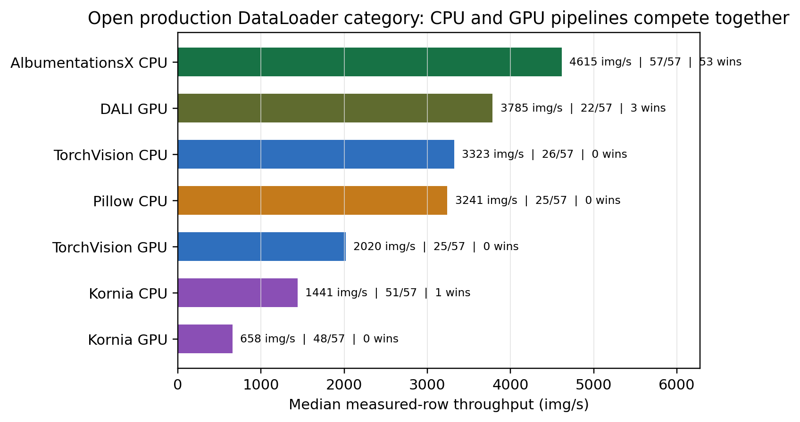
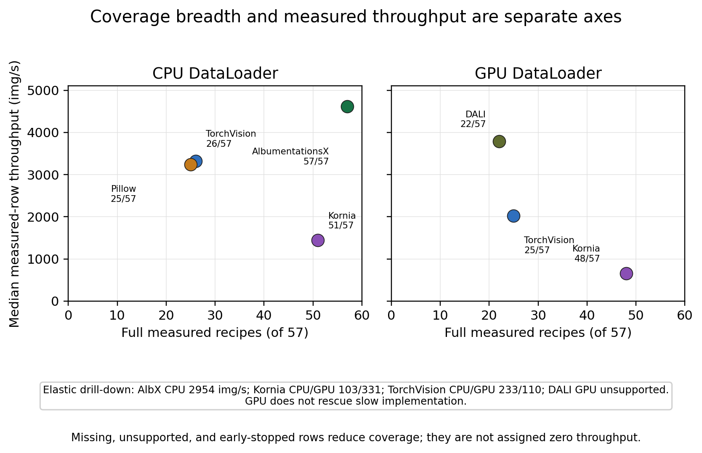
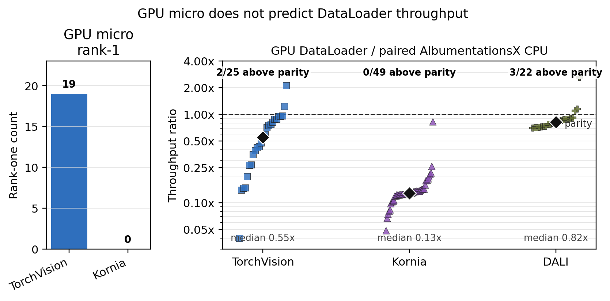
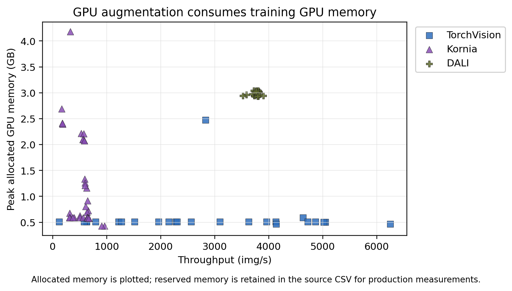
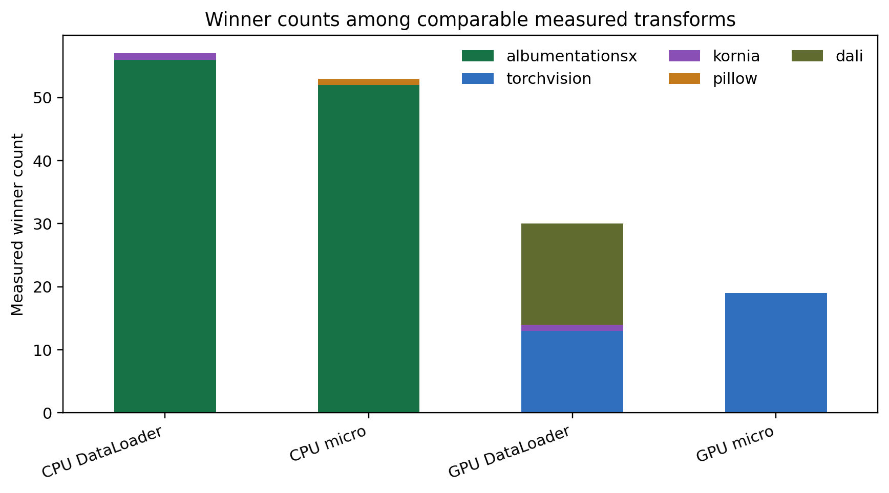

# Image and Video Augmentation Library Benchmarks

A comprehensive benchmarking suite for comparing the performance of popular image and video augmentation libraries including [AlbumentationsX](https://albumentations.ai/), [torchvision](https://docs.pytorch.org/vision/stable/index.html), and [Kornia](https://kornia.readthedocs.io/en/latest/).

## GitAds Sponsored
[](https://gitads.dev/v1/ad-track?source=albumentations-team/benchmark@github)

<details>
<summary>Table of Contents</summary>

- [Image and Video Augmentation Library Benchmarks](#image-and-video-augmentation-library-benchmarks)
  - [Overview](#overview)
  - [Benchmark Types](#benchmark-types)
    - [Image Benchmarks](#image-benchmarks)
    - [RGB DataLoader Benchmarks](#rgb-dataloader-benchmarks)
    - [Multi-Channel Image Benchmarks (9ch)](#multi-channel-image-benchmarks-9ch)
    - [Video Benchmarks](#video-benchmarks)
  - [Paper Figures](#paper-figures)
  - [Performance Highlights](#performance-highlights)
    - [Image Augmentation Performance](#image-augmentation-performance)
    - [RGB DataLoader Performance](#rgb-dataloader-performance)
    - [Video Augmentation Performance](#video-augmentation-performance)
  - [Requirements](#requirements)
  - [Supported Libraries](#supported-libraries)
  - [Setup](#setup)
    - [Getting Started](#getting-started)
    - [Using Your Own Data](#using-your-own-data)
  - [Running Benchmarks](#running-benchmarks)
    - [Google Cloud (detached)](#google-cloud-detached)
    - [RGB Image Benchmarks](#rgb-image-benchmarks-all-libraries)
    - [Video Benchmarks](#video-benchmarks-all-libraries)
  - [Architecture](#architecture)
  - [Methodology](#methodology)
  - [Contributing](#contributing)

</details>

## Overview

This benchmark suite measures the throughput and performance characteristics of common augmentation operations across different libraries. It features:

- Benchmarks for both image and video augmentation
- Adaptive warmup to ensure stable measurements
- Multiple runs for statistical significance
- Detailed performance metrics and system information
- Thread control settings for consistent performance
- Support for multiple image/video formats and loading methods

## Benchmark Types

### Image Benchmarks

The image benchmarks compare the performance of various libraries on standard image transformations. Interpret the tables by benchmark mode:

- **Micro / profiler benchmarks** preload decoded images and time augmentation only. These runs use one internal CPU thread for every library to measure single-stream transform cost. For tensor-native image libraries (`torchvision`, `kornia`), `--device cuda|mps|auto` preloads tensors on the selected device and times device-resident augmentation.
- **DataLoader benchmarks** use recipe-level training pipelines. `memory_dataloader_augment` preloads decoded samples and isolates worker/augmentation scaling; `decode_dataloader_augment` adds disk read/decode; `decode_dataloader_augment_batch_copy` additionally materializes the collated batch tensor and copies it to CUDA/MPS when requested. CPU image pipelines apply the full recipe inside the dataset path before collation. TorchVision and Kornia image GPU DataLoader rows split the recipe: workers use the same library on CPU for crop/pad shape preparation, then the collated batch is copied to GPU. Kornia runs the measured augmentation batched with `same_on_batch=False` plus normalization; TorchVision runs only the measured augmentation in a per-sample GPU loop to preserve per-image randomness, then applies normalization once to the whole batch. Pipeline recipes include `Normalize+ToTensor` in the library spec: AlbumentationsX uses `ToTensorV2`, Pillow uses `torchvision.transforms.PILToTensor` before normalization, and torchvision/Kornia already operate on tensors. All pipeline recipes return fixed-shape tensor outputs that PyTorch default collation can stack. These runs record worker counts, thread policy, device target, and whether decode/collate/device transfer were included.

For the deadline-first paper pass, use `2,000` ImageNet validation images for micro benchmarks and `10,000` images for
DataLoader/pipeline benchmarks. Run one measurement per row first, validate coverage, then top up important rows with
additional repeats.

## Paper Figures

<!-- PAPER_FIGURES_START -->

The paper figures below are regenerated from `docs/paper_data/all_results.csv` by `python _internal/paper/scripts/generate_figures_and_insights.py`.

### Figure 1. Open production DataLoader category



CPU and GPU DataLoader implementations compete together over the same 57-recipe universe. Bars show median measured-row throughput; labels show full measured coverage and open-category wins. AlbumentationsX CPU wins 52 of 57 recipes and has the highest median throughput.

### Figure 2. Coverage breadth versus measured throughput



DataLoader coverage and throughput are distinct benchmark axes. The x-axis is the count of full measured recipes over the canonical 57 CPU DataLoader recipes, and the y-axis is median throughput over measured rows only. The Elastic drill-down shows that GPU execution does not rescue a slow implementation of a hard transform.

### Figure 3. GPU DataLoader pipelines versus AlbumentationsX CPU



Each point is a paired GPU DataLoader recipe divided by the AlbumentationsX CPU DataLoader throughput for the same recipe. The dashed line marks parity. Most GPU rows fall below parity once the full DataLoader path is measured.

### Figure 4. GPU memory consumed by augmentation pipelines



GPU augmentation also consumes accelerator memory that would otherwise be available to model parameters, activations, optimizer state, or larger batches. Each point is a measured GPU DataLoader row with peak allocated memory recorded during the benchmark.

### Appendix Figure. Winner counts by benchmark regime



Measured winner counts among comparable measured transforms by regime. The conclusion changes when moving from augmentation-only microbenchmarks to production-style DataLoader measurements.

<!-- PAPER_FIGURES_END -->

<!-- IMAGE_BENCHMARK_TABLE_START -->

| Transform            | AlbumentationsX 2.2.6 [img/s]   | kornia 0.8.2 [img/s]   | pillow 12.2.0 [img/s]   | torchvision 0.26.0 [img/s]   | Speedup (albx / fastest, +/-1sd)   |
|:---------------------|:--------------------------------|:-----------------------|:------------------------|:-----------------------------|:-----------------------------------|
| Affine               | **872 ± 8**                     | 402 ± 3                | 264 ± 2                 | 240 ± 1                      | 2.17x (2.13-2.20x)                 |
| AutoContrast         | **1243 ± 19**                   | 231 ± 1                | 899 ± 4                 | 159 ± 0                      | 1.38x (1.36-1.41x)                 |
| Blur                 | **4449 ± 17**                   | 57 ± 0                 | 409 ± 3                 | -                            | 10.87x (10.76-10.98x)              |
| Brightness           | **6912 ± 13**                   | 766 ± 7                | 609 ± 4                 | 804 ± 15                     | 8.60x (8.43-8.77x)                 |
| CLAHE                | **283 ± 1**                     | 62 ± 0                 | -                       | -                            | 4.59x (4.57-4.62x)                 |
| ChannelDropout       | **6810 ± 65**                   | 828 ± 6                | -                       | -                            | 8.23x (8.09-8.37x)                 |
| ChannelShuffle       | **4337 ± 13**                   | 487 ± 2                | -                       | 1866 ± 72                    | 2.32x (2.23-2.43x)                 |
| ColorJiggle          | **639 ± 5**                     | 34 ± 0                 | -                       | 47 ± 0                       | 13.52x (13.37-13.68x)              |
| ColorJitter          | **641 ± 1**                     | 52 ± 1                 | -                       | 47 ± 0                       | 12.40x (12.25-12.56x)              |
| Contrast             | **6933 ± 30**                   | 771 ± 9                | 443 ± 1                 | 475 ± 7                      | 9.00x (8.85-9.15x)                 |
| CornerIllumination   | **425 ± 2**                     | 157 ± 0                | -                       | -                            | 2.71x (2.69-2.73x)                 |
| Elastic              | **191 ± 0**                     | ≤20 img/s              | -                       | ≤20 img/s                    | N/A                                |
| EnhanceDetail        | **2148 ± 13**                   | -                      | 275 ± 1                 | -                            | 7.80x (7.72-7.89x)                 |
| EnhanceEdge          | **1373 ± 16**                   | -                      | 219 ± 0                 | -                            | 6.27x (6.19-6.36x)                 |
| Equalize             | 807 ± 3                         | 128 ± 0                | **882 ± 12**            | 313 ± 1                      | 0.92x (0.90-0.93x)                 |
| Erasing              | **9511 ± 74**                   | 298 ± 1                | -                       | 1872 ± 71                    | 5.08x (4.86-5.32x)                 |
| GaussianBlur         | **2343 ± 4**                    | 57 ± 0                 | 169 ± 1                 | 86 ± 0                       | 13.85x (13.78-13.92x)              |
| GaussianIllumination | **388 ± 1**                     | 188 ± 0                | -                       | -                            | 2.07x (2.06-2.07x)                 |
| GaussianNoise        | **225 ± 0**                     | 49 ± 0                 | -                       | -                            | 4.63x                              |
| Grayscale            | **5194 ± 1**                    | 418 ± 1                | 1591 ± 15               | 1198 ± 32                    | 3.27x (3.23-3.30x)                 |
| HorizontalFlip       | **8416 ± 19**                   | 920 ± 10               | 2612 ± 21               | 1999 ± 82                    | 3.22x (3.19-3.25x)                 |
| Hue                  | **967 ± 1**                     | 66 ± 0                 | -                       | -                            | 14.75x (14.68-14.83x)              |
| Invert               | **15095 ± 61**                  | 1015 ± 2               | 1974 ± 26               | 2619 ± 152                   | 5.76x (5.43-6.14x)                 |
| JpegCompression      | **692 ± 7**                     | 43 ± 0                 | 515 ± 1                 | 512 ± 4                      | 1.34x (1.33-1.36x)                 |
| LinearIllumination   | **521 ± 1**                     | 327 ± 3                | -                       | -                            | 1.59x (1.57-1.61x)                 |
| LongestMaxSize       | **2825 ± 42**                   | 330 ± 1                | -                       | -                            | 8.55x (8.39-8.72x)                 |
| MedianBlur           | **843 ± 4**                     | ≤20 img/s              | ≤20 img/s               | -                            | N/A                                |
| MotionBlur           | **1953 ± 21**                   | 81 ± 1                 | -                       | -                            | 24.07x (23.54-24.62x)              |
| OpticalDistortion    | **274 ± 1**                     | 201 ± 1                | -                       | -                            | 1.36x (1.35-1.37x)                 |
| Pad                  | **13181 ± 118**                 | -                      | 3167 ± 37               | 2420 ± 122                   | 4.16x (4.08-4.25x)                 |
| Perspective          | **559 ± 2**                     | 181 ± 1                | -                       | 202 ± 2                      | 2.77x (2.73-2.81x)                 |
| PhotoMetricDistort   | **581 ± 4**                     | -                      | -                       | 45 ± 0                       | 12.84x (12.72-12.95x)              |
| PlankianJitter       | **2253 ± 17**                   | 580 ± 2                | -                       | -                            | 3.88x (3.84-3.92x)                 |
| PlasmaBrightness     | **267 ± 1**                     | ≤20 img/s              | -                       | -                            | N/A                                |
| PlasmaContrast       | **143 ± 0**                     | ≤20 img/s              | -                       | -                            | N/A                                |
| PlasmaShadow         | **420 ± 3**                     | 53 ± 0                 | -                       | -                            | 7.94x (7.89-8.00x)                 |
| Posterize            | **14399 ± 58**                  | 290 ± 9                | 1977 ± 7                | 2598 ± 137                   | 5.54x (5.24-5.87x)                 |
| RGBShift             | **2292 ± 3**                    | 597 ± 3                | -                       | -                            | 3.84x (3.81-3.86x)                 |
| Rain                 | **1259 ± 2**                    | 527 ± 5                | -                       | -                            | 2.39x (2.36-2.41x)                 |
| RandomCrop224        | **38380 ± 192**                 | 981 ± 5                | -                       | 8492 ± 1207                  | 4.52x (3.94-5.29x)                 |
| RandomGamma          | **9938 ± 46**                   | 308 ± 2                | -                       | -                            | 32.28x (31.91-32.65x)              |
| RandomJigsaw         | **5172 ± 16**                   | 219 ± 2                | -                       | -                            | 23.67x (23.40-23.94x)              |
| RandomResizedCrop    | **7150 ± 19**                   | 622 ± 3                | -                       | 2823 ± 172                   | 2.53x (2.38-2.70x)                 |
| RandomRotate90       | **5990 ± 85**                   | 333 ± 4                | -                       | -                            | 17.96x (17.52-18.42x)              |
| Resize               | **2463 ± 37**                   | 271 ± 1                | 396 ± 4                 | 979 ± 23                     | 2.52x (2.42-2.61x)                 |
| Rotate               | **1408 ± 40**                   | 325 ± 2                | 1045 ± 13               | 223 ± 1                      | 1.35x (1.29-1.40x)                 |
| SaltAndPepper        | **738 ± 10**                    | 154 ± 1                | -                       | -                            | 4.79x (4.71-4.88x)                 |
| Saturation           | **847 ± 17**                    | 67 ± 0                 | 500 ± 3                 | -                            | 1.69x (1.65-1.74x)                 |
| Sharpen              | **1388 ± 5**                    | 58 ± 0                 | -                       | 75 ± 0                       | 18.51x (18.36-18.65x)              |
| Shear                | **784 ± 6**                     | 403 ± 1                | 217 ± 0                 | -                            | 1.95x (1.93-1.96x)                 |
| SmallestMaxSize      | **2017 ± 25**                   | 214 ± 1                | -                       | -                            | 9.42x (9.27-9.57x)                 |
| Snow                 | **489 ± 3**                     | 62 ± 0                 | -                       | -                            | 7.86x (7.80-7.91x)                 |
| Solarize             | **9760 ± 34**                   | 214 ± 1                | 1966 ± 6                | 545 ± 10                     | 4.96x (4.93-5.00x)                 |
| ThinPlateSpline      | **52 ± 0**                      | 36 ± 0                 | -                       | -                            | 1.43x                              |
| Transpose            | **4627 ± 26**                   | -                      | 1934 ± 35               | -                            | 2.39x (2.34-2.45x)                 |
| UnsharpMask          | **906 ± 2**                     | -                      | 134 ± 0                 | -                            | 6.76x (6.73-6.78x)                 |
| VerticalFlip         | **14051 ± 55**                  | 1067 ± 2               | 3670 ± 21               | 2490 ± 149                   | 3.83x (3.79-3.87x)                 |

<!-- IMAGE_BENCHMARK_TABLE_END -->

### RGB DataLoader Benchmarks

DataLoader benchmarks measure full training-style recipes, including collation and worker behavior. The table below is
updated from the latest `paper-rgb-dataloader-*` published snapshot by `tools/update_readme.py`.

<!-- DATALOADER_BENCHMARK_TABLE_START -->

| Recipe                                                | AlbumentationsX 2.2.6 [img/s]   | kornia 0.8.2 [img/s]   | pillow 12.2.0 [img/s]   | torchvision 0.26.0 [img/s]   | Speedup (albx / fastest, +/-1sd)   |
|:------------------------------------------------------|:--------------------------------|:-----------------------|:------------------------|:-----------------------------|:-----------------------------------|
| RandomCrop224+Affine+Normalize+ToTensor               | **4533 ± 39**                   | 1501 ± 21              | 2616 ± 88               | 2843 ± 21                    | 1.59x (1.57-1.62x)                 |
| RandomCrop224+AutoContrast+Normalize+ToTensor         | **4594 ± 104**                  | 1604 ± 21              | 3268 ± 6                | 2275 ± 78                    | 1.41x (1.37-1.44x)                 |
| RandomCrop224+Blur+Normalize+ToTensor                 | **5222 ± 75**                   | 1228 ± 30              | 3011 ± 60               | -                            | 1.73x (1.68-1.79x)                 |
| RandomCrop224+Brightness+Normalize+ToTensor           | **5043 ± 265**                  | 1696 ± 38              | 3255 ± 7                | 3480 ± 16                    | 1.45x (1.37-1.53x)                 |
| RandomCrop224+CLAHE+Normalize+ToTensor                | **3277 ± 152**                  | 758 ± 5                | -                       | -                            | 4.32x (4.10-4.55x)                 |
| RandomCrop224+ChannelDropout+Normalize+ToTensor       | **5393 ± 109**                  | 1734 ± 8               | -                       | -                            | 3.11x (3.03-3.19x)                 |
| RandomCrop224+ChannelShuffle+Normalize+ToTensor       | **5083 ± 5**                    | 1687 ± 69              | -                       | 4061 ± 6                     | 1.25x (1.25-1.25x)                 |
| RandomCrop224+ColorJiggle+Normalize+ToTensor          | **4218 ± 79**                   | 767 ± 4                | -                       | 1217 ± 25                    | 3.46x (3.33-3.60x)                 |
| RandomCrop224+ColorJitter+Normalize+ToTensor          | **4046 ± 253**                  | 960 ± 12               | -                       | 1209 ± 56                    | 3.35x (3.00-3.73x)                 |
| RandomCrop224+Contrast+Normalize+ToTensor             | **5205 ± 76**                   | 1720 ± 12              | 2925 ± 60               | 3092 ± 150                   | 1.68x (1.58-1.79x)                 |
| RandomCrop224+CornerIllumination+Normalize+ToTensor   | **3823 ± 1**                    | 1421 ± 29              | -                       | -                            | 2.69x (2.64-2.75x)                 |
| RandomCrop224+Elastic+Normalize+ToTensor              | **2974 ± 28**                   | 102 ± 0                | -                       | 232 ± 1                      | 12.79x (12.64-12.95x)              |
| RandomCrop224+EnhanceDetail+Normalize+ToTensor        | **5017 ± 78**                   | -                      | 2646 ± 87               | -                            | 1.90x (1.81-1.99x)                 |
| RandomCrop224+EnhanceEdge+Normalize+ToTensor          | **4888 ± 137**                  | -                      | 2515 ± 5                | -                            | 1.94x (1.88-2.00x)                 |
| RandomCrop224+Equalize+Normalize+ToTensor             | **4298 ± 9**                    | 1232 ± 52              | 3230 ± 16               | 2857 ± 148                   | 1.33x (1.32-1.34x)                 |
| RandomCrop224+Erasing+Normalize+ToTensor              | **5006 ± 159**                  | 1425 ± 49              | -                       | 3639 ± 84                    | 1.38x (1.30-1.45x)                 |
| RandomCrop224+GaussianBlur+Normalize+ToTensor         | **4952 ± 117**                  | 1220 ± 8               | 2280 ± 42               | 1450 ± 12                    | 2.17x (2.08-2.26x)                 |
| RandomCrop224+GaussianIllumination+Normalize+ToTensor | **3674 ± 58**                   | 1380 ± 41              | -                       | -                            | 2.66x (2.54-2.79x)                 |
| RandomCrop224+GaussianNoise+Normalize+ToTensor        | **3312 ± 13**                   | 1492 ± 92              | -                       | -                            | 2.22x (2.08-2.37x)                 |
| RandomCrop224+Grayscale+Normalize+ToTensor            | **5245 ± 26**                   | 1692 ± 44              | 3535 ± 9                | 3922 ± 34                    | 1.34x (1.32-1.36x)                 |
| RandomCrop224+HorizontalFlip+Normalize+ToTensor       | **5247 ± 40**                   | 1818 ± 1               | 3589 ± 34               | 3749 ± 17                    | 1.40x (1.38-1.42x)                 |
| RandomCrop224+Hue+Normalize+ToTensor                  | **4664 ± 48**                   | 1093 ± 3               | -                       | -                            | 4.27x (4.21-4.32x)                 |
| RandomCrop224+Invert+Normalize+ToTensor               | **5437 ± 78**                   | 1761 ± 27              | 3467 ± 141              | 3791 ± 4                     | 1.43x (1.41-1.46x)                 |
| RandomCrop224+JpegCompression+Normalize+ToTensor      | **4036 ± 100**                  | 728 ± 2                | 2969 ± 4                | 3450 ± 49                    | 1.17x (1.13-1.22x)                 |
| RandomCrop224+LinearIllumination+Normalize+ToTensor   | **4048 ± 39**                   | 1580 ± 18              | -                       | -                            | 2.56x (2.51-2.62x)                 |
| RandomCrop224+LongestMaxSize+Normalize+ToTensor       | **1314 ± 5**                    | 629 ± 1                | -                       | -                            | 2.09x (2.08-2.10x)                 |
| RandomCrop224+MedianBlur+Normalize+ToTensor           | **4086 ± 136**                  | 88 ± 0                 | 164 ± 1                 | -                            | 24.86x (23.94-25.78x)              |
| RandomCrop224+MotionBlur+Normalize+ToTensor           | **4583 ± 45**                   | 1159 ± 21              | -                       | -                            | 3.95x (3.84-4.07x)                 |
| RandomCrop224+Normalize+ToTensor                      | **5004 ± 114**                  | 1873 ± 51              | 3692 ± 25               | 3917 ± 33                    | 1.28x (1.24-1.32x)                 |
| RandomCrop224+OpticalDistortion+Normalize+ToTensor    | **3509 ± 67**                   | 1378 ± 44              | -                       | -                            | 2.55x (2.42-2.68x)                 |
| RandomCrop224+Pad+Normalize+ToTensor                  | **4855 ± 16**                   | -                      | 3296 ± 108              | 3631 ± 108                   | 1.34x (1.29-1.38x)                 |
| RandomCrop224+Perspective+Normalize+ToTensor          | **3946 ± 65**                   | 1259 ± 5               | -                       | 2543 ± 10                    | 1.55x (1.52-1.58x)                 |
| RandomCrop224+PhotoMetricDistort+Normalize+ToTensor   | **4118 ± 44**                   | -                      | -                       | 1176 ± 21                    | 3.50x (3.40-3.60x)                 |
| RandomCrop224+PlankianJitter+Normalize+ToTensor       | **4864 ± 50**                   | 1662 ± 59              | -                       | -                            | 2.93x (2.80-3.07x)                 |
| RandomCrop224+PlasmaBrightness+Normalize+ToTensor     | **2642 ± 42**                   | 439 ± 0                | -                       | -                            | 6.01x (5.91-6.11x)                 |
| RandomCrop224+PlasmaContrast+Normalize+ToTensor       | **2145 ± 15**                   | 436 ± 3                | -                       | -                            | 4.92x (4.86-4.99x)                 |
| RandomCrop224+PlasmaShadow+Normalize+ToTensor         | **2762 ± 47**                   | 903 ± 0                | -                       | -                            | 3.06x (3.01-3.11x)                 |
| RandomCrop224+Posterize+Normalize+ToTensor            | **5318 ± 1**                    | 1553 ± 47              | 3430 ± 97               | 3687 ± 22                    | 1.44x (1.43-1.45x)                 |
| RandomCrop224+RGBShift+Normalize+ToTensor             | **4789 ± 58**                   | 1708 ± 12              | -                       | -                            | 2.80x (2.75-2.86x)                 |
| RandomCrop224+Rain+Normalize+ToTensor                 | **4542 ± 20**                   | 1474 ± 7               | -                       | -                            | 3.08x (3.05-3.11x)                 |
| RandomCrop224+RandomGamma+Normalize+ToTensor          | **5221 ± 43**                   | 1542 ± 27              | -                       | -                            | 3.39x (3.30-3.47x)                 |
| RandomCrop224+RandomJigsaw+Normalize+ToTensor         | **4891 ± 32**                   | 1522 ± 59              | -                       | -                            | 3.21x (3.07-3.36x)                 |
| RandomCrop224+RandomRotate90+Normalize+ToTensor       | **5091 ± 61**                   | 1455 ± 0               | -                       | -                            | 3.50x (3.46-3.54x)                 |
| RandomCrop224+Resize+Normalize+ToTensor               | **1328 ± 8**                    | 541 ± 10               | ≤20 img/s               | 1219 ± 8                     | 1.09x (1.08-1.10x)                 |
| RandomCrop224+Rotate+Normalize+ToTensor               | **4704 ± 111**                  | 1454 ± 7               | 3517 ± 22               | 2927 ± 85                    | 1.34x (1.30-1.38x)                 |
| RandomCrop224+SaltAndPepper+Normalize+ToTensor        | **4443 ± 23**                   | 1404 ± 35              | -                       | -                            | 3.16x (3.07-3.26x)                 |
| RandomCrop224+Saturation+Normalize+ToTensor           | **4518 ± 90**                   | 1095 ± 9               | 3122 ± 48               | -                            | 1.45x (1.40-1.50x)                 |
| RandomCrop224+Sharpen+Normalize+ToTensor              | **4776 ± 64**                   | 1200 ± 11              | -                       | 1398 ± 4                     | 3.42x (3.36-3.47x)                 |
| RandomCrop224+Shear+Normalize+ToTensor                | **4274 ± 19**                   | 1476 ± 18              | 2508 ± 22               | -                            | 1.70x (1.68-1.73x)                 |
| RandomCrop224+SmallestMaxSize+Normalize+ToTensor      | **1312 ± 23**                   | 552 ± 3                | -                       | -                            | 2.38x (2.32-2.43x)                 |
| RandomCrop224+Snow+Normalize+ToTensor                 | **4017 ± 191**                  | 1041 ± 5               | -                       | -                            | 3.86x (3.66-4.06x)                 |
| RandomCrop224+Solarize+Normalize+ToTensor             | **5309 ± 42**                   | 1505 ± 34              | 3576 ± 39               | 3495 ± 72                    | 1.48x (1.46-1.51x)                 |
| RandomCrop224+ThinPlateSpline+Normalize+ToTensor      | 677 ± 63                        | **750 ± 4**            | -                       | -                            | 0.90x (0.81-0.99x)                 |
| RandomCrop224+Transpose+Normalize+ToTensor            | **5169 ± 87**                   | -                      | 3543 ± 90               | -                            | 1.46x (1.40-1.52x)                 |
| RandomCrop224+UnsharpMask+Normalize+ToTensor          | **4516 ± 8**                    | -                      | 2079 ± 5                | -                            | 2.17x (2.16-2.18x)                 |
| RandomCrop224+VerticalFlip+Normalize+ToTensor         | **5266 ± 50**                   | 1794 ± 34              | 3694 ± 62               | 3808 ± 28                    | 1.38x (1.36-1.41x)                 |
| RandomResizedCrop+Normalize+ToTensor                  | **4985 ± 170**                  | 1537 ± 6               | 2779 ± 37               | 3754 ± 48                    | 1.33x (1.27-1.39x)                 |

<!-- DATALOADER_BENCHMARK_TABLE_END -->

### Multi-Channel Image Benchmarks (9ch)

Benchmarks on 9-channel images (3x stacked RGB) to test OpenCV chunking and library support for >4 channels.

<!-- MULTICHANNEL_BENCHMARK_TABLE_START -->

| Transform            | AlbumentationsX 2.2.6 [img/s]   | kornia 0.8.2 [img/s]   | torchvision 0.26.0 [img/s]   | Speedup (albx / fastest, +/-1sd)   |
|:---------------------|:--------------------------------|:-----------------------|:-----------------------------|:-----------------------------------|
| Affine               | **670 ± 11**                    | 260 ± 0                | 198 ± 2                      | 2.58x (2.53-2.62x)                 |
| AutoContrast         | 437 ± 15                        | 540 ± 1                | **780 ± 2**                  | 0.56x (0.54-0.58x)                 |
| Blur                 | **2567 ± 100**                  | 292 ± 0                | -                            | 8.79x (8.43-9.15x)                 |
| Brightness           | **3013 ± 284**                  | 2906 ± 6               | 985 ± 3                      | 1.04x (0.94-1.14x)                 |
| CenterCrop128        | **51003 ± 217**                 | 4628 ± 21              | 36610 ± 143                  | 1.39x (1.38-1.40x)                 |
| ChannelDropout       | **9472 ± 959**                  | 3840 ± 4               | -                            | 2.47x (2.21-2.72x)                 |
| ChannelShuffle       | **2641 ± 106**                  | 1411 ± 2               | 1892 ± 6                     | 1.40x (1.34-1.46x)                 |
| Contrast             | **3052 ± 99**                   | 2898 ± 4               | 572 ± 4                      | 1.05x (1.02-1.09x)                 |
| CornerIllumination   | 289 ± 16                        | **302 ± 0**            | -                            | 0.96x (0.91-1.01x)                 |
| Elastic              | **335 ± 3**                     | ≤10 img/s              | ≤10 img/s                    | N/A                                |
| Erasing              | **19946 ± 4338**                | 593 ± 1                | 6362 ± 227                   | 3.14x (2.37-3.96x)                 |
| GaussianBlur         | **802 ± 12**                    | 299 ± 0                | 121 ± 1                      | 2.69x (2.64-2.73x)                 |
| GaussianIllumination | 295 ± 9                         | **362 ± 1**            | -                            | 0.81x (0.79-0.84x)                 |
| GaussianNoise        | **109 ± 3**                     | 72 ± 0                 | -                            | 1.51x (1.47-1.56x)                 |
| Grayscale            | 392 ± 3                         | 1241 ± 5               | **1491 ± 7**                 | 0.26x (0.26-0.27x)                 |
| HorizontalFlip       | 2630 ± 73                       | 4069 ± 9               | **18238 ± 318**              | 0.14x (0.14-0.15x)                 |
| Invert               | 16207 ± 3388                    | 5325 ± 28              | **23672 ± 108**              | 0.68x (0.54-0.83x)                 |
| JpegCompression      | 160 ± 0                         | 73 ± 0                 | **258 ± 1**                  | 0.62x (0.62-0.62x)                 |
| LinearIllumination   | 206 ± 3                         | **1009 ± 3**           | -                            | 0.20x (0.20-0.21x)                 |
| LongestMaxSize       | **858 ± 16**                    | 410 ± 0                | -                            | 2.10x (2.05-2.14x)                 |
| MedianBlur           | **419 ± 5**                     | ≤10 img/s              | -                            | N/A                                |
| MotionBlur           | **1342 ± 65**                   | 126 ± 0                | -                            | 10.66x (10.11-11.20x)              |
| Normalize            | 1311 ± 54                       | **2957 ± 4**           | 1375 ± 1                     | 0.44x (0.42-0.46x)                 |
| OpticalDistortion    | **290 ± 7**                     | 193 ± 0                | -                            | 1.50x (1.46-1.54x)                 |
| Pad                  | 8066 ± 88                       | -                      | **15071 ± 103**              | 0.54x (0.53-0.54x)                 |
| Perspective          | **602 ± 17**                    | 172 ± 0                | 176 ± 0                      | 3.41x (3.31-3.52x)                 |
| PlasmaBrightness     | **151 ± 3**                     | 40 ± 0                 | -                            | 3.77x (3.69-3.86x)                 |
| PlasmaContrast       | **85 ± 0**                      | 42 ± 0                 | -                            | 2.02x (2.00-2.03x)                 |
| PlasmaShadow         | 253 ± 4                         | **288 ± 2**            | -                            | 0.88x (0.86-0.90x)                 |
| Posterize            | **23588 ± 5135**                | 487 ± 9                | 23074 ± 276                  | 1.02x (0.79-1.26x)                 |
| RandomCrop128        | **47302 ± 2384**                | 2929 ± 88              | 29917 ± 1842                 | 1.58x (1.41-1.77x)                 |
| RandomGamma          | **5465 ± 672**                  | 97 ± 0                 | -                            | 56.63x (49.57-63.71x)              |
| RandomJigsaw         | **5609 ± 44**                   | 302 ± 2                | -                            | 18.58x (18.32-18.84x)              |
| RandomResizedCrop    | **986 ± 22**                    | 335 ± 2                | 335 ± 2                      | 2.95x (2.87-3.03x)                 |
| RandomRotate90       | **1478 ± 24**                   | 259 ± 2                | -                            | 5.71x (5.57-5.86x)                 |
| Rotate               | **1772 ± 31**                   | 249 ± 1                | 246 ± 2                      | 7.11x (6.97-7.26x)                 |
| Sharpen              | **770 ± 11**                    | 202 ± 1                | 286 ± 4                      | 2.69x (2.62-2.77x)                 |
| Shear                | **662 ± 7**                     | 300 ± 0                | -                            | 2.21x (2.18-2.23x)                 |
| SmallestMaxSize      | **603 ± 18**                    | 250 ± 1                | -                            | 2.41x (2.34-2.49x)                 |
| Solarize             | **5615 ± 502**                  | 503 ± 1                | 567 ± 2                      | 9.91x (8.99-10.84x)                |
| ThinPlateSpline      | **85 ± 1**                      | 70 ± 0                 | -                            | 1.21x (1.20-1.22x)                 |
| VerticalFlip         | 9190 ± 2941                     | 3810 ± 14              | **19143 ± 130**              | 0.48x (0.32-0.64x)                 |

<!-- MULTICHANNEL_BENCHMARK_TABLE_END -->

### Video Benchmarks

The video benchmarks compare CPU-based processing (AlbumentationsX) with GPU-accelerated processing (Kornia) for video transformations. The benchmarks use the [UCF101 dataset](https://www.crcv.ucf.edu/data/UCF101.php), which contains realistic videos from 101 action categories.

For AlbumentationsX, each clip is a NumPy array `(T, H, W, C)`. The built-in spec files apply augmentations with `transform(images=video)["images"]`—Albumentations’ batch video API—so parameters are drawn once per clip and shared across frames, in line with typical video training and with Kornia’s `same_on_batch=True` for a fair comparison.

<!-- VIDEO_BENCHMARK_TABLE_START -->

| Transform                | AlbumentationsX (video) 2.1.1 [vid/s]   | kornia (video) 0.8.0 [vid/s]   | torchvision (video) 0.21.0 [vid/s]   | Speedup (albx / fastest, +/-1sd)   |
|:-------------------------|:----------------------------------------|:-------------------------------|:-------------------------------------|:-----------------------------------|
| AdditiveNoise            | **10 ± 0**                              | -                              | -                                    | N/A                                |
| AdvancedBlur             | **24 ± 1**                              | -                              | -                                    | N/A                                |
| Affine                   | 25 ± 0                                  | 21 ± 0                         | **453 ± 0**                          | 0.06x (0.06-0.06x)                 |
| AtmosphericFog           | **6 ± 0**                               | -                              | -                                    | N/A                                |
| AutoContrast             | 22 ± 0                                  | 21 ± 0                         | **578 ± 17**                         | 0.04x (0.04-0.04x)                 |
| Blur                     | **110 ± 1**                             | 21 ± 0                         | -                                    | 5.33x (5.29-5.37x)                 |
| Brightness               | 241 ± 2                                 | 22 ± 0                         | **756 ± 435**                        | 0.32x (0.20-0.76x)                 |
| CLAHE                    | **10 ± 0**                              | -                              | -                                    | N/A                                |
| CenterCrop128            | 975 ± 13                                | 70 ± 1                         | **1133 ± 235**                       | 0.86x (0.70-1.10x)                 |
| ChannelDropout           | **205 ± 1**                             | 22 ± 0                         | -                                    | 9.42x (9.37-9.47x)                 |
| ChannelShuffle           | 26 ± 0                                  | 20 ± 0                         | **958 ± 0**                          | 0.03x (0.03-0.03x)                 |
| ChannelSwap              | **24 ± 0**                              | -                              | -                                    | N/A                                |
| ChromaticAberration      | **9 ± 0**                               | -                              | -                                    | N/A                                |
| CoarseDropout            | **487 ± 6**                             | -                              | -                                    | N/A                                |
| ColorJitter              | 19 ± 1                                  | 19 ± 0                         | **69 ± 0**                           | 0.27x (0.26-0.29x)                 |
| ConstrainedCoarseDropout | **112591 ± 2961**                       | -                              | -                                    | N/A                                |
| Contrast                 | 239 ± 2                                 | 22 ± 0                         | **547 ± 13**                         | 0.44x (0.42-0.45x)                 |
| CornerIllumination       | **10 ± 0**                              | 3 ± 0                          | -                                    | 3.96x (3.79-4.13x)                 |
| CropAndPad               | **42 ± 2**                              | -                              | -                                    | N/A                                |
| Defocus                  | **2 ± 0**                               | -                              | -                                    | N/A                                |
| Downscale                | **83 ± 1**                              | -                              | -                                    | N/A                                |
| Elastic                  | 26 ± 0                                  | -                              | **127 ± 1**                          | 0.21x (0.20-0.21x)                 |
| Emboss                   | **47 ± 1**                              | -                              | -                                    | N/A                                |
| Equalize                 | 16 ± 0                                  | 4 ± 0                          | **192 ± 1**                          | 0.08x (0.08-0.08x)                 |
| Erasing                  | **458 ± 7**                             | -                              | 255 ± 7                              | 1.80x (1.73-1.88x)                 |
| FancyPCA                 | **2 ± 0**                               | -                              | -                                    | N/A                                |
| FilmGrain                | **5 ± 0**                               | -                              | -                                    | N/A                                |
| GaussianBlur             | 42 ± 1                                  | 22 ± 0                         | **543 ± 11**                         | 0.08x (0.07-0.08x)                 |
| GaussianIllumination     | 10 ± 0                                  | **20 ± 0**                     | -                                    | 0.50x (0.49-0.51x)                 |
| GaussianNoise            | 11 ± 0                                  | **22 ± 0**                     | -                                    | 0.51x (0.49-0.53x)                 |
| GlassBlur                | **1 ± 0**                               | -                              | -                                    | N/A                                |
| Grayscale                | 82 ± 0                                  | 22 ± 0                         | **838 ± 467**                        | 0.10x (0.06-0.22x)                 |
| GridDistortion           | **28 ± 0**                              | -                              | -                                    | N/A                                |
| GridDropout              | **93 ± 14**                             | -                              | -                                    | N/A                                |
| GridMask                 | **199 ± 3**                             | -                              | -                                    | N/A                                |
| HSV                      | **15 ± 1**                              | -                              | -                                    | N/A                                |
| Halftone                 | slow-skipped                            | -                              | -                                    | N/A                                |
| HorizontalFlip           | 30 ± 0                                  | 22 ± 0                         | **978 ± 49**                         | 0.03x (0.03-0.03x)                 |
| Hue                      | **26 ± 2**                              | 20 ± 0                         | -                                    | 1.33x (1.22-1.45x)                 |
| ISONoise                 | **9 ± 0**                               | -                              | -                                    | N/A                                |
| Invert                   | 467 ± 27                                | 22 ± 0                         | **843 ± 176**                        | 0.55x (0.43-0.74x)                 |
| JpegCompression          | **25 ± 0**                              | -                              | -                                    | N/A                                |
| LensFlare                | **7 ± 0**                               | -                              | -                                    | N/A                                |
| LinearIllumination       | **10 ± 0**                              | 4 ± 0                          | -                                    | 2.39x (2.25-2.54x)                 |
| LongestMaxSize           | **28 ± 0**                              | -                              | -                                    | N/A                                |
| MedianBlur               | **24 ± 0**                              | 8 ± 0                          | -                                    | 2.85x (2.79-2.91x)                 |
| Morphological            | **219 ± 2**                             | -                              | -                                    | N/A                                |
| MotionBlur               | **80 ± 2**                              | -                              | -                                    | N/A                                |
| MultiplicativeNoise      | **40 ± 0**                              | -                              | -                                    | N/A                                |
| Normalize                | 22 ± 0                                  | 22 ± 0                         | **461 ± 0**                          | 0.05x (0.05-0.05x)                 |
| OpticalDistortion        | **26 ± 0**                              | -                              | -                                    | N/A                                |
| Pad                      | 302 ± 11                                | -                              | **760 ± 338**                        | 0.40x (0.27-0.74x)                 |
| PadIfNeeded              | **17 ± 0**                              | -                              | -                                    | N/A                                |
| Perspective              | 22 ± 0                                  | -                              | **435 ± 0**                          | 0.05x (0.05-0.05x)                 |
| PhotoMetricDistort       | **16 ± 1**                              | -                              | -                                    | N/A                                |
| PiecewiseAffine          | **25 ± 0**                              | -                              | -                                    | N/A                                |
| PixelDropout             | **76 ± 0**                              | -                              | -                                    | N/A                                |
| PlankianJitter           | **59 ± 0**                              | 11 ± 0                         | -                                    | 5.41x (5.37-5.46x)                 |
| PlasmaBrightness         | 4 ± 0                                   | **17 ± 0**                     | -                                    | 0.26x (0.25-0.27x)                 |
| PlasmaContrast           | 3 ± 0                                   | **17 ± 0**                     | -                                    | 0.17x (0.17-0.17x)                 |
| PlasmaShadow             | 7 ± 0                                   | **19 ± 0**                     | -                                    | 0.36x (0.35-0.37x)                 |
| Posterize                | 240 ± 8                                 | -                              | **631 ± 15**                         | 0.38x (0.36-0.40x)                 |
| RGBShift                 | 9 ± 0                                   | **22 ± 0**                     | -                                    | 0.42x (0.42-0.43x)                 |
| Rain                     | **27 ± 1**                              | 4 ± 0                          | -                                    | 7.24x (7.07-7.41x)                 |
| RandomCrop128            | 933 ± 7                                 | 65 ± 0                         | **1133 ± 15**                        | 0.82x (0.81-0.84x)                 |
| RandomFog                | slow-skipped                            | -                              | -                                    | N/A                                |
| RandomGamma              | **238 ± 1**                             | 22 ± 0                         | -                                    | 10.98x (10.93-11.03x)              |
| RandomGravel             | **24 ± 1**                              | -                              | -                                    | N/A                                |
| RandomGridShuffle        | **11 ± 0**                              | -                              | -                                    | N/A                                |
| RandomResizedCrop        | 28 ± 0                                  | 6 ± 0                          | **182 ± 16**                         | 0.15x (0.14-0.17x)                 |
| RandomRotate90           | **41 ± 4**                              | -                              | -                                    | N/A                                |
| RandomScale              | **56 ± 1**                              | -                              | -                                    | N/A                                |
| RandomShadow             | **8 ± 1**                               | -                              | -                                    | N/A                                |
| RandomSizedCrop          | **24 ± 0**                              | -                              | -                                    | N/A                                |
| RandomSunFlare           | **5 ± 0**                               | -                              | -                                    | N/A                                |
| RandomToneCurve          | **239 ± 1**                             | -                              | -                                    | N/A                                |
| Resize                   | 26 ± 0                                  | 6 ± 0                          | **140 ± 35**                         | 0.18x (0.14-0.25x)                 |
| RingingOvershoot         | **3 ± 0**                               | -                              | -                                    | N/A                                |
| Rotate                   | 49 ± 0                                  | 22 ± 0                         | **534 ± 0**                          | 0.09x (0.09-0.09x)                 |
| SafeRotate               | **24 ± 0**                              | -                              | -                                    | N/A                                |
| SaltAndPepper            | **12 ± 0**                              | 9 ± 0                          | -                                    | 1.36x (1.34-1.38x)                 |
| Saturation               | 19 ± 1                                  | **37 ± 0**                     | -                                    | 0.52x (0.50-0.54x)                 |
| Sharpen                  | 38 ± 0                                  | 18 ± 0                         | **420 ± 9**                          | 0.09x (0.09-0.09x)                 |
| Shear                    | **23 ± 0**                              | -                              | -                                    | N/A                                |
| ShiftScaleRotate         | **24 ± 0**                              | -                              | -                                    | N/A                                |
| ShotNoise                | **1 ± 0**                               | -                              | -                                    | N/A                                |
| SmallestMaxSize          | **18 ± 0**                              | -                              | -                                    | N/A                                |
| Snow                     | **13 ± 0**                              | -                              | -                                    | N/A                                |
| Solarize                 | 249 ± 9                                 | 21 ± 0                         | **628 ± 6**                          | 0.40x (0.38-0.41x)                 |
| Spatter                  | **7 ± 0**                               | -                              | -                                    | N/A                                |
| SquareSymmetry           | **37 ± 3**                              | -                              | -                                    | N/A                                |
| Superpixels              | slow-skipped                            | -                              | -                                    | N/A                                |
| ThinPlateSpline          | 23 ± 0                                  | **45 ± 1**                     | -                                    | 0.51x (0.49-0.53x)                 |
| ToSepia                  | **135 ± 0**                             | -                              | -                                    | N/A                                |
| Transpose                | **28 ± 0**                              | -                              | -                                    | N/A                                |
| UnsharpMask              | **8 ± 0**                               | -                              | -                                    | N/A                                |
| VerticalFlip             | 591 ± 20                                | 22 ± 0                         | **978 ± 5**                          | 0.60x (0.58-0.63x)                 |
| Vignetting               | **10 ± 1**                              | -                              | -                                    | N/A                                |
| WaterRefraction          | **22 ± 0**                              | -                              | -                                    | N/A                                |
| ZoomBlur                 | **4 ± 0**                               | -                              | -                                    | N/A                                |

<!-- VIDEO_BENCHMARK_TABLE_END -->

## Performance Highlights

### Image Augmentation Performance

<!-- IMAGE_SPEEDUP_SUMMARY_START -->

See the full benchmark table above for RGB micro results.

<!-- IMAGE_SPEEDUP_SUMMARY_END -->

### RGB DataLoader Performance

<!-- DATALOADER_SPEEDUP_SUMMARY_START -->

See the full benchmark table above for RGB DataLoader results.

<!-- DATALOADER_SPEEDUP_SUMMARY_END -->

### Video Augmentation Performance

<!-- VIDEO_SPEEDUP_SUMMARY_START -->

See the full benchmark table above for video results.

<!-- VIDEO_SPEEDUP_SUMMARY_END -->

## Requirements

The benchmark automatically creates isolated virtual environments for each library and installs the necessary dependencies. Base requirements:

- Python 3.10+
- uv (for fast package installation)
- Disk space for virtual environments
- Image/video dataset in a supported format

## Supported Libraries

- [AlbumentationsX](https://albumentations.ai/) (commercial/AGPL)
- [torchvision](https://docs.pytorch.org/vision/stable/index.html)
- [Kornia](https://kornia.readthedocs.io/en/latest/)

Each library's specific dependencies are managed through separate requirements files in the `requirements/` directory.

## Setup

### Getting Started

For testing and comparison purposes, you can use standard datasets:

**For image benchmarks:**
```bash
wget https://image-net.org/data/ILSVRC/2012/ILSVRC2012_img_val.tar
mkdir -p imagenet/val
tar -xf ILSVRC2012_img_val.tar -C imagenet/val
```

This is the same ImageNet validation input convention used by `imread_benchmark`: download the official validation tar, unpack it locally, then point `--data-dir` at `imagenet/val`.

**For video benchmarks:**
```bash
# UCF101 dataset
wget https://www.crcv.ucf.edu/data/UCF101/UCF101.rar
unrar x UCF101.rar -d /path/to/your/target/directory
```

For cloud runs, package datasets as a single tarball and upload that object to GCS. This is much faster and more reliable
than copying thousands of small files from your laptop to GCS and then from GCS to the VM.

```bash
# ImageNet validation directory -> tarball.
COPYFILE_DISABLE=1 tar --no-xattrs \
  --exclude="__MACOSX" \
  --exclude="*/__MACOSX/*" \
  --exclude=".DS_Store" \
  --exclude="*/.DS_Store" \
  --exclude="._*" \
  --exclude="*/._*" \
  -cf /tmp/imagenet-val.tar \
  -C /path/to/imagenet val

gcloud storage cp /tmp/imagenet-val.tar gs://my-bucket/datasets/imagenet/val.tar

# UCF101 directory -> tarball.
COPYFILE_DISABLE=1 tar --no-xattrs \
  --exclude="__MACOSX" \
  --exclude="*/__MACOSX/*" \
  --exclude=".DS_Store" \
  --exclude="*/.DS_Store" \
  --exclude="._*" \
  --exclude="*/._*" \
  -cf /tmp/ucf101.tar \
  -C /Users/vladimiriglovikov/data ucf101

gcloud storage cp /tmp/ucf101.tar gs://imagenet_validation/ucf101/ucf101.tar
gcloud storage objects describe gs://imagenet_validation/ucf101/ucf101.tar \
  --format="yaml(size,crc32c,md5Hash,updated)"

# Optional sanity check: this should print nothing.
tar -tf /tmp/ucf101.tar | rg '(^__MACOSX/|/\.DS_Store$|^\.DS_Store$|/\._|^\._)'
```

The paper video cloud runs use `gs://imagenet_validation/ucf101/ucf101.tar`; the uploaded object was verified at
`14136559616` bytes.

### Using Your Own Data

We strongly recommend running the benchmarks on your own dataset that matches your use case:

- Use images/videos that are representative of your actual workload
- Consider sizes and formats you typically work with
- Include edge cases specific to your application

This will give you more relevant performance metrics for your specific use case.

## Running Benchmarks

All benchmarks use the unified CLI: `python -m benchmark.cli run`. Prefer checked-in YAML configs for paper and cloud
runs; CLI flags are override knobs for an existing config, not a second source of truth. Config files are validated with
Pydantic before work starts.
Named transform sets such as `paper` are expanded to concrete transform names, and the resolved config is written to
`resolved_config.yaml` in the output directory.

```bash
python -m benchmark.cli run --config configs/examples/local_rgb_micro_cpu.yaml
python -m benchmark.cli plan --config configs/paper/prod_g2_rgb_dataloader_gpu.yaml
python -m benchmark.cli run --config configs/paper/prod_g2_rgb_dataloader_gpu.yaml --gcp-dry-run
python -m benchmark.cli run --config configs/paper/gcp_g2_rgb_dataloader_gpu_smoke.yaml --num-items 25
```

Use `benchmark plan --config ...` or `benchmark run --config ... --dry-run` to print the resolved config, generated jobs,
expected output files, and cloud VM settings without starting local measurements or creating a VM.

Flag-only benchmark execution is intentionally unsupported. Start from a YAML file under `configs/examples/` or
`configs/paper/`, then use supported overrides such as `--num-items`, `--num-runs`, `--device`, `--workers`,
`--batch-size`, and `--output` when you need quick local changes.

The CLI creates joined virtual environments for compatible libraries, for example `.venv_albumentationsx` for AlbumentationsX and `.venv_torch_stack` for torchvision, Kornia, and Pillow image benchmarks. By default, each run refreshes `requirements/*.txt` from `requirements/*.in` with the latest compatible package versions, then installs dependencies only when the resolved requirement files changed. Pass `--no-refresh-requirements` for offline/debug reruns that should reuse the existing lock files and venv cache.

For paper runs, pass `--transform-set paper` to use only transforms present in at least two selected libraries. The fixed sets live under `docs/paper_transform_sets/`.

For production paper image runs, prefer the checked-in `prod_*` configs. The first paper pass uses one run per row so
the full table can be covered quickly; top-up repeats can be merged later after coverage is validated.

```bash
python -m benchmark.cli run --config configs/paper/prod_c4_rgb_micro_cpu.yaml --gcp-dry-run
python -m benchmark.cli run --config configs/paper/prod_c4_rgb_dataloader_cpu.yaml --gcp-dry-run
python -m benchmark.cli run --config configs/paper/prod_c4_9ch_micro_cpu.yaml --gcp-dry-run
python -m benchmark.cli run --config configs/paper/prod_c4_9ch_dataloader_cpu.yaml --gcp-dry-run
python -m benchmark.cli run --config configs/paper/prod_g2_rgb_micro_gpu.yaml --gcp-dry-run
python -m benchmark.cli run --config configs/paper/prod_g2_rgb_dataloader_gpu.yaml --gcp-dry-run
python -m benchmark.cli run --config configs/paper/prod_g2_9ch_micro_gpu.yaml --gcp-dry-run
python -m benchmark.cli run --config configs/paper/prod_g2_9ch_dataloader_gpu.yaml --gcp-dry-run
```

Smoke configs remain under `configs/paper/gcp_*_smoke.yaml` for path checks and fast reruns.

Pipeline result filenames include the key sweep parameters, for example
`albumentationsx_memory_dataloader_augment_n2000_r5_w8_b64_results.json` or
`torchvision_decode_dataloader_augment_batch_copy_nall_r5_w8_b64_dev-mps_results.json`.

Video DataLoader runs use dedicated recipe specs, not the transform-only video micro specs. For AlbumentationsX,
torchvision, and Kornia, the recipe shape is `crop + transform + Normalize + ToTensor` so DataLoader collation receives
fixed-shape tensor clips. This keeps video pipeline semantics aligned with RGB pipeline benchmarks while micro remains a
preloaded transform-only profiler.

Treat RGB micro results as an implementation profiler: preloaded decoded inputs, one process, one internal
library thread, augmentation only. They are useful for checking algorithmic implementation quality and regressions,
but they are intentionally artificial because they measure one CPU core instead of a production input pipeline.

The paper hardware set should focus on CPUs that resemble machines used to feed model training, not every available
cloud CPU family. For RGB micro/profiler runs, use a compact representative set:

- Apple Silicon laptop, e.g. MacBook M4, for local macOS Arm behavior.
- `c4-standard-16` for modern Intel x86.
- `c4d-standard-16` for modern AMD x86.
- `c4a-standard-16` for cloud Arm, if Arm portability is part of the claim.
- `g2-standard-16` for the host CPU used with L4 GPU training.
- `a2-highgpu-1g` for the host CPU used with A100 training.

Older/general-purpose machines such as `n2-standard-16` and `n2d-standard-16` are useful as historical baselines, but
they should not drive the main paper claims. The more important paper benchmarks are production-style DataLoader runs
for images, GPU image sanity checks for TorchVision/Kornia, and GPU video augmentation, especially torchvision video
paths on GPU.

Skip dependency lock refresh when you intentionally want the fastest local rerun from existing locks:

```bash
python -m benchmark.cli run --config configs/examples/local_rgb_micro_cpu.yaml --no-refresh-requirements
```

### Benchmark execution policy

- The benchmark matrix lives in `benchmark/matrix.py`. Add scenario/library/mode support there first so spec files,
  requirement groups, paper transform sets, device support, pipeline scopes, and backend selection stay aligned.
- Shared image/video defaults live in `benchmark/policy.py`. Do not duplicate slow-skip thresholds, warmup item counts, or
  item labels separately in micro and pipeline runners.
- Command construction lives in `benchmark/jobs.py`, and backend dispatch lives in `benchmark/orchestrator.py`. The CLI
  should parse user intent and resolve scenarios, not grow backend-specific branches.
- Cloud runs stage one dataset tarball, such as `gs://.../val.tar` or `gs://.../ucf101.tar`, onto the VM and unpack it locally. Do not upload or copy thousands of individual images/videos for each run. Tarballs created on macOS should use `COPYFILE_DISABLE=1`, `--no-xattrs`, and excludes for `.DS_Store`, AppleDouble `._*`, and `__MACOSX`; the VM-side extractor also ignores those entries.
- Micro benchmarks preload the requested number of images or videos once per library into that library's native in-memory representation. Per-transform timing must not reread or decode media from disk.
- Micro benchmarks measure only the named transform in each library's native layout, then force the returned object into contiguous memory before timing stops. Do not add `Normalize`, `ToTensor`, axis conversion, or DataLoader collation work to micro specs.
- GPU image micro benchmarks are device-resident transform profilers for `torchvision` and `kornia`: samples and transforms are moved to CUDA/MPS before timing, and the timed loop synchronizes the selected device. They do not include host-to-device transfer.
- Kornia image GPU rows exclude `Shear` in micro and DataLoader modes because Kornia's current CUDA shear parameter
  generator can fail with mixed CPU/CUDA tensors when moved to GPU. Keep `Shear` in the paper transform sets: it still
  runs for AlbumentationsX, Pillow, torchvision where supported, and Kornia CPU rows.
- Kornia 9-channel image GPU rows also exclude `MedianBlur`. On the L4 9-channel GPU micro run, Kornia's median-blur
  path requested a multi-GB temporary allocation after device-resident preload and OOMed. Keep `MedianBlur` in RGB GPU,
  CPU, and other-library rows; treat the exclusion as a Kornia 9-channel GPU memory limitation.
- Kornia RGB GPU DataLoader may record `GaussianIllumination` as unsupported because the current recipe path can hit a
  mixed CPU/CUDA tensor error. Keep this as a library/device limitation in the methodology rather than removing
  `GaussianIllumination` globally from CPU or other-library rows.
- Pyperf micro runs isolate transform measurements in subprocesses, but those subprocesses reuse the per-library media cache and lazily construct only the transform being measured.
- Libraries with lazy or partially lazy output objects must materialize their own result inside the timed call. Micro timing converts returned Pillow `Image.Image` objects to contiguous NumPy arrays and calls `.contiguous()` on tensor-like outputs so every measured transform produces realized contiguous output.
- Libraries should only be listed for direct per-transform rows when they support the named transform directly. Do not recreate missing transforms with extensive benchmark-side helper code just to fill a table cell. For example, Pillow can benchmark direct `Image` / `ImageOps` / `ImageFilter` operations, but should skip Albumentations-style composites such as `RandomResizedCrop`, `PadIfNeeded`, `SafeRotate`, `ShiftScaleRotate`, `LongestMaxSize`, and `SmallestMaxSize` in direct transform listings. Pipeline recipe benchmarks are the exception: they may include maintained Pillow equivalents for composite recipes when the goal is end-to-end pipeline comparison rather than claiming direct single-op support. When Pillow has a direct equivalent for an AlbumentationsX transform, keep the parameters exact.
- Compatible libraries share joined environments to avoid redundant dependency setup. Image benchmarks group torchvision, Kornia, and Pillow into the `torch_stack` environment; video benchmarks group torchvision and Kornia into `torch_video`.
- Environment setup is cached by resolved requirement files, Python version, media type, and environment group. Detached GCP runs can additionally reuse the GCS venv cache unless `--gcp-no-venv-cache` or `--gcp-force-venv-cache-rebuild` is set.
- Requirement lock refresh is expected once per library or joined-environment launch when refresh is enabled. Do not add extra cross-library refresh orchestration unless it removes real work without changing dependency freshness semantics; use `--no-refresh-requirements` for repeated local runs with fixed locks.
- Slow transforms are preflighted before exhaustive micro or DataLoader pipeline measurement. If an image transform is slower than the practical floor (`>=0.05 sec/image`, `<=20 img/s`), record an early-stop result instead of spending the full run budget. This prevents paper sweeps from getting stuck on transforms that are too slow for practical training use.
- Keep benchmark data local to the machine doing the timing. GCP runs should not benchmark against mounted buckets or network paths.
- Preserve single-thread micro timing for fair augmentation-only comparisons. Pipeline benchmarks use an explicit `--thread-policy`; the main paper path is `pipeline-default`, and controlled appendix runs can use `pipeline-single-worker`.
- Pipeline specs, not `pipeline_runner.py`, own recipe-level tensor conversion. The runner should receive fixed-shape outputs and use PyTorch default collation; it should not repair channel layouts with benchmark-side heuristics.
- GPU image pipeline benchmarks are separate from CPU pipeline rows. For TorchVision and Kornia, `--device cuda|mps|auto` keeps decode/load and library-native crop/pad shape preparation in DataLoader workers on CPU, copies each fixed-shape collated batch to the selected device, applies the measured augmentation plus normalization on GPU, and includes synchronization in timing. Kornia uses batched augmentation with `same_on_batch=False`; TorchVision applies the measured augmentation in a per-sample GPU loop and then normalizes the whole batch because TorchVision v2 lacks a `same_on_batch=False` equivalent for batched transforms. AlbumentationsX and Pillow remain CPU-only for image benchmarks.
- TorchVision `JpegCompression` maps to `torchvision.transforms.v2.JPEG`, which requires `uint8` CPU input and is excluded from TorchVision GPU image rows. Keep it in CPU TorchVision rows and in other libraries that support it. Treat this as a JPEG-compression augmentation constraint when describing methodology.
- CUDA DataLoader rows record per-transform peak GPU memory during timed runs under `results.<transform>.gpu_memory`, including peak allocated/reserved bytes and before/after allocation snapshots. Pyperf micro rows do not report peak memory because their timed loops run inside pyperf worker processes.
- Benchmark code must be fair but fast: avoid repeated decode, loader construction, conversion, synchronization, checksums, materialization, or dependency work unless it is explicitly part of the named measurement scope or needed to make lazy work complete.

### Google Cloud (detached)

Run benchmarks on a **Compute Engine** VM that starts from your laptop, then keeps going after you disconnect. The default path is **detached**: the CLI uploads the repo and a typed job definition to **GCS**, creates a VM whose **startup script** downloads one dataset tarball such as `gs://.../val.tar` or `gs://.../ucf101.tar`, unpacks media files to **local disk** (benchmarks do not read from a mounted bucket), writes the typed run config to disk, runs `python -m benchmark.cli run --resolved-config /root/benchmark-work/job_config.yaml`, uploads **results**, **vm.log**, **exit_code.txt**, and **run_meta.json** under a unique prefix, and **deletes the VM** when finished (unless you set `cloud.keep_instance: true` or pass `--gcp-keep-instance` as an override).

The VM bootstrap stages the dataset before benchmark dependencies are installed. `benchmark/cloud/stage_dataset.py` must
therefore remain stdlib-only; Pydantic validation happens later inside the control venv and the per-library benchmark
venvs.

**Prerequisites**

- [Google Cloud SDK](https://cloud.google.com/sdk) (`gcloud`) authenticated for your project.
- VM boot image must provide **Python 3.13+** (the package matches `requires-python` in `pytorch-latest-*` images only if that image already ships 3.13; otherwise use a custom image or install 3.13 in your startup flow—the bootstrap script fails fast with a clear error if `python3` is too old).
- A GCS bucket (or two) with:
  - A **dataset tarball** your VM can read, e.g. `gs://my-bucket/datasets/imagenet/val.tar` or `gs://my-bucket/datasets/ucf101/ucf101.tar`.
  - A **results base URI** where each run is written, e.g. `gs://my-bucket/benchmark-runs`.
- The default Compute Engine service account (or the one attached to the VM) needs **read** access to the dataset object and **read/write** to the results bucket. For the VM to **delete itself** after the run, that service account also needs permission to call **compute.instances.delete** on its own instance (e.g. `roles/compute.instanceAdmin.v1` on a dedicated benchmark project—tighten IAM for production).

**Submit a detached run**

Detached runs carry a typed `run_config` in `job.json`; the VM writes that config to disk and runs `benchmark.cli` with
`--resolved-config`. Point the real dataset at GCS in the YAML config:

```bash
python -m benchmark.cli plan --config configs/paper/prod_c4_rgb_micro_cpu.yaml
python -m benchmark.cli run --config configs/paper/prod_c4_rgb_micro_cpu.yaml --gcp-dry-run
python -m benchmark.cli run --config configs/paper/prod_c4_rgb_micro_cpu.yaml
```

After submission, open `./gcp_runs/gcp_last_run.json` for `run_prefix`, `instance_name`, and a suggested `gcloud storage cp` command to pull `results/` when the run finishes.

**Dry run (no upload, no VM)**

```bash
python -m benchmark.cli run --config configs/paper/prod_g2_rgb_dataloader_gpu.yaml --gcp-dry-run
```

If a GPU zone is stocked out, keep the config fixed and override only the zone that GCP suggests:

```bash
python -m benchmark.cli run --config configs/paper/prod_g2_rgb_micro_gpu.yaml --gcp-zone us-central1-a
```

**Attached / SSH mode (debug)**

Creates the VM, waits for SSH, uploads the repo, runs the benchmark in a live session, downloads results to `--output`, then deletes the VM. Requires a dataset path **on the VM** (you must stage data yourself):

```bash
python -m benchmark.cli run --config configs/paper/gcp_g2_video_smoke.yaml --gcp-attached --gcp-remote-data-dir /data/benchmark/videos
```

**Cost note:** GCS storage for a subset and JSON results is usually small compared to **GPU/CPU VM uptime**; the expensive mistake is leaving instances running. Detached runs terminate the VM by default after uploading artifacts.

### RGB image benchmarks (all libraries)

```bash
python -m benchmark.cli run --config configs/examples/local_rgb_micro_cpu.yaml --data-dir /path/to/images --output /path/to/output
```

### RGB image benchmarks (single library)

```bash
python -m benchmark.cli run --config configs/examples/local_rgb_micro_cpu.yaml --data-dir /path/to/images --output /path/to/output --libraries albumentationsx
python -m benchmark.cli run --config configs/examples/local_rgb_micro_cpu.yaml --data-dir /path/to/images --output /path/to/output --libraries torchvision
python -m benchmark.cli run --config configs/examples/local_rgb_micro_cpu.yaml --data-dir /path/to/images --output /path/to/output --libraries kornia
```

### Multi-channel image benchmarks (9ch, all libraries)

```bash
python -m benchmark.cli run --config configs/examples/local_9ch_micro_cpu.yaml --data-dir /path/to/images --output /path/to/output
```

### Multi-channel image benchmarks (9ch, single library)

```bash
python -m benchmark.cli run --config configs/examples/local_9ch_micro_cpu.yaml --data-dir /path/to/images --output /path/to/output --libraries albumentationsx
python -m benchmark.cli run --config configs/examples/local_9ch_micro_cpu.yaml --data-dir /path/to/images --output /path/to/output --libraries torchvision
python -m benchmark.cli run --config configs/examples/local_9ch_micro_cpu.yaml --data-dir /path/to/images --output /path/to/output --libraries kornia
```

### Video benchmarks (all libraries)

```bash
python -m benchmark.cli run --config configs/examples/local_video_micro_cpu.yaml --data-dir /path/to/videos --output /path/to/output
```

### Video benchmarks (single library)

```bash
python -m benchmark.cli run --config configs/examples/local_video_micro_cpu.yaml --data-dir /path/to/videos --output /path/to/output --libraries albumentationsx
python -m benchmark.cli run --config configs/examples/local_video_micro_cpu.yaml --data-dir /path/to/videos --output /path/to/output --libraries torchvision
python -m benchmark.cli run --config configs/examples/local_video_micro_cpu.yaml --data-dir /path/to/videos --output /path/to/output --libraries kornia
```

After running benchmarks, update the README tables with:

```bash
./tools/update_docs.sh
# Or with custom result dirs:
./tools/update_docs.sh --image-results output/ --video-results output_videos/
```

### Using Custom Transforms

To benchmark transforms, create a Python file defining `LIBRARY` and `CUSTOM_TRANSFORMS`:

```python
# my_transforms.py
import albumentations as A

# Specify the library
LIBRARY = "albumentationsx"

CUSTOM_TRANSFORMS = [
    # Test different parameters of the same transform
    A.ToGray(method="weighted_average", p=1),
    A.ToGray(method="pca", p=1),

    # Different noise levels
    A.GaussNoise(var_limit=(10.0, 50.0), p=1),
    A.GaussNoise(var_limit=(100.0, 200.0), p=1),

    # Any other transforms...
    A.RandomBrightnessContrast(brightness_limit=0.2, contrast_limit=0.2, p=1),
]
```

Then reference it from a YAML config:

```bash
python -m benchmark.cli run --config configs/examples/local_rgb_micro_cpu.yaml --spec my_transforms.py
```

The results will show each transform with all its parameters:
- `ToGray(method=weighted_average, p=1)`
- `ToGray(method=pca, p=1)`
- `GaussNoise(var_limit=(10.0, 50.0), mean=0, p=1, per_channel=True)`

See `examples/custom_video_specs_template.py` and `example_direct_transforms.py` for more examples.

To analyze parametric results:

```bash
python tools/analyze_parametric_results.py parametric_results.json
```

This will show:
- Best and worst configurations for each transform
- Performance differences between parameter choices
- Optimal settings for your use case

## Architecture

The implementation is split between a control plane and timing engines:

- `benchmark/parser.py`: argument parsing and CLI override tracking.
- `benchmark/cli.py`: command handlers and typed config execution.
- `benchmark/matrix.py`: declarative scenario/library/mode matrix.
- `benchmark/policy.py`: shared media defaults and slow-transform policy.
- `benchmark/jobs.py`: immutable `BenchmarkJob` plus subprocess command construction.
- `benchmark/orchestrator.py`: backend dispatch, including DALI image/video pipeline jobs.
- `benchmark/envs.py`: virtualenvs, requirement refresh, and dependency cache keys.
- `benchmark/specs/load.py`: transform spec loading and validation.
- `benchmark/media/loaders.py`: RGB, 9-channel, and video media loading for micro benchmarks.
- `benchmark/pyperf_micro_runner.py`: production micro timing engine.
- `benchmark/pipeline_runner.py`: DataLoader/pipeline timing engine.
- `benchmark/runner.py`: compatibility/simple-timer runner.

See `docs/benchmark_architecture.md` for extension rules and the test files that protect this split.

## Methodology

The benchmark methodology is designed to ensure fair and reproducible comparisons:

1. **Measurement scope**: Micro benchmarks measure primitive augmentation-only cost from preloaded data. GPU image micro rows are device-resident and exclude host-to-device transfer. DataLoader benchmarks split memory-only worker scaling, disk/decode pipelines, and optional tensor batch/device-copy pipelines; GPU image DataLoader rows include CPU crop/pad shape preparation, batch copy, and GPU augmentation plus normalization. TorchVision GPU image DataLoader rows also include a per-sample GPU loop to preserve correct random augmentation semantics.
2. **Threading policy**: Micro benchmarks force one internal thread through runner-level policy. Pipeline benchmarks use explicit thread policies and record both dataloader workers and library thread settings.
3. **Dataset size**: Deadline-first paper image configs use `2,000` ImageNet validation images for micro rows and
   `10,000` images for DataLoader rows. Full `50,000`-image ImageNet sweeps are optional top-ups once the one-run table
   is complete and validated.
4. **Slow-transform guard**: Micro and DataLoader pipeline runs preflight transforms and early-stop impractically slow operations (`<=20 img/s` for images) instead of letting one unusable transform dominate runtime.
5. **Visual progress**: Long-running loops use tqdm with descriptive labels for library loops, media loading, micro transforms, pyperf subprocess transforms, and DataLoader pipeline transforms.
6. **Warmup and statistics**: Runs report robust summary statistics, coefficient of variation, confidence intervals, and unstable-result flags.
7. **Environment metadata**: Results record CPU/GPU metadata, package versions, git state, timing backend, dataset fingerprint, batch size, workers, and whether decode/collate/GPU transfer are included.

## Contributing

Contributions are welcome! If you'd like to add support for a new library, improve the benchmarking methodology, or fix issues, please submit a pull request.

When contributing, please:
1. Follow the existing code style
2. Add tests for new functionality
3. Update documentation as needed
4. Ensure all tests pass

<!-- GitAds-Verify: ROVYUM6GM9I4GUYXL61ND2O2ZT2SVPGP -->
