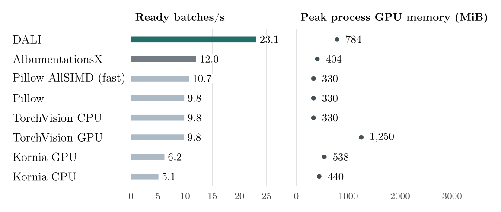
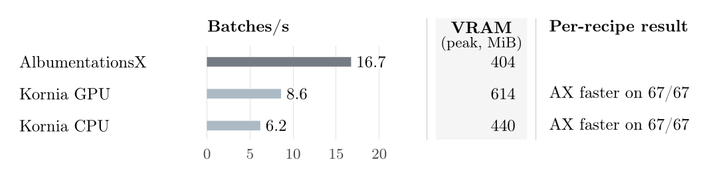
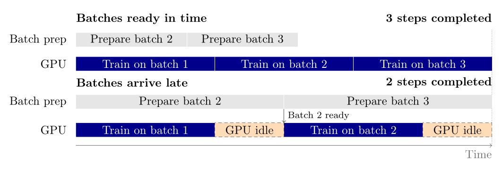

# Augmentation Benchmark

## Citing

If you use this code, benchmark results, or methodology in your research, please cite
[RGB Input Pipelines: Throughput, GPU Memory, and Transformation Coverage](https://arxiv.org/abs/2609.06635).
Your citation makes the project's research impact visible to funders and helps sustain maintenance.

```bibtex
@misc{iglovikov2026rgbinputpipelines,
  title={RGB Input Pipelines: Throughput, GPU Memory, and Transformation Coverage},
  author={Vladimir Iglovikov},
  year={2026},
  eprint={2609.06635},
  archivePrefix={arXiv},
  primaryClass={cs.PF},
  url={https://arxiv.org/abs/2609.06635}
}
```

## About the benchmark

Eight RGB input paths take ImageNet JPEGs from disk to a normalized CUDA batch.
Each measurement records throughput and peak process GPU memory together.
The CPU paths include AlbumentationsX, Pillow, and Pillow-AllSIMD in fast mode.
TorchVision and Kornia each have a CPU and a GPU path. DALI uses its native GPU pipeline.

See the [current manuscript](paper/main.tex), [per-recipe results and seed observations](paper/generated/recipe-results.csv),
and [reproduction instructions](paper/README.md). The [September preprint](https://arxiv.org/abs/2609.06635)
reports the earlier seven-path experiment.

The [methodology FAQ](docs/benchmark_faq.md) explains the workload, timing boundary, and adapter choices.

<!-- BEGIN GENERATED RESULTS -->

## RGB results

1323 measurements across 441 implementation–recipe pairs, with 3 seeds per pair. See the [per-seed results and manifests](docs/generated/results.json).



### Mean per-recipe throughput ratios

All rows below use the same 35 recipes. Throughput is the arithmetic mean of per-recipe ratios: each path's median over 3 seeds divided by AX's median for that recipe. GPU memory is the median of those recipes' peak-memory medians.

| Measured path | Version | Mean throughput / AX (higher is faster) | Peak process GPU memory (MiB, lower is better) |
| --- | --- | ---: | ---: |
| DALI GPU | 2.4.0 | 1.35× | 1,872 |
| AlbumentationsX CPU | 2.6.3 | 1.00× | 404 |
| Pillow-AllSIMD CPU (fast) | 13.0.0.post4 | 0.88× | 330 |
| TorchVision CPU | 0.29.2 | 0.80× | 330 |
| Pillow CPU | 13.0.0 | 0.73× | 330 |
| Kornia GPU | 0.9.1 | 0.49× | 538 |
| Kornia CPU | 0.9.1 | 0.41× | 440 |
| TorchVision GPU | 0.29.2 | 0.11× | 3,266 |

Across 47 shared recipes, Pillow-AllSIMD was 1.64× as fast as Pillow on average, with a 1.24× median ratio. Its R27 MedianBlur ratio was 16.14×.

Each implementation ran in its own process. Peak VRAM includes the CUDA state that process retains. The per-seed baseline before pipeline construction is in the machine-readable results.

### Throughput ratio on each shared recipe

Each value is the path's median throughput across three seeds divided by AX's median for that recipe. A value above 1.00 means that path delivered batches faster than AX.

| Shared recipe | DALI | Kornia CPU | Kornia GPU | Pillow | Pillow-AllSIMD | TorchVision CPU | TorchVision GPU |
| --- | ---: | ---: | ---: | ---: | ---: | ---: | ---: |
| R01 Resize | 1.08 | 0.50 | 0.51 | 0.57 | 0.89 | 0.82 | 0.10 |
| R02 RandomCrop224 | 1.44 | 0.51 | 0.51 | 0.98 | 0.95 | 0.93 | 0.11 |
| R03 RandomResizedCrop | 1.29 | 0.41 | 0.42 | 0.58 | 0.83 | 0.76 | 0.10 |
| R04 HorizontalFlip | 1.62 | 0.54 | 0.56 | 1.08 | 1.08 | 1.06 | 0.12 |
| R05 VerticalFlip | 1.50 | 0.48 | 0.52 | 0.99 | 0.97 | 0.99 | 0.11 |
| R06 Pad | 1.18 | 0.42 | 0.44 | 0.92 | 0.95 | 0.84 | 0.11 |
| R07 Rotate | 1.45 | 0.34 | 0.51 | 0.92 | 0.95 | 0.57 | 0.09 |
| R08 Affine | 1.57 | 0.37 | 0.55 | 0.64 | 0.95 | 0.65 | 0.09 |
| R09 Perspective | 1.47 | 0.37 | 0.55 | 0.63 | 0.88 | 0.63 | 0.09 |
| R12 ChannelShuffle | 1.32 | 0.44 | 0.45 | 0.88 | 0.88 | 0.84 | 0.10 |
| R13 Grayscale | 1.34 | 0.42 | 0.46 | 0.85 | 0.85 | 0.80 | 0.10 |
| R15 GaussianBlur | 1.44 | 0.28 | 0.49 | 0.57 | 0.86 | 0.49 | 0.10 |
| R17 Invert | 1.30 | 0.42 | 0.44 | 0.80 | 0.85 | 0.86 | 0.10 |
| R18 Posterize | 1.28 | 0.33 | 0.45 | 0.80 | 0.81 | 0.83 | 0.10 |
| R19 Solarize | 1.38 | 0.41 | 0.48 | 0.83 | 0.92 | 0.78 | 0.10 |
| R22 Equalize | 1.61 | 0.38 | 0.56 | 0.94 | 0.97 | 0.75 | 0.10 |
| R24 JpegCompression | 1.64 | 0.17 | 0.54 | 0.91 | 0.93 | 0.86 | 0.10 |
| R25 RandomGamma | 1.40 | 0.37 | 0.49 | 0.88 | 0.89 | 0.67 | 0.11 |
| R30 Brightness | 1.37 | 0.44 | 0.46 | 0.85 | 0.83 | 0.84 | 0.10 |
| R31 Contrast | 1.44 | 0.45 | 0.50 | 0.84 | 0.56 | 0.78 | 0.11 |
| R46 Shear | 1.71 | 0.41 | 0.61 | 0.70 | 1.02 | 0.76 | 0.11 |
| R50 LongestMaxSize | 1.35 | 0.34 | 0.34 | 0.33 | 0.79 | 0.91 | 0.12 |
| R51 SmallestMaxSize | 1.58 | 0.31 | 0.30 | 0.27 | 0.75 | 0.97 | 0.15 |
| R52 Transpose | 1.29 | 0.34 | 0.43 | 0.84 | 0.88 | 0.81 | 0.10 |
| R53 RandomRotate90 | 1.32 | 0.29 | 0.45 | 0.88 | 0.90 | 0.86 | 0.10 |
| R58 CenterCrop | 1.40 | 0.59 | 0.57 | 0.90 | 0.94 | 0.91 | 0.11 |
| R59 Crop | 1.11 | 0.44 | 0.46 | 0.51 | 0.83 | 0.78 | 0.10 |
| R60 CropAndPad | 1.18 | 0.52 | 0.53 | 0.62 | 0.93 | 0.68 | 0.11 |
| R61 LetterBox | 1.09 | 0.51 | 0.56 | 0.62 | 0.86 | 0.81 | 0.10 |
| R62 PadIfNeeded | 1.14 | 0.53 | 0.49 | 0.94 | 1.00 | 0.97 | 0.11 |
| R63 ChannelSwap | 1.11 | 0.47 | 0.50 | 0.58 | 0.81 | 0.78 | 0.10 |
| R68 RandomScale | 1.36 | 0.32 | 0.31 | 0.31 | 0.74 | 0.82 | 0.13 |
| R69 RandomSizedCrop | 1.16 | 0.37 | 0.51 | 0.43 | 0.81 | 0.76 | 0.10 |
| R70 CoarseDropout | 1.15 | 0.44 | 0.50 | 0.61 | 0.90 | 0.80 | 0.10 |
| R73 ShiftScaleRotate | 1.32 | 0.37 | 0.59 | 0.51 | 0.93 | 0.66 | 0.10 |

### AlbumentationsX against each library

Each chart uses the recipes shared by every path it shows. Compare rows within each chart.




### Measurement settings

Machine: `g2-standard-16`, `nvidia-l4`. Output: CUDA `float16` BCHW `256x3x224x224`. Dataset: first 10,000 lexicographically sorted ImageNet Val JPEGs. Seeds: 137, 138, 139. Workers: 15; prefetch setting: 2; persistent workers: true; dataset prewarm: true.

Warm-up batches: 1. Throughput measures 32 batches (8,192 images), ending after CUDA synchronization. Construction and worker startup are excluded; prefetch effects remain.

GPU memory is sampled by NVML every 50 ms from before pipeline construction through final synchronization and cleanup in the same pass. The peak includes process and library allocations. Shorter peaks may be missed; CPU and model memory are not measured.



<!-- END GENERATED RESULTS -->

## How to read the comparisons

- Resize (R01) and RandomResizedCrop (R03) use bilinear interpolation without
  antialiasing. AX uses OpenCV `INTER_LINEAR`. The two Pillow paths use an
  affine resampling call because Pillow's bilinear resize filters when downsampling.
- Shear (R46) uses a fixed 10° X shear around the image center, bilinear
  interpolation, and zero-valued samples outside the frame on all eight paths.
  The CUDA preflight checked the corrected geometry before timing.
- Pillow and Pillow-AllSIMD augment on CPU, transfer the pinned `uint8` batch
  to CUDA, then normalize on GPU. The AllSIMD worker recorded AVX2 in fast mode.
- AX uses its batch `InputNormalizer` on GPU. Preflight verified the fused
  Triton path on a full `256×3×224×224` batch. The timed results cover the
  complete input pipeline.
- RandomCrop224 takes a crop at decoded resolution. DALI uses an integer-offset
  slice with centered zero padding where needed.
- R08 applies scale, rotation, both shear axes, and translation in all paths.
  R24 samples JPEG quality per image. Codec paths and artifact simulators can
  produce different pixels at the same nominal quality.

Three seeds provide repeated executions with the same per-seed file order across
paths. The results measure input preparation on one machine type. Performance
during training also depends on the model and its use of the GPU.

## Update the README results

Use the [report generation commands](paper/README.md#regenerate-the-results)
to rebuild the figures, tables, and [machine-readable results](docs/generated/results.json)
from validated cells. Website builds consume that export, including the source
run ID for each observation. Rebuild the paper from the same inputs.

## Transformation coverage

The [coverage census](catalog/operations.yaml) records the APIs reviewed for
125 selected 2D RGB entries in AlbumentationsX 2.6.2. It records counterparts for 57 entries in
Kornia 0.9.0, 40 in TorchVision 0.29.2, 45 in Pillow 13.0.0, and 56 in
DALI 2.4.0. The counts include direct operations and compositions, with
approximate matches marked separately.

## Run the RGB matrix

Read [the execution contract](docs/benchmark_execution_contract.md) before changing or launching a run. Configure [GCP access](configs/cloud/gcp-l4.yaml) and access to the [dataset archive](configs/families/rgb.yaml), then commit the intended inputs. With `uv` and an authenticated `gcloud` installed, run from the repository root:

```bash
uv run augbench launch-rgb
```

The command requires a clean worktree, validates existing immutable cells, and resumes missing cells for the same run identity. It reuses an active VM for that run or provisions one L4 VM. Code and frozen inputs determine the run identity; changing them creates a new run. To inspect or regenerate the report without launching a VM, follow the [paper's reproduction instructions](paper/README.md).

## Repository layout

```text
catalog/       operation census and RGB recipes
configs/       workload and GCP configuration
environments/  locked RGB benchmark environment
infra/gcp/     VM bootstrap
src/augbench/  benchmark implementation
paper/         manuscript, bibliography, generated tables, and per-seed data
```

RGB is the only runnable study. 9-channel images, video, and volumes require separate datasets, recipes, implementations, output contracts, and runs.
