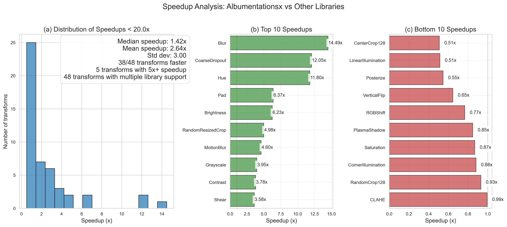
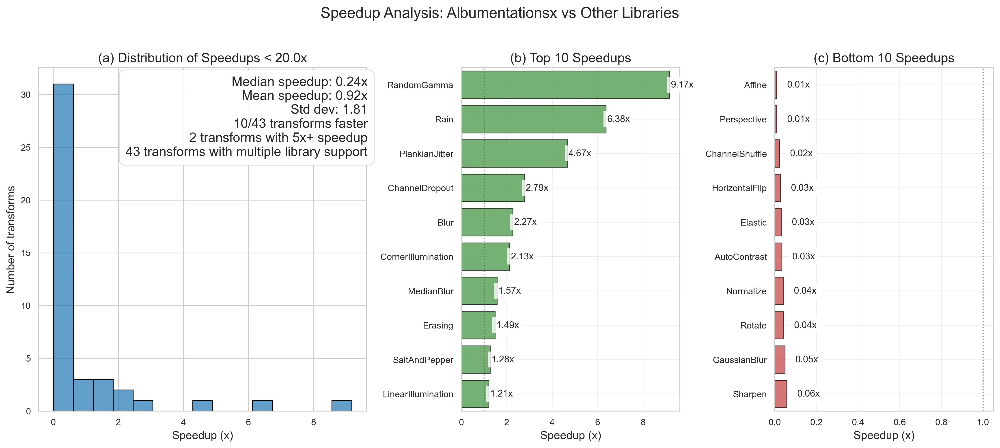

# Image and Video Augmentation Library Benchmarks

A comprehensive benchmarking suite for comparing the performance of popular image and video augmentation libraries including [AlbumentationsX](https://albumentations.ai/), [imgaug](https://imgaug.readthedocs.io/en/latest/), [torchvision](https://docs.pytorch.org/vision/stable/index.html), [Kornia](https://kornia.readthedocs.io/en/latest/), and [Augly](https://github.com/facebookresearch/AugLy).

## GitAds Sponsored
[](https://gitads.dev/v1/ad-track?source=albumentations-team/benchmark@github)

<details>
<summary>Table of Contents</summary>

- [Image and Video Augmentation Library Benchmarks](#image-and-video-augmentation-library-benchmarks)
  - [Overview](#overview)
  - [Benchmark Types](#benchmark-types)
    - [Image Benchmarks](#image-benchmarks)
    - [Video Benchmarks](#video-benchmarks)
  - [Performance Highlights](#performance-highlights)
    - [Image Augmentation Performance](#image-augmentation-performance)
    - [Video Augmentation Performance](#video-augmentation-performance)
  - [Requirements](#requirements)
  - [Supported Libraries](#supported-libraries)
  - [Setup](#setup)
    - [Getting Started](#getting-started)
    - [Using Your Own Data](#using-your-own-data)
  - [Running Benchmarks](#running-benchmarks)
    - [Image Benchmarks](#running-image-benchmarks)
    - [Video Benchmarks](#running-video-benchmarks)
  - [Methodology](#methodology)
  - [Contributing](#contributing)

</details>

## Overview

This benchmark suite measures the throughput and performance characteristics of common augmentation operations across different libraries. It features:

- Benchmarks for both image and video augmentation
- Adaptive warmup to ensure stable measurements
- Multiple runs for statistical significance
- Detailed performance metrics and system information
- Thread control settings for consistent performance
- Support for multiple image/video formats and loading methods

## Benchmark Types

### Image Benchmarks

The image benchmarks compare the performance of various libraries on standard image transformations. All benchmarks are run on a single CPU thread to ensure consistent and comparable results.

[**Detailed Image Benchmark Results**](docs/images/README.md)



### Video Benchmarks

The video benchmarks compare CPU-based processing (AlbumentationsX) with GPU-accelerated processing (Kornia) for video transformations. The benchmarks use the [UCF101 dataset](https://www.crcv.ucf.edu/data/UCF101.php), which contains realistic videos from 101 action categories.

[**Detailed Video Benchmark Results**](docs/videos/README.md)



## Performance Highlights

### Image Augmentation Performance

<!-- IMAGE_SPEEDUP_SUMMARY_START -->
AlbumentationsX is generally the fastest library for image augmentation, with a median speedup of 4.1× compared to other libraries. For some transforms, the speedup can be as high as 119.7× (MedianBlur).
<!-- IMAGE_SPEEDUP_SUMMARY_END -->

### Video Augmentation Performance

<!-- VIDEO_SPEEDUP_SUMMARY_START -->
For video processing, the performance comparison between CPU (AlbumentationsX) and GPU (Kornia) shows interesting trade-offs. While GPU acceleration provides significant benefits for complex transformations, CPU processing can be more efficient for simple operations.
<!-- VIDEO_SPEEDUP_SUMMARY_END -->

## Requirements

The benchmark automatically creates isolated virtual environments for each library and installs the necessary dependencies. Base requirements:

- Python 3.10+
- uv (for fast package installation)
- Disk space for virtual environments
- Image/video dataset in a supported format

## Supported Libraries

- [AlbumentationsX](https://albumentations.ai/)
- [imgaug](https://imgaug.readthedocs.io/en/latest/)
- [torchvision](https://docs.pytorch.org/vision/stable/index.html)
- [Kornia](https://kornia.readthedocs.io/en/latest/)
- [Augly](https://github.com/facebookresearch/AugLy)

Each library's specific dependencies are managed through separate requirements files in the `requirements/` directory.

## Setup

### Getting Started

For testing and comparison purposes, you can use standard datasets:

**For image benchmarks:**
```bash
wget https://image-net.org/data/ILSVRC/2012/ILSVRC2012_img_val.tar
tar -xf ILSVRC2012_img_val.tar -C /path/to/your/target/directory
```

**For video benchmarks:**
```bash
# UCF101 dataset
wget https://www.crcv.ucf.edu/data/UCF101/UCF101.rar
unrar x UCF101.rar -d /path/to/your/target/directory
```

### Using Your Own Data

We strongly recommend running the benchmarks on your own dataset that matches your use case:

- Use images/videos that are representative of your actual workload
- Consider sizes and formats you typically work with
- Include edge cases specific to your application

This will give you more relevant performance metrics for your specific use case.

## Running Benchmarks

### Running Image Benchmarks

To benchmark a single library:

```bash
./run_single.sh -l albumentationsx -d /path/to/images -o /path/to/output
```

To run benchmarks for all supported libraries and generate a comparison:

```bash
./run_all.sh -d /path/to/images -o /path/to/output --update-docs
```

### Running Video Benchmarks

To benchmark a single library:

```bash
./run_video_single.sh -l albumentationsx -d /path/to/videos -o /path/to/output
```

To run benchmarks for all supported libraries and generate a comparison:

```bash
./run_video_all.sh -d /path/to/videos -o /path/to/output --update-docs
```

#### Using Custom Transforms

To benchmark transforms, create a Python file defining `LIBRARY` and `CUSTOM_TRANSFORMS`:

```python
# my_transforms.py
import albumentations as A

# Specify the library
LIBRARY = "albumentationsx"

CUSTOM_TRANSFORMS = [
    # Test different parameters of the same transform
    A.ToGray(method="weighted_average", p=1),
    A.ToGray(method="pca", p=1),

    # Different noise levels
    A.GaussNoise(var_limit=(10.0, 50.0), p=1),
    A.GaussNoise(var_limit=(100.0, 200.0), p=1),

    # Any other transforms...
    A.RandomBrightnessContrast(brightness_limit=0.2, contrast_limit=0.2, p=1),
]
```

Then run:

```bash
# Using the shell script (recommended)
./run_video_single.sh -d /path/to/videos -o output/ -s my_transforms.py

# Or Python directly
python -m benchmark.video_runner -d /path/to/videos -o output.json -s my_transforms.py
```

The results will show each transform with all its parameters:
- `ToGray(method=weighted_average, p=1)`
- `ToGray(method=pca, p=1)`
- `GaussNoise(var_limit=(10.0, 50.0), mean=0, p=1, per_channel=True)`

See `examples/custom_video_specs_template.py` and `example_direct_transforms.py` for more examples.

To analyze parametric results:

```bash
python tools/analyze_parametric_results.py parametric_results.json
```

This will show:
- Best and worst configurations for each transform
- Performance differences between parameter choices
- Optimal settings for your use case

## Methodology

The benchmark methodology is designed to ensure fair and reproducible comparisons:

1. **Data Loading**: Data is loaded using library-specific loaders to ensure optimal format compatibility
2. **Warmup Phase**: Adaptive warmup until performance variance stabilizes
3. **Measurement Phase**: Multiple runs with statistical analysis
4. **Environment Control**: Consistent thread settings and hardware utilization

For detailed methodology, see the specific benchmark READMEs:
- [Image Benchmark Methodology](docs/images/README.md#methodology)
- [Video Benchmark Methodology](docs/videos/README.md#methodology)

## Contributing

Contributions are welcome! If you'd like to add support for a new library, improve the benchmarking methodology, or fix issues, please submit a pull request.

When contributing, please:
1. Follow the existing code style
2. Add tests for new functionality
3. Update documentation as needed
4. Ensure all tests pass

<!-- GitAds-Verify: ROVYUM6GM9I4GUYXL61ND2O2ZT2SVPGP -->
