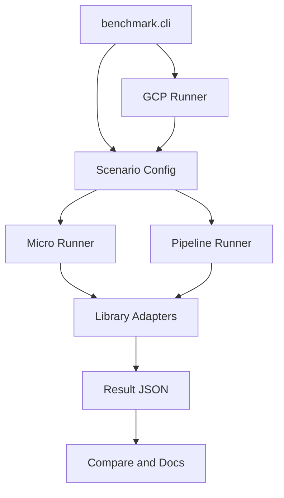

---

name: augmentation benchmark v2
overview: "Build a benchmark suite with two first-class modes: augmentation-only profiling without dataloader, and realistic dataloader/training-input throughput. Keep the current repo's useful transform specs, result format, docs tooling, and GCP path, but refactor the runner model so RGB image, 9-channel image, and 16-frame video scenarios can be compared fairly across CPU and GPU libraries."
todos:

- id: define-scenarios
content: Add scenario and mode model for RGB image, 9-channel image, video decode, and 16-frame video augmentation benchmarks.
status: pending
- id: refactor-runners
content: Split current runner behavior into micro runner and add a batch/dataloader pipeline runner.
status: pending
- id: add-adapters
content: Create library adapters for AlbumentationsX, torchvision, Kornia, Pillow, and DALI as video pipeline-only.
status: pending
- id: add-video-decoders
content: Add video decoder adapters for OpenCV, PyAV, Decord, TorchCodec or torchvision where available, and DALI decode.
status: pending
- id: extend-cli-gcp
content: Extend CLI and existing GCP runner with scenario/mode/batch/workers flags and better cloud artifact handling.
status: pending
- id: update-reporting
content: Update comparison and README generation for profiler vs realistic pipeline tables.
status: pending
- id: validate-smoke
content: Add smoke tests and run tiny local/GCP benchmark checks before full sweeps.
status: pending
isProject: false

---

# Augmentation Benchmark V2

## Recommendation

If I were writing this from scratch, I would use almost the same library set, but not the same runner shape.

Keep these comparisons:

- RGB uint8 CPU: AlbumentationsX vs torchvision vs Kornia vs Pillow.
- 9-channel CPU: AlbumentationsX vs torchvision vs Kornia. No Pillow, because Pillow is not a meaningful >3-channel augmentation baseline.
- Video decode, 16-frame samples: OpenCV vs PyAV vs Decord vs TorchCodec or torchvision where available vs DALI.
- Video, 16-frame clips: AlbumentationsX CPU vs torchvision GPU vs Kornia GPU. Add NVIDIA DALI GPU only for pipeline mode.

Add two benchmark modes for every scenario:

- `micro`: preloaded decoded samples, no dataloader. This is the profiler mode and should stay close to the current [benchmark/runner.py](benchmark/runner.py) behavior.
- `pipeline`: realistic dataloader mode. This measures dataset decode/load, collation, CPU augmentation or GPU transfer, GPU augmentation, and ready-for-model output throughput.
- `decode`: video decoder profiling. This measures disk video -> sampled 16-frame RGB clip, without augmentation.

I would not copy `imread_benchmark` wholesale. Its GCP shell workflow is good operationally, but this repo already has integrated CLI/GCP support in [benchmark/cli.py](benchmark/cli.py) and [benchmark/cloud/gcp.py](benchmark/cloud/gcp.py). I would borrow the better operational pieces from imread only where this repo is weaker: live log sync, DONE/FAILED sentinels, optional venv cache, and run-many sweeps.

## Architecture

Refactor around explicit scenarios and measurement boundaries:




Add these concepts:

- `benchmark/scenarios.py`: canonical benchmark scenarios: `image_rgb_cpu`, `image_9ch_cpu`, `video_decode_16f`, `video_16f_micro`, `video_16f_pipeline`; DALI augmentation is registered only for `video_16f_pipeline`.
- `benchmark/micro_runner.py`: augmentation-only timing, derived from current [benchmark/runner.py](benchmark/runner.py).
- `benchmark/decode_runner.py`: video decode timing from disk to 16-frame RGB clips, with no augmentation.
- `benchmark/pipeline_runner.py`: dataloader/training-input timing with PyTorch `Dataset`/`DataLoader` and batch-level adapters.
- `benchmark/adapters/`: per-library adapters that expose a common interface for item transforms and batch/pipeline transforms.
- `benchmark/decoders/`: video decoder adapters for OpenCV, PyAV, Decord, TorchCodec/torchvision, and DALI.
- `benchmark/results.py`: shared result metadata and JSON writing so micro and pipeline output schemas stay comparable.

Keep the existing transform registry in [benchmark/transforms/registry.py](benchmark/transforms/registry.py) and shared transform definitions in [benchmark/transforms/specs.py](benchmark/transforms/specs.py), but extend adapters so each library can say which transforms it supports in micro and pipeline modes.

## Measurement Rules

Use these boundaries by default:

- Micro image: decoded inputs preloaded in memory, one image at a time, transform only.
- Pipeline image CPU: image paths -> decode -> augment -> collate -> ready tensor batch.
- Pipeline image GPU: image paths -> decode -> collate -> host-to-device transfer -> GPU augment -> ready GPU tensor batch.
- Decode video: video path -> sample 16 frames -> decode to RGB clip, no augmentation.
- Micro video: decoded 16-frame clips preloaded in memory, one clip at a time, transform only.
- Pipeline video: video source -> sample 16 frames -> decode -> collate -> CPU or GPU augment -> ready batch.

Defaults:

- RGB dataset source: same convention as `imread_benchmark` — download `ILSVRC2012_img_val.tar`, unpack it to `imagenet/val`, and point `--data-dir` at that directory.
- RGB micro dataset: `2,000` images from the unpacked ImageNet validation set via `--num-items 2000`. More images mostly slow the run down; reliability should come from calibrated timing, repeated measurements, and variance checks.
- RGB pipeline dataset: full unpacked ImageNet validation set (`50,000` images) for paper runs. Use `10,000+` only for intermediate sweeps where runtime is the constraint.
- Video clip length: `16` frames.
- Image batch sizes: configurable, start with `32` and `128`.
- Video batch sizes: configurable, start with `4` and `8`, because 16-frame clips eat memory fast.
- Report both throughput and latency: images/sec or clips/sec, plus ms/sample and ms/batch.
- Record CPU model, GPU model, torch/CUDA versions, decoder, whether decode is included, dataloader workers, batch size, pin memory, precision, channel count, clip length.

Threading policy:

- Micro benchmarks are controlled single-stream measurements: one process, one internal library thread, preloaded
  decoded inputs, augmentation only. Treat them as an implementation profiler: they are valuable for checking
  algorithmic quality and regressions, but they are intentionally artificial because they measure one CPU core rather
  than a production training input pipeline. Set `OMP_NUM_THREADS=1`, `OPENBLAS_NUM_THREADS=1`,
  `MKL_NUM_THREADS=1`, `NUMEXPR_NUM_THREADS=1`, OpenCV threads to `1`, and PyTorch CPU threads to `1` where
  applicable.
- Pipeline benchmarks should represent production-style throughput, not a single-core lab constraint. Use dataloader worker sweeps and allow each library to use its normal or recommended production threading model. AlbumentationsX gets parallelism through multiple dataloader workers; torchvision/Kornia/OpenCV should not be artificially limited in the main user-facing pipeline table.
- Always record both dataloader workers and internal thread settings. If space allows, add a controlled appendix table with internal threads forced to `1`, but keep the main pipeline result production-style.

Paper hardware matrix:

- Choose CPUs because they resemble machines used to feed model training, not because they cover every GCP CPU family.
- RGB micro/profiler: MacBook M4 or similar Apple Silicon, `c4-standard-16` for modern Intel x86,
  `c4d-standard-16` for modern AMD x86, and `c4a-standard-16` only if cloud Arm portability is part of the claim.
  Add `g2-standard-16` and `a2-highgpu-1g` if the profiler should represent the host CPUs used beside L4 and A100
  training jobs.
- CPU-only pipeline: one modern C4/C4D-class CPU machine is enough for the main RGB and 9-channel CPU pipeline table;
  add the second CPU vendor only if the paper claims cross-vendor CPU behavior.
- Mainstream GPU: one L4 machine for realistic training-input pipeline results.
- High-end GPU: one A100 machine for stress-testing whether CPU augmentation becomes the bottleneck when model-side throughput is high.
- More important than extra CPU micro runs: DataLoader/pipeline image benchmarks and video augmentation with GPU execution, especially torchvision video on GPU.

## Video Decode Benchmark

Keep video decode in this repo, not in `imread_benchmark`. `imread_benchmark` should remain focused on still image decode: file -> RGB image. Video decode belongs here because the meaningful unit for users is video file -> sampled 16-frame clip -> augmented training batch.

Add a dedicated decode scenario:

```bash
python -m benchmark.cli run --scenario video-decode-16f --mode decode \
  --data-dir /data/videos \
  --output output/video_decode \
  --decoders opencv pyav decord torchcodec dali
```

Decoder benchmark output should report:

- clips/sec and frames/sec;
- ms/clip and ms/frame;
- frame sampling policy;
- output shape and dtype;
- CPU/GPU decode path;
- decoder package and version.

For augmentation microbenchmarks, use a controlled common decoded input so decoder differences are excluded. For pipeline benchmarks, include the realistic/native decoder path and label it clearly in metadata.

## DALI Integration

Add DALI only for pipeline video. That is where it is meaningful.

DALI is pipeline/batch-native, so forcing it into the current one-item transform spec would produce a fake comparison. Do not include DALI in any `micro` run or micro result table. For realistic mode, implement DALI as its own batch pipeline adapter and compare it against batch-level torchvision and Kornia.

DALI can also appear in `video-decode-16f --mode decode` as a decoder benchmark, because that measures DALI's video reader/decoder, not DALI as a micro augmentation library.

Files to add:

- [requirements/dali-video.txt](requirements/dali-video.txt)
- [benchmark/adapters/dali_video.py](benchmark/adapters/dali_video.py)
- DALI scenario registration in [benchmark/cli.py](benchmark/cli.py) or a new [benchmark/scenarios.py](benchmark/scenarios.py)

## GCP / Local Runs

Keep one CLI for local and cloud:

```bash
python -m benchmark.cli run --scenario image-rgb --mode micro --data-dir /data/images --output output/rgb_micro
python -m benchmark.cli run --scenario image-rgb --mode pipeline --data-dir /data/images --output output/rgb_pipeline --batch-size 64 --workers 8
python -m benchmark.cli run --scenario video-decode-16f --mode decode --data-dir /data/videos --output output/video_decode --decoders opencv pyav decord torchcodec dali
python -m benchmark.cli run --scenario video-16f --mode micro --data-dir /data/videos --output output/video_micro --libraries albumentationsx torchvision kornia
python -m benchmark.cli run --scenario video-16f --mode pipeline --data-dir /data/videos --output output/video_pipeline --batch-size 4 --workers 8 --libraries albumentationsx torchvision kornia dali
```

Extend existing GCP flags instead of adding separate shell scripts:

```bash
python -m benchmark.cli run \
  --cloud gcp \
  --gcp-project PROJECT \
  --gcp-gcs-data-uri gs://bucket/datasets/videos \
  --gcp-gcs-results-uri gs://bucket/augmentation-runs \
  --gcp-machine-type g2-standard-16 \
  --gcp-gpu-type nvidia-l4 \
  --scenario video-16f \
  --mode pipeline \
  --batch-size 4 \
  --workers 8 \
  --libraries albumentationsx torchvision kornia dali
```

Upgrade [benchmark/cloud/gcp.py](benchmark/cloud/gcp.py) with the useful imread patterns:

- live periodic result/log sync, not only final upload;
- `DONE` and `FAILED` sentinel files;
- optional dependency cache keyed by requirement file hashes;
- a `run-many` equivalent for CPU/GPU machine sweeps.

## Docs / Output

Update [README.md](README.md) so users see two different questions answered:

- Profiler tables: "How fast is the augmentation operation itself?"
- Realistic pipeline tables: "What should I use in a training loop?"

For RGB images, document the paper defaults explicitly:

- Micro/profiler tables use `2,000` images from the unpacked ImageNet validation tar, preloaded into memory, with one internal thread for every library.
- Pipeline tables use the full `50,000` ImageNet validation images from disk, dataloader worker sweeps, and production-style library threading. These tables are the user guidance tables.
- Do not compare the micro and pipeline numbers in the same ranking without labels; they answer different questions.

Update report tooling to group by scenario and mode instead of only image/video:

- Extend [tools/compare.py](tools/compare.py) to compare `scenario + mode + library`.
- Extend [tools/update_readme.py](tools/update_readme.py) to render separate sections for RGB micro, RGB pipeline, 9ch micro, 9ch pipeline, video decode 16f, video-16f micro, video-16f pipeline.

## Validation

Start with smoke tests on tiny generated data:

- 8 RGB JPEGs for image micro/pipeline.
- synthetic 9-channel images generated from RGB stacking.
- 2 short videos with at least 16 frames.
- decode-only smoke for at least OpenCV and one PyTorch-friendly decoder.
- one transform subset: `Resize`, `HorizontalFlip`, `RandomCrop128`, `Normalize`.

Then run full local CPU image benchmarks, then one GPU video smoke run on GCP, then full GCP sweeps.

## Key Risks

- DALI comparison is only fair in pipeline mode. Treating it as a per-item transform library would be misleading.
- GPU results must synchronize correctly around timing or they will over-report throughput.
- AlbumentationsX pipeline needs a good CPU dataloader baseline: enough workers, pinned memory when handing batches to GPU, and clear accounting of CPU augment + transfer time.
- Video decode and frame sampling can dominate results. Keep decode-only, augmentation-only, and full-pipeline tables separate so users can see where the bottleneck comes from.
